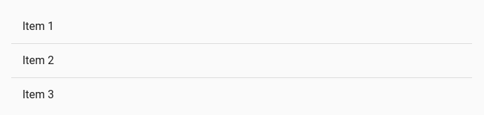
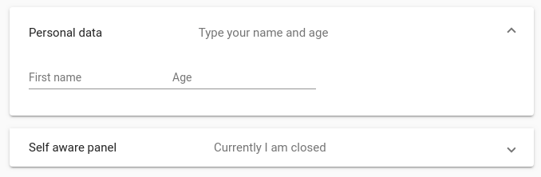
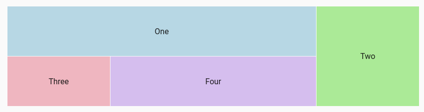
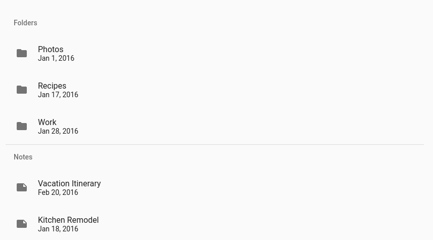
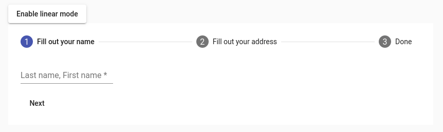
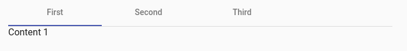
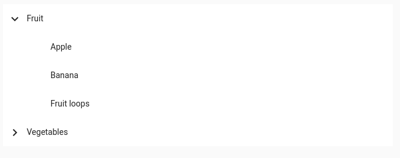

# Card
```
<mat-card class="example-card">
  <mat-card-header>
    <div mat-card-avatar class="example-header-image"></div>
    <mat-card-title>Shiba Inu</mat-card-title>
    <mat-card-subtitle>Dog Breed</mat-card-subtitle>
  </mat-card-header>
  
  <mat-card-content>
    <p>
      The Shiba Inu is the smallest of the six original and distinct spitz breeds of dog from Japan.
      A small, agile dog that copes very well with mountainous terrain, the Shiba Inu was originally
      bred for hunting.
    </p>
  </mat-card-content>
  <mat-card-actions>
    <button mat-button>LIKE</button>
    <button mat-button>SHARE</button>
  </mat-card-actions>
</mat-card>


```
## Basic card sections
| Element | Description |
|----------------------|--------------------------------------------------------|
| `<mat-card-title>` | Card title |
| `<mat-card-subtitle>` | Card subtitle |
| `<mat-card-content>` | Primary card content. Intended for blocks of text |
| `` | Card image. Stretches the image to the container width |
| `<mat-card-actions>` | Container for buttons at the bottom of the card |
| `<mat-card-footer>` | Section anchored to the bottom of the card |

## Card headers
Element	Description
- `<mat-card-title>`	A title within the header
- `<mat-card-subtitle>`	A subtitle within the header
- ``	An image used as an avatar within the header

## Group, region, and landmarks


# Divider
```
<mat-list>
  <mat-list-item>Item 1</mat-list-item>
  <mat-divider></mat-divider>
  <mat-list-item>Item 2</mat-list-item>
  <mat-divider></mat-divider>
  <mat-list-item>Item 3</mat-list-item>
</mat-list>
```


## Simple divider
## Inset divider
## Vertical divider
## Lists with inset dividers


# Expansion Panel
```
<mat-accordion>
  <mat-expansion-panel>
    <mat-expansion-panel-header>
      <mat-panel-title>
        Personal data
      </mat-panel-title>
      <mat-panel-description>
        Type your name and age
      </mat-panel-description>
    </mat-expansion-panel-header>

    <mat-form-field>
      <input matInput placeholder="First name">
    </mat-form-field>

    <mat-form-field>
      <input matInput placeholder="Age">
    </mat-form-field>
  </mat-expansion-panel>
  <mat-expansion-panel (opened)="panelOpenState = true"
                       (closed)="panelOpenState = false">
    <mat-expansion-panel-header>
      <mat-panel-title>
        Self aware panel
      </mat-panel-title>
      <mat-panel-description>
        Currently I am {{panelOpenState ? 'open' : 'closed'}}
      </mat-panel-description>
    </mat-expansion-panel-header>
    <p>I'm visible because I am open</p>
  </mat-expansion-panel>
</mat-accordion>
```


## Expansion-panel content
## Accordion
## Lazy rendering


# Grid list
```
<mat-grid-list cols="2" rowHeight="2:1">
  <mat-grid-tile>1</mat-grid-tile>
  <mat-grid-tile>2</mat-grid-tile>
  <mat-grid-tile>3</mat-grid-tile>
  <mat-grid-tile>4</mat-grid-tile>
</mat-grid-list>
```

```
<mat-grid-list cols="4" rowHeight="100px">
  <mat-grid-tile
      *ngFor="let tile of tiles"
      [colspan]="tile.cols"
      [rowspan]="tile.rows"
      [style.background]="tile.color">
    {{tile.text}}
  </mat-grid-tile>
</mat-grid-list>

// ts
import {Component} from '@angular/core';

export interface Tile {
  color: string;
  cols: number;
  rows: number;
  text: string;
}

/**
 * @title Dynamic grid-list
 */
@Component({
  selector: 'grid-list-dynamic-example',
  templateUrl: 'grid-list-dynamic-example.html',
  styleUrls: ['grid-list-dynamic-example.css'],
})
export class GridListDynamicExample {
  tiles: Tile[] = [
    {text: 'One', cols: 3, rows: 1, color: 'lightblue'},
    {text: 'Two', cols: 1, rows: 2, color: 'lightgreen'},
    {text: 'Three', cols: 1, rows: 1, color: 'lightpink'},
    {text: 'Four', cols: 2, rows: 1, color: '#DDBDF1'},
  ];
}
```



## Setting the number of columns
## Setting the row height
## Setting the gutter size
## Adding tiles that span multiple rows or columns
## Tile headers and footers


# List
```
<mat-list>
  <h3 mat-subheader>Folders</h3>
  <mat-list-item *ngFor="let folder of folders">
    <mat-icon mat-list-icon>folder</mat-icon>
    <h4 mat-line>{{folder.name}}</h4>
    <p mat-line> {{folder.updated | date}} </p>
  </mat-list-item>
  <mat-divider></mat-divider>
  <h3 mat-subheader>Notes</h3>
  <mat-list-item *ngFor="let note of notes">
    <mat-icon mat-list-icon>note</mat-icon>
    <h4 mat-line>{{note.name}}</h4>
    <p mat-line> {{note.updated | date}} </p>
  </mat-list-item>
</mat-list>

// ts
import {Component} from '@angular/core';

export interface Section {
  name: string;
  updated: Date;
}

/**
 * @title List with sections
 */
@Component({
  selector: 'list-sections-example',
  styleUrls: ['list-sections-example.css'],
  templateUrl: 'list-sections-example.html',
})
export class ListSectionsExample {
  folders: Section[] = [
    {
      name: 'Photos',
      updated: new Date('1/1/16'),
    },
    {
      name: 'Recipes',
      updated: new Date('1/17/16'),
    },
    {
      name: 'Work',
      updated: new Date('1/28/16'),
    }
  ];
  notes: Section[] = [
    {
      name: 'Vacation Itinerary',
      updated: new Date('2/20/16'),
    },
    {
      name: 'Kitchen Remodel',
      updated: new Date('1/18/16'),
    }
  ];
}
```



## Simple lists
## Navigation lists
## Action lists
## Selection lists
## Multi-line lists
## Lists with icons
## Lists with avatars
## Dense lists
## Lists with multiple sections


# Stepper
Angular Material's stepper provides a wizard-like workflow by dividing content into logical steps.
```
<button mat-raised-button (click)="isLinear = !isLinear" id="toggle-linear">
  {{!isLinear ? 'Enable linear mode' : 'Disable linear mode'}}
</button>
<mat-horizontal-stepper [linear]="isLinear" #stepper>
  <mat-step [stepControl]="firstFormGroup">
    <form [formGroup]="firstFormGroup">
      <ng-template matStepLabel>Fill out your name</ng-template>
      <mat-form-field>
        <input matInput placeholder="Last name, First name" formControlName="firstCtrl" required>
      </mat-form-field>
      <div>
        <button mat-button matStepperNext>Next</button>
      </div>
    </form>
  </mat-step>
  <mat-step [stepControl]="secondFormGroup">
    <form [formGroup]="secondFormGroup">
      <ng-template matStepLabel>Fill out your address</ng-template>
      <mat-form-field>
        <input matInput placeholder="Address" formControlName="secondCtrl" required>
      </mat-form-field>
      <div>
        <button mat-button matStepperPrevious>Back</button>
        <button mat-button matStepperNext>Next</button>
      </div>
    </form>
  </mat-step>
  <mat-step>
    <ng-template matStepLabel>Done</ng-template>
    You are now done.
    <div>
      <button mat-button matStepperPrevious>Back</button>
      <button mat-button (click)="stepper.reset()">Reset</button>
    </div>
  </mat-step>
</mat-horizontal-stepper>

// ts
import {Component, OnInit} from '@angular/core';
import {FormBuilder, FormGroup, Validators} from '@angular/forms';

/**
 * @title Stepper overview
 */
@Component({
  selector: 'stepper-overview-example',
  templateUrl: 'stepper-overview-example.html',
  styleUrls: ['stepper-overview-example.css'],
})
export class StepperOverviewExample implements OnInit {
  isLinear = false;
  firstFormGroup: FormGroup;
  secondFormGroup: FormGroup;

  constructor(private _formBuilder: FormBuilder) {}

  ngOnInit() {
    this.firstFormGroup = this._formBuilder.group({
      firstCtrl: ['', Validators.required]
    });
    this.secondFormGroup = this._formBuilder.group({
      secondCtrl: ['', Validators.required]
    });
  }
}
```


## Stepper variants
## Labels
## Label position
## Stepper buttons
## Linear stepper
## Types of steps
## Error State


# Tabs
```
<mat-tab-group>
  <mat-tab label="First"> Content 1 </mat-tab>
  <mat-tab label="Second"> Content 2 </mat-tab>
  <mat-tab label="Third"> Content 3 </mat-tab>
</mat-tab-group>
```



## Events
## Labels
## Dynamic Height
## Tabs and navigation
## Lazy Loading
## Label alignment
## Controlling the tab animation


# Tree
The `mat-tree `provides a Material Design styled tree that can be used to display hierarchy data.

## Flat tree
```
<mat-tree [dataSource]="dataSource" [treeControl]="treeControl">
  <!-- This is the tree node template for leaf nodes -->
  <mat-tree-node *matTreeNodeDef="let node" matTreeNodePadding>
    <!-- use a disabled button to provide padding for tree leaf -->
    <button mat-icon-button disabled></button>
    {{node.name}}
  </mat-tree-node>
  <!-- This is the tree node template for expandable nodes -->
  <mat-tree-node *matTreeNodeDef="let node;when: hasChild" matTreeNodePadding>
    <button mat-icon-button matTreeNodeToggle
            [attr.aria-label]="'toggle ' + node.name">
      <mat-icon class="mat-icon-rtl-mirror">
        {{treeControl.isExpanded(node) ? 'expand_more' : 'chevron_right'}}
      </mat-icon>
    </button>
    {{node.name}}
  </mat-tree-node>
</mat-tree>
```


## Nested tree
## Features
## TreeControl
