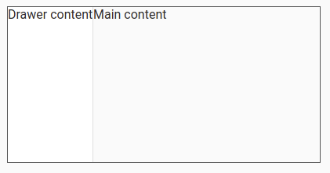

# Menu
```
<button mat-button [matMenuTriggerFor]="menu">Menu</button>
<mat-menu #menu="matMenu">
  <button mat-menu-item>Item 1</button>
  <button mat-menu-item>Item 2</button>
</mat-menu>
```

## Icons
```
<button mat-icon-button [matMenuTriggerFor]="menu" aria-label="Example icon-button with a menu">
  <mat-icon>more_vert</mat-icon>
</button>
<mat-menu #menu="matMenu">
  <button mat-menu-item>
    <mat-icon>dialpad</mat-icon>
    <span>Redial</span>
  </button>
  <button mat-menu-item disabled>
    <mat-icon>voicemail</mat-icon>
    <span>Check voice mail</span>
  </button>
  <button mat-menu-item>
    <mat-icon>notifications_off</mat-icon>
    <span>Disable alerts</span>
  </button>
</mat-menu>

```

## Customizing menu position

## Nested menu
```
<button mat-button [matMenuTriggerFor]="animals">Animal index</button>

<mat-menu #animals="matMenu">
  <button mat-menu-item [matMenuTriggerFor]="vertebrates">Vertebrates</button>
  <button mat-menu-item [matMenuTriggerFor]="invertebrates">Invertebrates</button>
</mat-menu>

<mat-menu #vertebrates="matMenu">
  <button mat-menu-item [matMenuTriggerFor]="fish">Fishes</button>
  <button mat-menu-item [matMenuTriggerFor]="amphibians">Amphibians</button>
  <button mat-menu-item [matMenuTriggerFor]="reptiles">Reptiles</button>
  <button mat-menu-item>Birds</button>
  <button mat-menu-item>Mammals</button>
</mat-menu>

<mat-menu #invertebrates="matMenu">
  <button mat-menu-item>Insects</button>
  <button mat-menu-item>Molluscs</button>
  <button mat-menu-item>Crustaceans</button>
  <button mat-menu-item>Corals</button>
  <button mat-menu-item>Arachnids</button>
  <button mat-menu-item>Velvet worms</button>
  <button mat-menu-item>Horseshoe crabs</button>
</mat-menu>

<mat-menu #fish="matMenu">
  <button mat-menu-item>Baikal oilfish</button>
  <button mat-menu-item>Bala shark</button>
  <button mat-menu-item>Ballan wrasse</button>
  <button mat-menu-item>Bamboo shark</button>
  <button mat-menu-item>Banded killifish</button>
</mat-menu>

<mat-menu #amphibians="matMenu">
  <button mat-menu-item>Sonoran desert toad</button>
  <button mat-menu-item>Western toad</button>
  <button mat-menu-item>Arroyo toad</button>
  <button mat-menu-item>Yosemite toad</button>
</mat-menu>

<mat-menu #reptiles="matMenu">
  <button mat-menu-item>Banded Day Gecko</button>
  <button mat-menu-item>Banded Gila Monster</button>
  <button mat-menu-item>Black Tree Monitor</button>
  <button mat-menu-item>Blue Spiny Lizard</button>
  <button mat-menu-item disabled>Velociraptor</button>
</mat-menu>
```

## Lazy rendering
## Passing in data to a menu


# Sidenav
```
<mat-sidenav-container class="example-container" *ngIf="shouldRun">
  <mat-sidenav mode="side" opened>Sidenav content</mat-sidenav>
  <mat-sidenav-content>Main content</mat-sidenav-content>
</mat-sidenav-container>

<div *ngIf="!shouldRun">Please open on Stackblitz to see result</div>

// ts
import {Component} from '@angular/core';

/** @title Basic sidenav */
@Component({
  selector: 'sidenav-overview-example',
  templateUrl: 'sidenav-overview-example.html',
  styleUrls: ['sidenav-overview-example.css'],
})
export class SidenavOverviewExample {
  shouldRun = [/(^|\.)plnkr\.co$/, /(^|\.)stackblitz\.io$/].some(h => h.test(window.location.host));
}
```

```
<mat-drawer-container class="example-container">
  <mat-drawer mode="side" opened>Drawer content</mat-drawer>
  <mat-drawer-content>Main content</mat-drawer-content>
</mat-drawer-container>
```



## Specifying the main and side content
## Opening and closing a sidenav
## Changing the sidenav's behavior
## Disabling automatic close
## Resizing an open sidenav
## Setting the sidenav's size
## Fixed position sidenavs
## Creating a responsive layout for mobile & desktop
## Reacting to scroll events inside the sidenav container


# Toolbar
```
<mat-toolbar color="primary">
  <mat-toolbar-row>
    <span>Custom Toolbar</span>
  </mat-toolbar-row>

  <mat-toolbar-row>
    <span>Second Line</span>
    <span class="example-spacer"></span>
    <mat-icon class="example-icon" aria-hidden="false" aria-label="Example user verified icon">verified_user</mat-icon>
  </mat-toolbar-row>

  <mat-toolbar-row>
    <span>Third Line</span>
    <span class="example-spacer"></span>
    <mat-icon class="example-icon" aria-hidden="false" aria-label="Example heart icon">favorite</mat-icon>
    <mat-icon class="example-icon" aria-hidden="false" aria-label="Example delete icon">delete</mat-icon>
  </mat-toolbar-row>
</mat-toolbar>

// 
```

## Single row
```
<mat-toolbar>
  <span>My Application</span>
</mat-toolbar>
```

## Multiple rows
```
<mat-toolbar>  
  <mat-toolbar-row>
    <span>First Row</span>
  </mat-toolbar-row>

  <mat-toolbar-row>
    <span>Second Row</span>
  </mat-toolbar-row>
</mat-toolbar>
```

## Positioning toolbar content
## Theming
