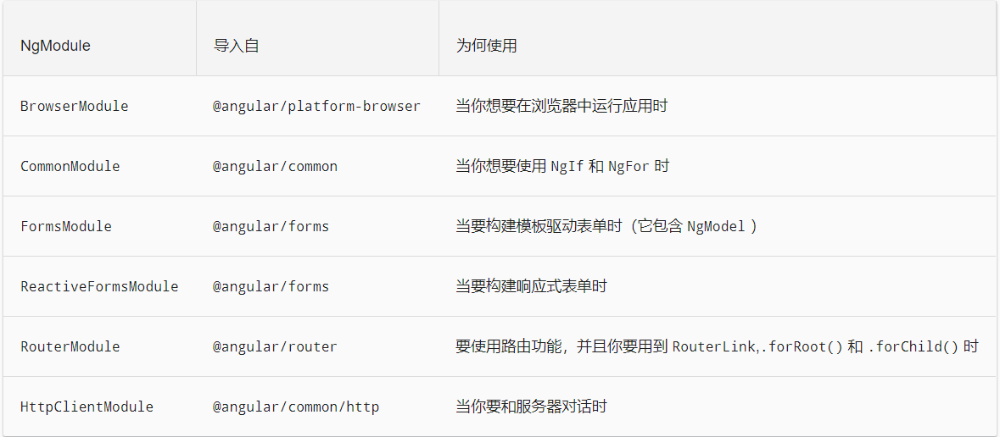
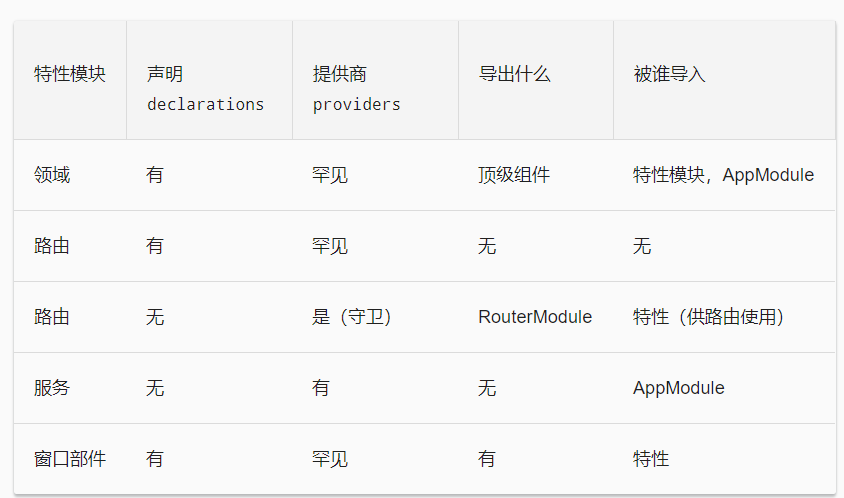

# 模块 NgModule
NgModule 把组件、指令和管道打包成内聚的功能块，每个模块聚焦于一个特性区域、业务领域、工作流或通用工具。


- declarations（可声明对象表） —— 那些属于本 NgModule 的组件、指令、管道。
- exports（导出表） —— 那些能在其它模块的组件模板中使用的可声明对象的子集。
- imports（导入表） —— 那些导出了本模块中的组件模板所需的类的其它模块。
- providers —— 本模块向全局服务中贡献的那些服务的创建器。 这些服务能被本应用中的任何部分使用。（你也可以在组件级别指定服务提供商，这通常是首选方式。）
- bootstrap —— 应用的主视图，称为根组件。它是应用中所有其它视图的宿主。只有根模块才应该设置这个 bootstrap 属性。
- entryComponents —— Angular 会自动把模块的 bootstrap 中的组件和路由定义中的组件添加到 entryComponents 列表。


# 常用模块



当你使用这些 Angular 模块时，在 AppModule（或适当的特性模块）中导入它们，并把它们列在当前 @NgModule 的 imports 数组中。比如，在 Angular CLI 生成的基本应用中，`BrowserModule` 会在 `app.module.ts` 中 AppModule 的顶部最先导入。

## BrowserModule 和 CommonModule
- `BrowserModule` 导入了 `CommonModule`，它贡献了很多通用的指令，比如 `ngIf` 和 `ngFor`。 另外，`BrowserModule` 重新导出了 `CommonModule`，以便它所有的指令在任何导入了 `BrowserModule` 的模块中都可以使用。
- 对于运行在浏览器中的应用来说，都必须在根模块中 `AppModule` 导入 `BrowserModule` ，因为它提供了启动和运行浏览器应用时某些必须的服务。`BrowserModule` 的提供商是面向整个应用的，所以它只能在根模块中使用，而不是特性模块。 特性模块只需要 `CommonModule` 中的常用指令，它们不需要重新安装所有全应用级的服务。
- 如果你把 `BrowserModule` 导入了惰性加载的特性模块中，Angular 就会返回一个错误，并告诉你要改用 `CommonModule`。


# 特性模块 Feature Modules
特性模块提供了聚焦于特定应用需求的一组功能，比如用户工作流、路由或表单。 虽然你也可以用根模块做完所有事情，不过特性模块可以帮助你把应用划分成一些聚焦的功能区。特性模块通过它提供的服务以及共享出的组件、指令和管道来与根模块和其它模块合作。

特性模块的五个常用分类，包括五组
- 领域特性模块。
- 带路由的特性模块。
- 路由模块。
- 服务特性模块
- 可视部件特性模块。




# 单例服务
Angular 中有两种方式来生成单例服务：
- 把 `@Injectable()` 的 `providedIn` 属性声明为 `root`。从 Angular 6.0 开始，创建单例服务的首选方式就是在那个服务类的 `@Injectable` 装饰器上把 `providedIn` 设置为 `root`。这会告诉 Angular 在应用的根上提供此服务。
```
// src/app/user.service.ts
import { Injectable } from '@angular/core';

@Injectable({
  providedIn: 'root',
})
export class UserService {
}
```
- 把该服务包含在 `AppModule` 或某个只会被 AppModule 导入的模块中。


## forRoot() 模式
如果模块同时定义了 `providers`（服务）和 `declarations`（组件、指令、管道），那么，当你同时在多个特性模块中加载此模块时，这些服务就会被注册在多个地方。这会导致出现多个服务实例，并且该服务的行为不再像单例一样。有多种方式来防止这种现象：
- 用 `providedIn` 语法代替在模块中注册服务的方式。
- 把你的服务分离到它们自己的模块中。
- 在模块中分别定义 `forRoot()` 和 `forChild()` 方法。


# 惰性加载的特性模块
要想建立一个惰性加载的特性模块，有三个主要步骤：
- 创建该特性模块。
- 创建该特性模块的路由模块。
- 配置相关路由。


