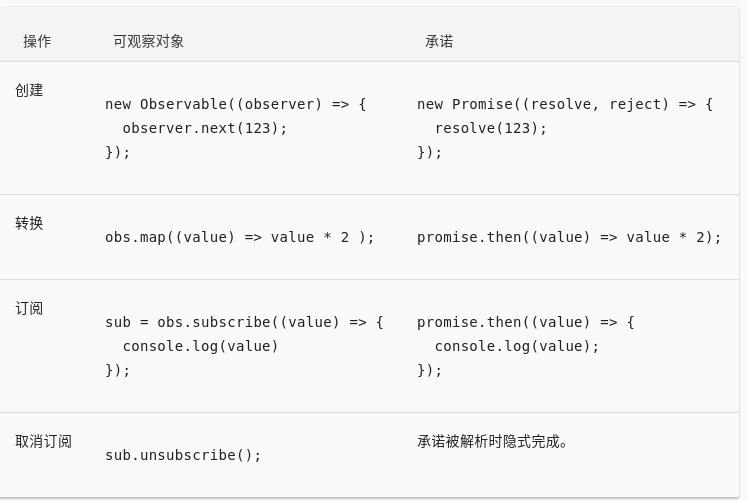
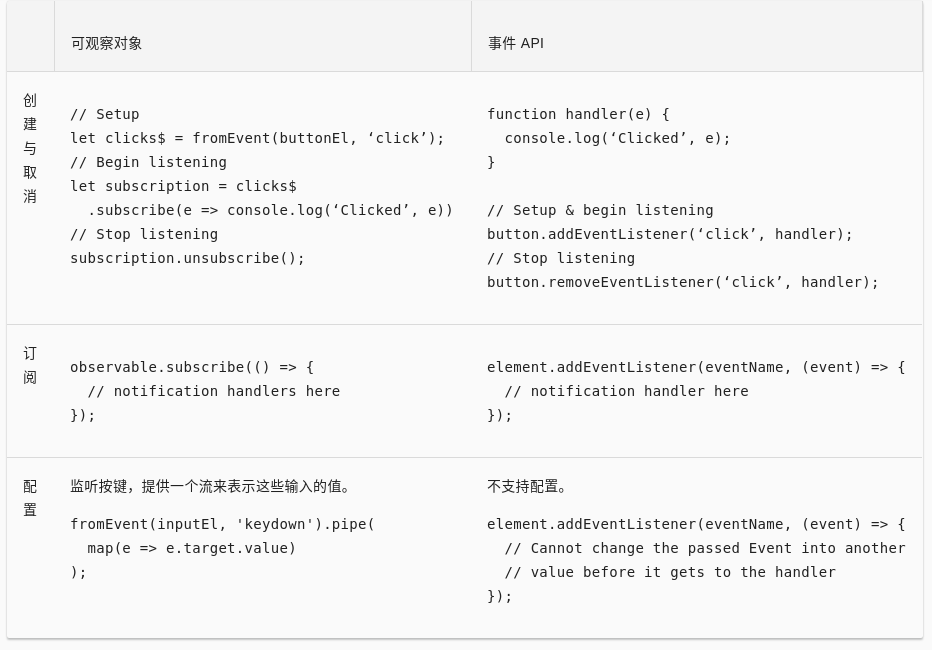
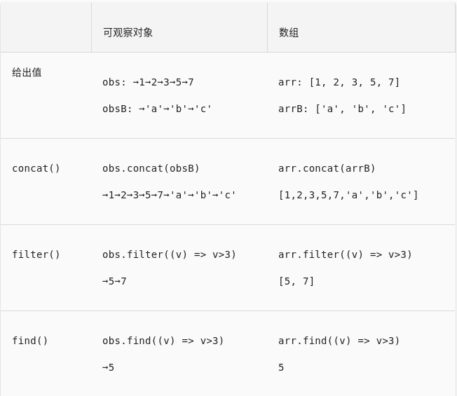
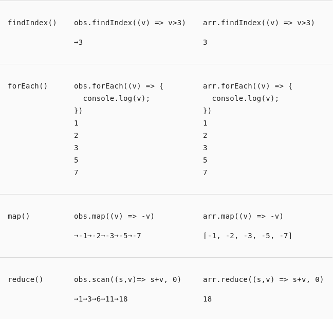

# Observable
- 可观察对象支持在应用中的发布者和订阅者之间传递消息。 
- 在需要进行事件处理、异步编程和处理多个值的时候，可观察对象相对其它技术有着显著的优点。
- Observable 在有人订阅之前什么都不会做。


## 基本用法和词汇
作为发布者，你创建一个 Observable 的实例，其中定义了一个订阅者（`subscriber`）函数。 当有消费者调用 `subscribe()` 方法时，这个函数就会执行。 订阅者函数用于定义“如何获取或生成那些要发布的值或消息”。

要执行所创建的可观察对象，并开始从中接收通知，你就要调用它的 `subscribe()` 方法，并传入一个观察者（`observer`）。 这是一个 JavaScript 对象，它定义了你收到的这些消息的处理器（`handler`）。 `subscribe()` 调用会返回一个 Subscription 对象，该对象具有一个 `unsubscribe()` 方法。 当调用该方法时，你就会停止接收通知。


## 定义观察者 observers
用于接收可观察对象通知的处理器要实现 `Observer` 接口。这个对象定义了一些回调函数来处理可观察对象可能会发来的三种通知：
- `next`        必要。用来处理每个送达值。在开始执行后可能执行零次或多次。
- `error`       可选。用来处理错误通知。错误会中断这个可观察对象实例的执行过程。
- `complete`    可选。用来处理执行完毕（`complete`）通知。当执行完毕后，这些值就会继续传给下一个处理器。


## 订阅 Subscribing
只有当有人订阅 `Observable` 的实例时，它才会开始发布值。 订阅时要先调用该实例的 `subscribe()` 方法，并把一个观察者对象传给它，用来接收通知。

为了展示订阅的原理，我们需要创建新的可观察对象。它有一个构造函数可以用来创建新实例，但是为了更简明，也可以使用 `Observable` 上定义的一些静态方法来创建一些常用的简单可观察对象：
- `of(...items)` —— 返回一个 `Observable` 实例，它用同步的方式把参数中提供的这些值发送出来。
- `from(iterable)` —— 把它的参数转换成一个 `Observable` 实例。 该方法通常用于把一个数组转换成一个（发送多个值的）可观察对象。


`subscribe()` 方法还可以接收定义在同一行中的回调函数，无论 `next`、`error` 还是 `complete` 处理器。

`next()` 函数可以接受消息字符串、事件对象、数字值或各种结构，具体类型取决于上下文。 为了更通用一点，我们把由可观察对象发布出来的数据统称为流。任何类型的值都可以表示为可观察对象，而这些值会被发布为一个流。

作为一条通用的规则，`Observable` 在有人订阅之前什么都不会做。


## 创建可观察对象
使用 `Observable` 构造函数可以创建任何类型的可观察流。 当执行可观察对象的 `subscribe()` 方法时，这个构造函数就会把它接收到的参数作为订阅函数来运行。 订阅函数会接收一个 `Observer` 对象，并把值发布给观察者的 `next()` 方法。


## 多播
多播用来让可观察对象在一次执行中同时广播给多个订阅者。借助支持多播的可观察对象，你不必注册多个监听器，而是复用第一个（`next`）监听器，并且把值发送给各个订阅者。


## 错误处理
由于可观察对象会异步生成值，所以用 `try/catch` 是无法捕获错误的。你应该在观察者中指定一个 `error` 回调来处理错误。发生错误时还会导致可观察对象清理现有的订阅，并且停止生成值。可观察对象可以生成值（调用 `next` 回调），也可以调用 `complete` 或 `error` 回调来主动结束。


# RxJS
RxJS 提供了一种对 `Observable` 类型的实现，直到 `Observable` 成为了 JavaScript 语言的一部分并且浏览器支持它之前，它都是必要的。这个库还提供了一些工具函数，用于创建和使用可观察对象。这些工具函数可用于：
- 把现有的异步代码转换成可观察对象
- 迭代流中的各个值
- 把这些值映射成其它类型
- 对流进行过滤
- 组合多个流


## 创建可观察对象的函数 Observable creation functions
RxJS 提供了一些用来创建可观察对象的函数。这些函数可以简化根据某些东西创建可观察对象的过程，比如事件、定时器、承诺等等。


## 操作符 Operators
操作符是基于可观察对象构建的一些对集合进行复杂操作的函数。RxJS 定义了一些操作符，比如 `map()`、`filter()`、`concat()` 和 `flatMap()`。

- 操作符接受一些配置项，然后返回一个以来源可观察对象为参数的函数。当执行这个返回的函数时，这个操作符会观察来源可观察对象中发出的值，转换它们，并返回由转换后的值组成的新的可观察对象。
- 你可以使用管道来把这些操作符链接起来。管道让你可以把多个由操作符返回的函数组合成一个。pipe() 函数以你要组合的这些函数作为参数，并且返回一个新的函数，当执行这个新函数时，就会顺序执行那些被组合进去的函数。
- `pipe()` 函数也同时是 RxJS 的 Observable 上的一个方法，所以你可以用下列简写形式来达到同样的效果：
```
import { filter, map } from 'rxjs/operators';

const squareOdd = of(1, 2, 3, 4, 5)
  .pipe(
    filter(n => n % 2 !== 0),
    map(n => n * n)
  );

// Subscribe to get values
squareOdd.subscribe(x => console.log(x));
```

### 常用操作符
- 创建 from,fromEvent, of / from, fromPromise,fromEvent, of
- 组合 combineLatest, concat, merge, startWith , withLatestFrom, zip
- 过滤 debounceTime, distinctUntilChanged, filter, take, takeUntil
- 转换 bufferTime, concatMap, map, mergeMap, scan, switchMap
- 工具 tap
- 多播 share


`tap`操作符会查看 `Observable` 中的值，使用那些值做一些事情，并且把它们传出来。 这种 `tap` 回调不会改变这些值本身。


## 错误处理
除了可以在订阅时提供 `error()` 处理器外，`RxJS` 还提供了 `catchError` 操作符，它允许你在管道中处理已知错误。

### 重试失败的可观察对象
- `catchError` 提供了一种简单的方式进行恢复，而 `retry` 操作符让你可以尝试失败的请求。
- 可以在 catchError 之前使用 retry 操作符。它会订阅到原始的来源可观察对象，它可以重新运行导致结果出错的动作序列。如果其中包含 HTTP 请求，它就会重新发起那个 HTTP 请求。


## 可观察对象的命名约定
- 虽然 Angular 框架并没有针对可观察对象的强制性命名约定，不过你经常会看到可观察对象的名字以“$”符号结尾。
- 如果你希望用某个属性来存储来自可观察对象的最近一个值，它的命名惯例是与可观察对象同名，但不带“$”后缀。


# Angular 中的可观察对象
Angular 使用可观察对象作为处理各种常用异步操作的接口。比如：
- `EventEmitter` 类派生自 `Observable`
- `HTTP` 模块使用可观察对象来处理 `AJAX` 请求和响应
- 路由器和表单模块使用可观察对象来监听对用户输入事件的响应


## 事件发送器 EventEmitter
Angular 提供了一个 `EventEmitter` 类，它用来从组件的 `@Output()` 属性中发布一些值。`EventEmitter` 扩展了 `Observable`，并添加了一个 `emit()` 方法，这样它就可以发送任意值了。当你调用 `emit()` 时，就会把所发送的值传给订阅上来的观察者的 `next()` 方法。

## HTTP
Angular 的 `HttpClient` 从 `HTTP` 方法调用中返回了可观察对象。例如，http.get(‘/api’) 就会返回可观察对象。相对于基于承诺（`Promise`）的 HTTP API，它有一系列优点：
- 可观察对象不会修改服务器的响应（和在承诺上串联起来的 .`then()` 调用一样）。反之，你可以使用一系列操作符来按需转换这些值。
- HTTP 请求是可以通过 `unsubscribe()` 方法来取消的。
- 请求可以进行配置，以获取进度事件的变化。
- 失败的请求很容易重试。


## Async 管道
AsyncPipe 会订阅一个可观察对象或承诺，并返回其发出的最后一个值。当发出新值时，该管道就会把这个组件标记为需要进行变更检查的（译注：因此可能导致刷新界面）。
```
@Component({
  selector: 'async-observable-pipe',
  template: `
    <div>
        <code>observable|async</code>:
        Time: {{ time | async }}
    </div>
    `
})
export class AsyncObservablePipeComponent {
  time = new Observable(observer =>
    setInterval(() => observer.next(new Date().toString()), 1000)
  );
}
```


## 路由器 (router)
Router.events 以可观察对象的形式提供了其事件。 你可以使用 RxJS 中的 `filter()` 操作符来找到感兴趣的事件，并且订阅它们，以便根据浏览过程中产生的事件序列作出决定。 
```
import { Router, NavigationStart } from '@angular/router';
import { filter } from 'rxjs/operators';

@Component({
  selector: 'app-routable',
  templateUrl: './routable.component.html',
  styleUrls: ['./routable.component.css']
})
export class Routable1Component implements OnInit {

  navStart: Observable<NavigationStart>;

  constructor(private router: Router) {
    // Create a new Observable that publishes only the NavigationStart event
    this.navStart = router.events.pipe(
      filter(evt => evt instanceof NavigationStart)
    ) as Observable<NavigationStart>;
  }

  ngOnInit() {
    this.navStart.subscribe(evt => console.log('Navigation Started!'));
  }
}
```
ActivatedRoute 是一个可注入的路由器服务，它使用可观察对象来获取关于路由路径和路由参数的信息。比如，ActivateRoute.url 包含一个用于汇报路由路径的可观察对象。例子如下
```
import { ActivatedRoute } from '@angular/router';

@Component({
  selector: 'app-routable',
  templateUrl: './routable.component.html',
  styleUrls: ['./routable.component.css']
})
export class Routable2Component implements OnInit {
  constructor(private activatedRoute: ActivatedRoute) {}

  ngOnInit() {
    this.activatedRoute.url
      .subscribe(url => console.log('The URL changed to: ' + url));
  }
}
```


## 响应式表单 (reactive forms)
响应式表单具有一些属性，它们使用可观察对象来监听表单控件的值。 `FormControl` 的 `valueChanges` 属性和 `statusChanges` 属性包含了会发出变更事件的可观察对象。订阅可观察的表单控件属性是在组件类中触发应用逻辑的途径之一。
```
import { FormGroup } from '@angular/forms';

@Component({
  selector: 'my-component',
  template: 'MyComponent Template'
})
export class MyComponent implements OnInit {
  nameChangeLog: string[] = [];
  heroForm: FormGroup;

  ngOnInit() {
    this.logNameChange();
  }

  logNameChange() {
    const nameControl = this.heroForm.get('name');
    nameControl.valueChanges.forEach(
      (value: string) => this.nameChangeLog.push(value)
    );
  }
}
```


# 用法实战
## Example1 输入提示建议 Type-ahead suggestions
可观察对象可以简化输入提示建议的实现方式。典型的输入提示要完成一系列独立的任务：
- 从输入中监听数据。
- 移除输入值前后的空白字符，并确认它达到了最小长度。
- 防抖（这样才能防止连续按键时每次按键都发起 API 请求，而应该等到按键出现停顿时才发起）
- 如果输入值没有变化，则不要发起请求（比如按某个字符，然后快速按退格）。
- 如果已发出的 AJAX 请求的结果会因为后续的修改而变得无效，那就取消它。

完全用 JavaScript 的传统写法实现这个功能可能需要大量的工作。使用可观察对象，你可以使用这样一个 RxJS 操作符的简单序列：
```
import { fromEvent } from 'rxjs';
import { ajax } from 'rxjs/ajax';
import { map, filter, debounceTime, distinctUntilChanged, switchMap } from 'rxjs/operators';

const searchBox = document.getElementById('search-box');

const typeahead = fromEvent(searchBox, 'input').pipe(
  map((e: KeyboardEvent) => e.target.value),
  filter(text => text.length > 2),
  debounceTime(10),
  distinctUntilChanged(),
  switchMap(() => ajax('/api/endpoint'))
);

typeahead.subscribe(data => {
 // Handle the data from the API
});
```


## Example2 指数化退避 Exponential backoff
指数化退避是一种失败后重试 API 的技巧，它会在每次连续的失败之后让重试时间逐渐变长，超过最大重试次数之后就会彻底放弃。 如果使用承诺和其它跟踪 AJAX 调用的方法会非常复杂，而使用可观察对象，这非常简单：

```
import { pipe, range, timer, zip } from 'rxjs';
import { ajax } from 'rxjs/ajax';
import { retryWhen, map, mergeMap } from 'rxjs/operators';

function backoff(maxTries, ms) {
 return pipe(
   retryWhen(attempts => zip(range(1, maxTries), attempts)
     .pipe(
       map(([i]) => i * i),
       mergeMap(i =>  timer(i * ms))
     )
   )
 );
}

ajax('/api/endpoint')
  .pipe(backoff(3, 250))
  .subscribe(data => handleData(data));

function handleData(data) {
  // ...
}
```


# 可观察对象与其它技术的比较
## Observables vs. promises
- Observables是声明式的，在被订阅之前，它不会开始执行。promises是在创建时就立即执行的。这让Observables可用于定义那些应该按需执行的菜谱。
- Observables能提供多个值。promises只提供一个。这让Observables可用于随着时间的推移获取多个值。
- Observables会区分串联处理和订阅语句。promises只有 .then() 语句。这让Observables可用于创建供系统的其它部分使用而不希望立即执行的复杂菜谱。
- Observables的 `subscribe()` 会负责处理错误。promises会把错误推送给它的子promises。这让Observables可用于进行集中式、可预测的错误处理。

### 创建与订阅 Creation and subscription
- 在有消费者订阅之前，可观察对象不会执行。subscribe() 会执行一次定义好的行为，并且可以再次调用它。每次订阅都是单独计算的。重新订阅会导致重新计算这些值。
- 承诺会立即执行，并且只执行一次。当承诺创建时，会立即计算出结果。没有办法重新做一次。所有的 then 语句（订阅）都会共享同一次计算。

### 串联 Chaining
- 可观察对象会区分各种转换函数，比如映射和订阅。只有订阅才会激活订阅者函数，以开始计算那些值。
- 承诺并不区分最后的 `.then()` 语句（等价于订阅）和中间的 `.then()` 语句（等价于映射）。

### 可取消 Cancellation
- 可观察对象的订阅是可取消的。取消订阅会移除监听器，使其不再接受将来的值，并通知订阅者函数取消正在进行的工作。
- 承诺是不可取消的。

### 错误处理 Error handling
- 可观察对象的错误处理工作交给了订阅者的错误处理器，并且该订阅者会自动取消对这个可观察对象的订阅。
- 承诺会把错误推给其子承诺。




## 可观察对象 vs. 事件 events API
可观察对象和事件 API 中的事件处理器很像。这两种技术都会定义通知处理器，并使用它们来处理一段时间内传递的多个值。订阅可观察对象与添加事件处理器是等价的。一个显著的不同是你可以配置可观察对象，使其在把事件传给事件处理器之间先进行转换。
使用可观察对象来处理错误和异步操作在 HTTP 请求这样的场景下更加具有一致性。




## 可观察对象 vs. arrays
可观察对象会随时间生成值。数组是用一组静态的值创建的。某种意义上，可观察对象是异步的，而数组是同步的。 在下列例子中，➞ 符号表示异步传递值。




