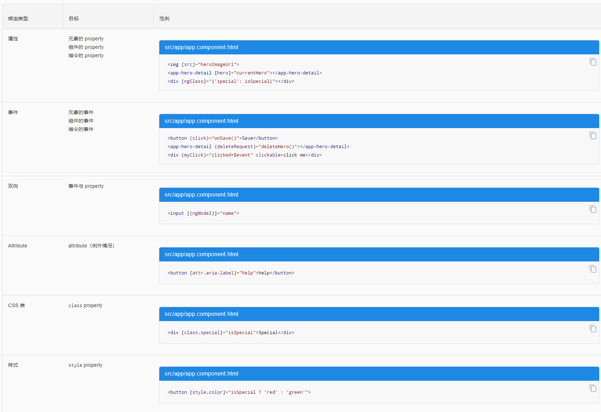

# 数据绑定(data binding)
数据绑定，就不再跟 `HTML attribute` 打交道了。 这里不是设置 `attribute`，而是设置 DOM 元素、组件和指令的 `property`。模板绑定是通过 `property` 和事件来工作的，而不是 `attribute`。`attribute` 初始化 `DOM property`，然后它们的任务就完成了。`property` 的值可以改变；`attribute` 的值不能改变。


## 插值表达式 interpolation
所谓 "插值" 是指将表达式嵌入到标记文本中。
- 要使用插值表达式，就把属性名包裹在双花括号里放进视图模板，如 {{myHero}}。
- 当这些属性发生变化时，Angular 就会自动刷新显示。
```
<p>{{title}}</p>
<div></div>
```

## 模板表达式 Template expressions
- 模板表达式会产生一个值，并出现在双花括号 `{{ }}` 中。 Angular 执行这个表达式，并把它赋值给绑定目标的属性，这个绑定目标可能是 `HTML 元素、组件或指令`。
- 在属性绑定中会再次看到模板表达式，它出现在 = 右侧的引号中，就像这样：`[property]="expression"`

不合法的模板表达式
- 赋值 `(=, +=, -=, ...)`
- `new`、`typeof`、`instanceof` 等操作符。
- 使用 `;` 或 `, `串联起来的表达式
- 自增和自减运算符：`++` 和 `--`
- 一些 ES2015+ 版本的操作符
- 位运算，比如 `|` 和 `&`
- 新的模板表达式运算符，比如 `|`、`?`. 和 `!`。


### 表达式上下文 expression context
典型的表达式上下文就是这个组件实例.表达式的上下文可以包括组件之外的对象。 比如模板输入变量 (let customer)和模板引用变量(#customerInput)就是备选的上下文对象之一。
```
<ul>
  <li *ngFor="let customer of customers">{{customer.name}}</li>
</ul>

<label>Type something:
  <input #customerInput>{{customerInput.value}}
</label>
```

### 模板表达式操作符 Template expression operators
#### 管道操作符 ( `|` )
管道是一个简单的函数，它接受一个输入值，并返回转换结果。
 
#### 安全导航操作符 ( `?.` )
Angular 的安全导航操作符 (?.) 是一种流畅而便利的方式，用来保护出现在属性路径中 null 和 undefined 值。
```
The current hero's name is {{currentHero?.name}}
```

也可以通过用NgIf代码环绕它来解决这个问题
```
<div *ngIf="nullHero">The null hero's name is {{nullHero.name}}</div>
```

还可以尝试通过 `&&` 来把属性路径的各部分串起来，让它在遇到第一个空值的时候，就返回空。
```
The null hero's name is {{nullHero && nullHero.name}}
```

#### 非空断言操作符（`!`）
非空断言操作符不会防止出现 null 或 undefined。 它只是告诉 TypeScript 的类型检查器对特定的属性表达式，不做 "严格空值检测"。
```
<div *ngIf="hero">
  The hero's name is {{hero!.name}}
</div>
```


## 模板语句(template statement)
模板语句用来响应由绑定目标（如 HTML 元素、组件或指令）触发的事件。`(event)="statement"`
```
<button (click)="deleteHero()">Delete hero</button>
```
- 模板语句有副作用。 这是事件处理的关键。因为你要根据用户的输入更新应用状态。
- 模板语句解析器和模板表达式解析器有所不同，特别之处在于它支持基本赋值 (`=`) 和表达式链 (`;` 和 `,`)。

不合法的有：
- new 运算符
- 自增和自减运算符：++ 和 --
- 操作并赋值，例如 += 和 -=
- 位操作符 | 和 &
- 模板表达式运算符


### 语句上下文(Statement context)
典型的语句上下文就是当前组件的实例。
- 语句只能引用语句上下文中 —— 通常是正在绑定事件的那个组件实例。
- `(click)="deleteHero()"` 中的 `deleteHero` 就是这个数据绑定组件上的一个方法。
- 模板上下文中的变量名的优先级高于组件上下文中的变量名。
- 模板语句不能引用全局命名空间的任何东西。比如不能引用 `window` 或 `document`，也不能调用 `console.log` 或 `Math.max`
- 语句上下文可以引用模板自身上下文中的属性。
```
<button (click)="onSave($event)">Save</button>
<button *ngFor="let hero of heroes" (click)="deleteHero(hero)">{{hero.name}}</button>
<form #heroForm (ngSubmit)="onSubmit(heroForm)"> ... </form>
```


## 绑定目标 Binding targets
数据绑定的目标是 DOM 中的某些东西。 这个目标可能是（元素/组件/指令的）`property`、（元素/组件/指令的）`事件`，或(极少数情况下) `attribute` 名。




## 属性绑定 ( `[属性名]` ) 
- 最常用的属性绑定是把元素属性设置为组件属性的值
- 人们经常把属性绑定描述成单向数据绑定，因为值的流动是单向的，从组件的数据属性流动到目标元素的属性。
```

<button [disabled]="isUnchanged">Cancel is disabled</button>
// 设置指令的属性
<div [ngClass]="classes">[ngClass] binding to the classes property</div>
// 设置自定义组件的模型属性（这是父子组件之间通讯的重要途径）
<app-hero-detail [hero]="currentHero"></app-hero-detail>
```


## 事件绑定 Event binding 
事件绑定允许你侦听某些事件，比如按键、鼠标移动、点击和触屏。

### 使用 EventEmitter 实现自定义事件
指令使用 `Angular EventEmitter` 来触发自定义事件。 指令创建一个 `EventEmitter` 实例，并且把它作为属性暴露出来。 指令调用 `EventEmitter.emit(payload)` 来触发事件，可以传入任何东西作为消息载荷。 父指令通过绑定到这个属性来监听事件，并通过 `$event` 对象来访问载荷。


## 双向数据绑定 ( `[(...)]` )
- 显示数据属性，并在用户作出更改时更新该属性。在元素层面上，既要设置元素属性，又要监听元素事件变化。
- 双向数据绑定语法：`[(x)]`。 `[(x)]` 语法结合了属性绑定的方括号 `[x]` 和事件绑定的圆括号 `(x)`。
