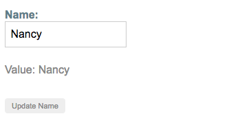
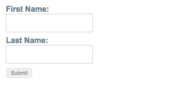
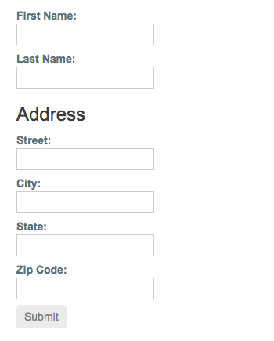
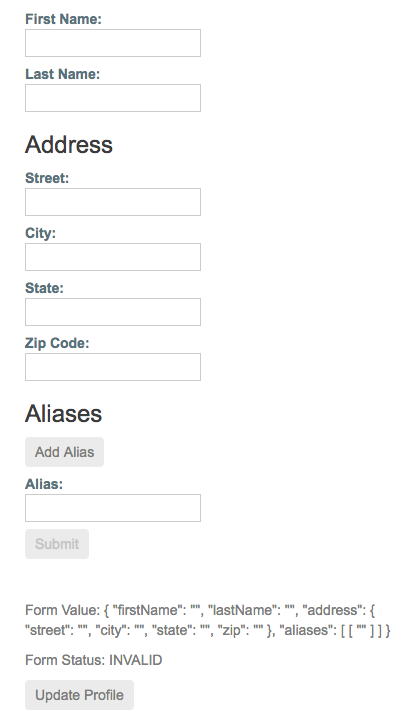

# Reactive Forms
- 响应式表单使用显式的、不可变的方式，管理表单在特定的时间点上的状态。对表单状态的每一次变更都会返回一个新的状态，这样可以在变化时维护模型的整体性。响应式表单是围绕 Observable 的流构建的，表单的输入和值都是通过这些输入值组成的流来提供的，它可以同步访问。
- 响应式表单还提供了一种更直观的测试路径，因为在请求时你可以确信这些数据是一致的、可预料的。这个流的任何一个消费者都可以安全地操纵这些数据。
- 响应式表单与模板驱动的表单有着显著的不同点。响应式表单通过对数据模型的同步访问提供了更多的可预测性，使用 Observable 的操作符提供了不可变性，并且通过 Observable 流提供了变化追踪功能。 如果你更喜欢在模板中直接访问数据，那么模板驱动的表单会显得更明确，因为它们依赖嵌入到模板中的指令，并借助可变数据来异步跟踪变化。参见表单概览来了解这两种范式之间的详细比较。


# Form
导入 ReactiveFormsModule 并把它添加到你的 NgModule 的 imports 数组中。
```
import { ReactiveFormsModule } from '@angular/forms';

@NgModule({
  imports: [
    // other imports ...
    ReactiveFormsModule
  ],
})
export class AppModule { }
```

生成并导入一个新的表单控件 `ng generate component NameEditor`
```
// src/app/name-editor/name-editor.component.ts
import { Component } from '@angular/core';
import { FormControl } from '@angular/forms';

@Component({
  selector: 'app-name-editor',
  templateUrl: './name-editor.component.html',
  styleUrls: ['./name-editor.component.css']
})
export class NameEditorComponent {
  name = new FormControl('');
  
  updateName() {
    this.name.setValue('Nancy');
  }
}

// src/app/name-editor/name-editor.component.html
<label>
  Name:
  <input type="text" [formControl]="name">
</label>
<p>
  Value: {{ name.value }}
</p>

<p>
  <button (click)="updateName()">Update Name</button>
</p>

// src/app/app.component.html (name editor)
<app-name-editor></app-name-editor>
```

然后就可以看到



# Form Group
就像 FormControl 的实例能让你控制单个输入框所对应的控件一样，FormGroup 的实例也能跟踪一组 FormControl 实例（比如一个表单）的表单状态。
```
ng generate component ProfileEditor


// src/app/profile-editor/profile-editor.component.ts (form group)
import { Component } from '@angular/core';
import { FormGroup, FormControl } from '@angular/forms';

@Component({
  selector: 'app-profile-editor',
  templateUrl: './profile-editor.component.html',
  styleUrls: ['./profile-editor.component.css']
})
export class ProfileEditorComponent {
  profileForm = new FormGroup({
    firstName: new FormControl(''),
    lastName: new FormControl(''),
  });
  
  onSubmit() {
    // TODO: Use EventEmitter with form value
    console.warn(this.profileForm.value);
  }
}


// src/app/profile-editor/profile-editor.component.html (template form group)
<form [formGroup]="profileForm" (ngSubmit)="onSubmit()">
  
  <label>
    First Name:
    <input type="text" formControlName="firstName">
  </label>

  <label>
    Last Name:
    <input type="text" formControlName="lastName">
  </label>
  
  <button type="submit" [disabled]="!profileForm.valid">Submit</button>

</form>


// src/app/app.component.html (profile editor)
<app-profile-editor></app-profile-editor>
```

此时可以看到




## 嵌套的表单组
FormGroup 可以同时接纳 FormControl 和 FormGroup 作为子控件。
```
// src/app/profile-editor/profile-editor.component.ts (nested form group)
import { Component } from '@angular/core';
import { FormGroup, FormControl } from '@angular/forms';

@Component({
  selector: 'app-profile-editor',
  templateUrl: './profile-editor.component.html',
  styleUrls: ['./profile-editor.component.css']
})
export class ProfileEditorComponent {
  profileForm = new FormGroup({
    firstName: new FormControl(''),
    lastName: new FormControl(''),
    address: new FormGroup({
      street: new FormControl(''),
      city: new FormControl(''),
      state: new FormControl(''),
      zip: new FormControl('')
    })
  });
  
  updateProfile() {
    this.profileForm.patchValue({
      firstName: 'Nancy',
      address: {
        street: '123 Drew Street'
      }
    });
  }
}


// src/app/profile-editor/profile-editor.component.html (template form group)
<form [formGroup]="profileForm" (ngSubmit)="onSubmit()">
  
  <label>
    First Name:
    <input type="text" formControlName="firstName">
  </label>

  <label>
    Last Name:
    <input type="text" formControlName="lastName">
  </label>
  
  <div formGroupName="address">
    <h3>Address</h3>
  
    <label>
      Street:
      <input type="text" formControlName="street">
    </label>
  
    <label>
      City:
      <input type="text" formControlName="city">
    </label>
    
    <label>
      State:
      <input type="text" formControlName="state">
    </label>
  
    <label>
      Zip Code:
      <input type="text" formControlName="zip">
    </label>
  </div>
  
  <p>
    <button (click)="updateProfile()">Update Profile</button>
  </p>
  
  <button type="submit" [disabled]="!profileForm.valid">Submit</button>

</form>
```

此时可以看到




两种更新模型值的方式：
- 使用 `setValue()` 方法来为单个控件设置新值。 `setValue()` 方法会严格遵循表单组的结构，并整体性替换控件的值。
- 使用 `patchValue()` 方法可以用对象中所定义的任何属性为表单模型进行替换。


# FormBuilder
当需要与多个表单打交道时，手动创建多个表单控件实例会非常繁琐。FormBuilder 服务提供了一些便捷方法来生成表单控件。FormBuilder 在幕后也使用同样的方式来创建和返回这些实例，只是用起来更简单。

## Step 1: Importing the FormBuilder class
```
// src/app/profile-editor/profile-editor.component.ts (import)
import { FormBuilder } from '@angular/forms';
```

## Step 2: Injecting the FormBuilder service
```
constructor(private fb: FormBuilder) { }
```

## Step 3: Generating form controls
FormBuilder 服务有三个方法：`control()`、`group()` 和 `array()`。这些方法都是工厂方法，用于在组件类中分别生成 `FormControl`、`FormGroup` 和 `FormArray`。

用 `group` 方法来创建 `profileForm` 控件。
```
// src/app/profile-editor/profile-editor.component.ts (form builder)
import { Component } from '@angular/core';
import { FormBuilder } from '@angular/forms';

@Component({
  selector: 'app-profile-editor',
  templateUrl: './profile-editor.component.html',
  styleUrls: ['./profile-editor.component.css']
})
export class ProfileEditorComponent {
  profileForm = this.fb.group({
    firstName: [''],
    lastName: [''],
    address: this.fb.group({
      street: [''],
      city: [''],
      state: [''],
      zip: ['']
    }),
  });

  constructor(private fb: FormBuilder) { }
}
```


## 简单表单验证
Step 1: Importing a validator function
```
// src/app/profile-editor/profile-editor.component.ts (import)
import { Validators } from '@angular/forms';
```

// Step 2: Making a field required
```
profileForm = this.fb.group({
  firstName: ['', Validators.required],
  lastName: [''],
  address: this.fb.group({
    street: [''],
    city: [''],
    state: [''],
    zip: ['']
  }),
});
```

HTML5 有一组内置的属性，用来进行原生验证，包括 required、minlength、maxlength 等。虽然是可选的，不过你也可以在表单的输入元素上把它们添加为附加属性来使用它们。这里我们把 required 属性添加到 firstName 输入元素上。

```
// src/app/profile-editor/profile-editor.component.html (required attribute)
<input type="text" formControlName="firstName" required>
```

### 显示表单状态
当你往表单控件上添加了一个必填字段时，它的初始值是无效的（invalid）。这种无效状态会传播到其父 FormGroup 元素中，也让这个 FormGroup 的状态变为无效的。你可以通过该 FormGroup 实例的 status 属性来访问其当前状态。
```
// src/app/profile-editor/profile-editor.component.html (display status)
<p>
  Form Status: {{ profileForm.status }}
</p>
```
提交按钮被禁用了，因为 firstName 控件的必填项规则导致了 profileForm 也是无效的。在你填写了 firstName 输入框之后，该表单就变成了有效的，并且提交按钮也启用了。


## 使用表单数组FormArray管理动态控件
- FormArray 是 FormGroup 之外的另一个选择，用于管理任意数量的匿名控件。
- 像 FormGroup 实例一样，你也可以往 FormArray 中动态插入和移除控件，并且 FormArray 实例的值和验证状态也是根据它的子控件计算得来的。 
- 不需要为每个控件定义一个名字作为 key，因此，如果你事先不知道子控件的数量，这就是一个很好的选择。

### Step 1: Importing the FormArray class
```
import { FormArray } from '@angular/forms';
```

### Step 2: Defining a FormArray control
FormGroup 中的这个 aliases 控件现在管理着一个控件，将来还可以动态添加多个。
```
profileForm = this.fb.group({
  firstName: ['', Validators.required],
  lastName: [''],
  address: this.fb.group({
    street: [''],
    city: [''],
    state: [''],
    zip: ['']
  }),
  aliases: this.fb.array([
    this.fb.control('')
  ])
});
```

### Step 3: Accessing the FormArray control
相对于重复使用 profileForm.get() 方法获取每个实例的方式，getter 可以让你轻松访问表单数组各个实例中的别名。 表单数组实例用一个数组来代表未定数量的控件。通过 getter 来访问控件很方便，这种方法还能很容易地重复处理更多控件。

```
// 使用 getter 语法创建类属性 aliases，以从父表单组中接收表示绰号的表单数组控件。
get aliases() {
  return this.profileForm.get('aliases') as FormArray;
}

// 定义一个方法来把一个aliase控件动态插入到绰号 FormArray 中。用 FormArray.push() 方法把该控件添加为数组中的新条目。
addAlias() {
  this.aliases.push(this.fb.control(''));
}
```


### Step 4: Displaying the form array in the template
*ngFor 指令对 aliases FormArray 提供的每个 FormControl 进行迭代。因为 FormArray 中的元素是匿名的，所以你要把索引号赋值给 i 变量，并且把它传给每个控件的 formControlName 输入属性。
```
<div formArrayName="aliases">
  <h3>Aliases</h3> 
  <button (click)="addAlias()">Add Alias</button>

  <div *ngFor="let address of aliases.controls; let i=index">
    <!-- The repeated alias template -->
    <label>
      Alias:
      <input type="text" [formControlName]="i">
    </label>
  </div>
</div>
```
每当新的 alias 加进来时，FormArray 的实例就会基于这个索引号提供它的控件。这将允许你在每次计算根控件的状态和值时跟踪每个控件。


