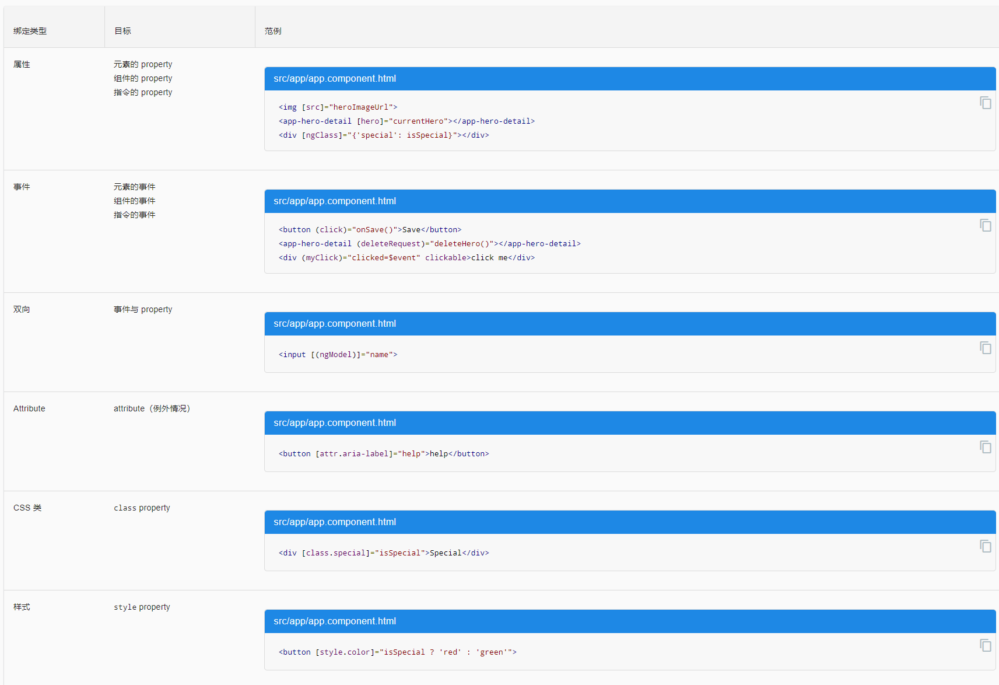

# Install & Start
```
install node.js and npm
npm install -g @angular/cli
ng new my-app
cd my-app
ng serve --open
```


# 模块 NgModule
- declarations（可声明对象表） —— 那些属于本 NgModule 的组件、指令、管道。
- exports（导出表） —— 那些能在其它模块的组件模板中使用的可声明对象的子集。
- imports（导入表） —— 那些导出了本模块中的组件模板所需的类的其它模块。
- providers —— 本模块向全局服务中贡献的那些服务的创建器。 这些服务能被本应用中的任何部分使用。（你也可以在组件级别指定服务提供商，这通常是首选方式。）
- bootstrap —— 应用的主视图，称为根组件。它是应用中所有其它视图的宿主。只有根模块才应该设置这个 bootstrap 属性。


# 组件 component & 模板 template
## Component的组成
- `selector` 一旦在模板 HTML 中找到了这个选择器对应的标签，就创建并插入该组件的一个实例。
- `templateUrl` 该组件的 HTML 模板文件相对于这个组件文件的地址。 另外，你还可以用 `template` 属性的值来提供内联的 HTML 模板
- `styleUrls` 该组件的 `Style` 模板文件相对于这个组件文件的地址。 另外，你还可以内联的 `Style` 模板 或者直接为空
- `Providers`: 当前组件所需的服务的一个数组


## 模板语法
-  `<script>` 元素，它被禁用了
- 有些合法的 `HTML` 被用在模板中是没有意义的。`<html>、<body> 和 <base>` 元素这个舞台上中并没有扮演有用的角色。剩下的所有元素基本上就都一样用了。


# 数据绑定(data binding)
数据绑定，就不再跟 `HTML attribute` 打交道了。 这里不是设置 `attribute`，而是设置 DOM 元素、组件和指令的 `property`。模板绑定是通过 `property` 和事件来工作的，而不是 `attribute`。`attribute` 初始化 `DOM property`，然后它们的任务就完成了。`property` 的值可以改变；`attribute` 的值不能改变。


## 插值表达式 interpolation
所谓 "插值" 是指将表达式嵌入到标记文本中。
- 要使用插值表达式，就把属性名包裹在双花括号里放进视图模板，如 {{myHero}}。
- 当这些属性发生变化时，Angular 就会自动刷新显示。
```
<p>{{title}}</p>
<div></div>
```

## 模板表达式 Template expressions
- 模板表达式会产生一个值，并出现在双花括号 `{{ }}` 中。 Angular 执行这个表达式，并把它赋值给绑定目标的属性，这个绑定目标可能是 `HTML 元素、组件或指令`。
- 在属性绑定中会再次看到模板表达式，它出现在 = 右侧的引号中，就像这样：`[property]="expression"`

不合法的模板表达式
- 赋值 `(=, +=, -=, ...)`
- `new`、`typeof`、`instanceof` 等操作符。
- 使用 `;` 或 `, `串联起来的表达式
- 自增和自减运算符：`++` 和 `--`
- 一些 ES2015+ 版本的操作符
- 位运算，比如 `|` 和 `&`
- 新的模板表达式运算符，比如 `|`、`?`. 和 `!`。


### 表达式上下文 expression context
典型的表达式上下文就是这个组件实例.表达式的上下文可以包括组件之外的对象。 比如模板输入变量 (let customer)和模板引用变量(#customerInput)就是备选的上下文对象之一。
```
<ul>
  <li *ngFor="let customer of customers">{{customer.name}}</li>
</ul>

<label>Type something:
  <input #customerInput>{{customerInput.value}}
</label>
```

### 模板表达式操作符 Template expression operators
#### 管道操作符 ( `|` )
管道是一个简单的函数，它接受一个输入值，并返回转换结果。
 
#### 安全导航操作符 ( `?.` )
Angular 的安全导航操作符 (?.) 是一种流畅而便利的方式，用来保护出现在属性路径中 null 和 undefined 值。
```
The current hero's name is {{currentHero?.name}}
```

也可以通过用NgIf代码环绕它来解决这个问题
```
<div *ngIf="nullHero">The null hero's name is {{nullHero.name}}</div>
```

还可以尝试通过 `&&` 来把属性路径的各部分串起来，让它在遇到第一个空值的时候，就返回空。
```
The null hero's name is {{nullHero && nullHero.name}}
```

#### 非空断言操作符（`!`）
非空断言操作符不会防止出现 null 或 undefined。 它只是告诉 TypeScript 的类型检查器对特定的属性表达式，不做 "严格空值检测"。
```
<div *ngIf="hero">
  The hero's name is {{hero!.name}}
</div>
```


## 模板语句(template statement)
模板语句用来响应由绑定目标（如 HTML 元素、组件或指令）触发的事件。`(event)="statement"`
```
<button (click)="deleteHero()">Delete hero</button>
```
- 模板语句有副作用。 这是事件处理的关键。因为你要根据用户的输入更新应用状态。
- 模板语句解析器和模板表达式解析器有所不同，特别之处在于它支持基本赋值 (`=`) 和表达式链 (`;` 和 `,`)。

不合法的有：
- new 运算符
- 自增和自减运算符：++ 和 --
- 操作并赋值，例如 += 和 -=
- 位操作符 | 和 &
- 模板表达式运算符


### 语句上下文(Statement context)
典型的语句上下文就是当前组件的实例。
- 语句只能引用语句上下文中 —— 通常是正在绑定事件的那个组件实例。
- `(click)="deleteHero()"` 中的 `deleteHero` 就是这个数据绑定组件上的一个方法。
- 模板上下文中的变量名的优先级高于组件上下文中的变量名。
- 模板语句不能引用全局命名空间的任何东西。比如不能引用 `window` 或 `document`，也不能调用 `console.log` 或 `Math.max`
- 语句上下文可以引用模板自身上下文中的属性。
```
<button (click)="onSave($event)">Save</button>
<button *ngFor="let hero of heroes" (click)="deleteHero(hero)">{{hero.name}}</button>
<form #heroForm (ngSubmit)="onSubmit(heroForm)"> ... </form>
```


## 绑定目标 Binding targets
数据绑定的目标是 DOM 中的某些东西。 这个目标可能是（元素/组件/指令的）`property`、（元素/组件/指令的）`事件`，或(极少数情况下) `attribute` 名。




## 属性绑定 ( `[属性名]` ) 
- 最常用的属性绑定是把元素属性设置为组件属性的值
- 人们经常把属性绑定描述成单向数据绑定，因为值的流动是单向的，从组件的数据属性流动到目标元素的属性。
```

<button [disabled]="isUnchanged">Cancel is disabled</button>
// 设置指令的属性
<div [ngClass]="classes">[ngClass] binding to the classes property</div>
// 设置自定义组件的模型属性（这是父子组件之间通讯的重要途径）
<app-hero-detail [hero]="currentHero"></app-hero-detail>
```


## 事件绑定 Event binding 
事件绑定允许你侦听某些事件，比如按键、鼠标移动、点击和触屏。

### 使用 EventEmitter 实现自定义事件
指令使用 `Angular EventEmitter` 来触发自定义事件。 指令创建一个 `EventEmitter` 实例，并且把它作为属性暴露出来。 指令调用 `EventEmitter.emit(payload)` 来触发事件，可以传入任何东西作为消息载荷。 父指令通过绑定到这个属性来监听事件，并通过 `$event` 对象来访问载荷。


## 双向数据绑定 ( `[(...)]` )
- 显示数据属性，并在用户作出更改时更新该属性。在元素层面上，既要设置元素属性，又要监听元素事件变化。
- 双向数据绑定语法：`[(x)]`。 `[(x)]` 语法结合了属性绑定的方括号 `[x]` 和事件绑定的圆括号 `(x)`。


# 服务 service
- 提供用于数据绑定的属性和方法，以便作为视图（由模板渲染）和应用逻辑（通常包含一些模型的概念）的中介者。
- 组件应该把诸如从服务器获取数据、验证用户输入或直接往控制台中写日志等工作委托给各种服务。通过把各种处理任务定义到可注入的服务类中，你可以让它被任何组件使用。 通过在不同的环境中注入同一种服务的不同提供商，你还可以让你的应用更具适应性。
- DI的service在construct内部创建instance的时候，如果需要绑定到模板，就需要public，否则private就可以

```
// src/app/logger.service.ts (class)
export class Logger {
  log(msg: any)   { console.log(msg); }
  error(msg: any) { console.error(msg); }
  warn(msg: any)  { console.warn(msg); }
}
```

## 依赖注入（dependency injection）
- 可以把一个服务注入到组件中，让组件类得以访问该服务类。
- 在 Angular 中，要把一个类定义为服务，就要用 @Injectable() 装饰器来提供元数据，以便让 Angular 可以把它作为依赖注入到组件中。
- 你的应用中所需的任何依赖，都必须使用该应用的注入器来注册一个提供商，以便注入器可以使用这个提供商来创建新实例。 
- 依赖不一定是服务 —— 它还可能是函数或值。


# pipe
- Your templates can use pipes to improve the user experience by transforming values for display. For example, use pipes to display dates and currency values that are appropriate for a user's locale. Angular provides predefined pipes for common transformations, and you can also define your own pipes.


# 指令 Directives
## 结构型指令
结构型指令通过添加、移除或替换 DOM 元素来修改布局。 

### *ngFor 
一个迭代器，它要求 Angular 为 heroes 列表中的每个英雄渲染出一个 `<li>`。

#### 带 trackBy 的 *ngFor
- ngFor 指令有时候会性能较差，特别是在大型列表中。 对一个条目的一丁点改动、移除或添加，都会导致级联的 DOM 操作。
- 指定一个 trackBy，Angular 就可以避免这种折腾。 往组件中添加一个方法，它会返回 NgFor应该追踪的值。 


### *ngIf 
条件语句，只有当选中的英雄存在时，它才会包含 HeroDetail 组件。

- 隐藏子树和用 NgIf 排除子树是截然不同的。当隐藏子树时，它仍然留在 DOM 中。 子树中的组件及其状态仍然保留着。 即使对于不可见属性，Angular 也会继续检查变更。 子树可能占用相当可观的内存和运算资源。
- 当 NgIf 为 false 时，Angular 从 DOM 中物理地移除了这个元素子树。 它销毁了子树中的组件及其状态，也潜在释放了可观的资源，最终让用户体验到更好的性能。
- 显示/隐藏的技术对于只有少量子元素的元素是很好用的，但要当心别试图隐藏大型组件树。相比之下，NgIf 则是个更安全的选择。
- ngIf 指令通常会用来防范空指针错误。 


### *ngSwitch 
一组指令，用来在多个可选视图之间切换。


## 属性型指令
属性型指令会修改现有元素的外观或行为。 在模板中，它们看起来就像普通的 HTML 属性一样，因此得名“属性型指令”。

### NgClass
通过绑定到 NgClass，可以同时添加或移除多个类。

### NgStyle
NgStyle 绑定可以同时设置多个内联样式。

### NgModel 
ngModel 指令就是属性型指令的一个例子，它实现了双向数据绑定。 ngModel 修改现有元素（一般是 <input>）的行为：设置其显示属性值，并响应 change 事件。

- 使用 ngModel 时需要 FormsModule
- 在使用 ngModel 指令进行双向数据绑定之前，你必须导入 FormsModule 并把它添加到 NgModule 的 imports 列表中。 
``` 
<input [(ngModel)]="hero.name">
```



# Http
HttpClient.put() 方法接受三个参数
- URL 地址
- 要修改的数据（这里就是修改后的英雄）
- 选项
ttpClient.get 默认情况下把响应体当做无类型的 JSON 对象进行返回。 如果指定了可选的模板类型 <Hero[]>，就会给返回你一个类型化的对象。


# Observable
- 可观察对象支持在应用中的发布者和订阅者之间传递消息。 
- 在需要进行事件处理、异步编程和处理多个值的时候，可观察对象相对其它技术有着显著的优点。
- Observable 在有人订阅之前什么都不会做。


# RxJS
- tap操作符会查看 Observable 中的值，使用那些值做一些事情，并且把它们传出来。 这种 tap 回调不会改变这些值本身。
- 如果你忘了调用 subscribe()，本服务将不会把这个删除请求发送给服务器。 作为一条通用的规则，Observable 在有人订阅之前什么都不会做。

