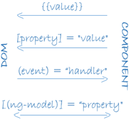

# Install & Start
```
install node.js and npm
npm install -g @angular/cli
ng new my-app
cd my-app
ng serve --open
```


# 模块 NgModule
- declarations（可声明对象表） —— 那些属于本 NgModule 的组件、指令、管道。
- exports（导出表） —— 那些能在其它模块的组件模板中使用的可声明对象的子集。
- imports（导入表） —— 那些导出了本模块中的组件模板所需的类的其它模块。
- providers —— 本模块向全局服务中贡献的那些服务的创建器。 这些服务能被本应用中的任何部分使用。（你也可以在组件级别指定服务提供商，这通常是首选方式。）
- bootstrap —— 应用的主视图，称为根组件。它是应用中所有其它视图的宿主。只有根模块才应该设置这个 bootstrap 属性。


# 组件 component & 模板 template
- selector 一旦在模板 HTML 中找到了这个选择器对应的标签，就创建并插入该组件的一个实例。
- templateUrl 该组件的 HTML 模板文件相对于这个组件文件的地址。 另外，你还可以用 template 属性的值来提供内联的 HTML 模板
- styleUrls 该组件的 Style 模板文件相对于这个组件文件的地址。 另外，你还可以内联的 Style 模板 或者直接为空
- Providers: 当前组件所需的服务的一个数组


## 数据绑定(data binding)
- 数据绑定，就不再跟 HTML attribute 打交道了。 这里不是设置 attribute，而是设置 DOM 元素、组件和指令的 property。模板绑定是通过 property 和事件来工作的，而不是 attribute。
- attribute 初始化 DOM property，然后它们的任务就完成了。property 的值可以改变；attribute 的值不能改变。



### 插值表达式 interpolation (template expression)
所谓 "插值" 是指将表达式嵌入到标记文本中。
- 要使用插值表达式，就把属性名包裹在双花括号里放进视图模板，如 {{myHero}}。
- 当这些属性发生变化时，Angular 就会自动刷新显示。
```
<p>{{title}}</p>
<div></div>
```

#### 表达式上下文
典型的表达式上下文就是这个组件实例.表达式的上下文可以包括组件之外的对象。 比如模板输入变量 (let customer)和模板引用变量(#customerInput)就是备选的上下文对象之一。
```
<ul>
  <li *ngFor="let customer of customers">{{customer.name}}</li>
</ul>

<label>Type something:
  <input #customerInput>{{customerInput.value}}
</label>
```


### 属性绑定
#### 模板语句(template statement)
模板语句用来响应由绑定目标（如 HTML 元素、组件或指令）触发的事件。`(event)="statement"`
```
<button (click)="deleteHero()">Delete hero</button>
```

#### 语句上下文(Statement context)
典型的语句上下文就是当前组件的实例。
- (click)="deleteHero()" 中的 deleteHero 就是这个数据绑定组件上的一个方法。
- 模板上下文中的变量名的优先级高于组件上下文中的变量名。
- 模板语句不能引用全局命名空间的任何东西。比如不能引用 window 或 document，也不能调用 console.log 或 Math.max。


# 服务 service
- 提供用于数据绑定的属性和方法，以便作为视图（由模板渲染）和应用逻辑（通常包含一些模型的概念）的中介者。
- 组件应该把诸如从服务器获取数据、验证用户输入或直接往控制台中写日志等工作委托给各种服务。通过把各种处理任务定义到可注入的服务类中，你可以让它被任何组件使用。 通过在不同的环境中注入同一种服务的不同提供商，你还可以让你的应用更具适应性。
- DI的service在construct内部创建instance的时候，如果需要绑定到模板，就需要public，否则private就可以

```
// src/app/logger.service.ts (class)
export class Logger {
  log(msg: any)   { console.log(msg); }
  error(msg: any) { console.error(msg); }
  warn(msg: any)  { console.warn(msg); }
}
```

## 依赖注入（dependency injection）
- 可以把一个服务注入到组件中，让组件类得以访问该服务类。
- 在 Angular 中，要把一个类定义为服务，就要用 @Injectable() 装饰器来提供元数据，以便让 Angular 可以把它作为依赖注入到组件中。
- 你的应用中所需的任何依赖，都必须使用该应用的注入器来注册一个提供商，以便注入器可以使用这个提供商来创建新实例。 
- 依赖不一定是服务 —— 它还可能是函数或值。


# pipe
- Your templates can use pipes to improve the user experience by transforming values for display. For example, use pipes to display dates and currency values that are appropriate for a user's locale. Angular provides predefined pipes for common transformations, and you can also define your own pipes.


# Directives
结构型指令
结构型指令通过添加、移除或替换 DOM 元素来修改布局。 
- *ngFor 是一个迭代器，它要求 Angular 为 heroes 列表中的每个英雄渲染出一个 `<li>`。
- *ngIf 是个条件语句，只有当选中的英雄存在时，它才会包含 HeroDetail 组件。

属性型指令
属性型指令会修改现有元素的外观或行为。 在模板中，它们看起来就像普通的 HTML 属性一样，因此得名“属性型指令”。
ngModel 指令就是属性型指令的一个例子，它实现了双向数据绑定。 ngModel 修改现有元素（一般是 <input>）的行为：设置其显示属性值，并响应 change 事件。` <input [(ngModel)]="hero.name">`



# Http
HttpClient.put() 方法接受三个参数
- URL 地址
- 要修改的数据（这里就是修改后的英雄）
- 选项
ttpClient.get 默认情况下把响应体当做无类型的 JSON 对象进行返回。 如果指定了可选的模板类型 <Hero[]>，就会给返回你一个类型化的对象。


# Observable
- 可观察对象支持在应用中的发布者和订阅者之间传递消息。 
- 在需要进行事件处理、异步编程和处理多个值的时候，可观察对象相对其它技术有着显著的优点。
- Observable 在有人订阅之前什么都不会做。


# RxJS
- tap操作符会查看 Observable 中的值，使用那些值做一些事情，并且把它们传出来。 这种 tap 回调不会改变这些值本身。
- 如果你忘了调用 subscribe()，本服务将不会把这个删除请求发送给服务器。 作为一条通用的规则，Observable 在有人订阅之前什么都不会做。

