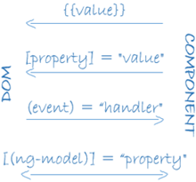

[Install]
- install node.js and npm
- npm install -g @angular/cli

[Start]
ng new my-app
cd my-app
ng serve --open

[cli]
Boolean and enumerated options： Boolean options have two forms: --thisOption sets the flag, --noThisOption clears it.


[NgModule]
- declarations（可声明对象表） —— 那些属于本 NgModule 的组件、指令、管道。
- exports（导出表） —— 那些能在其它模块的组件模板中使用的可声明对象的子集。
- imports（导入表） —— 那些导出了本模块中的组件模板所需的类的其它模块。
- providers —— 本模块向全局服务中贡献的那些服务的创建器。 这些服务能被本应用中的任何部分使用。（你也可以在组件级别指定服务提供商，这通常是首选方式。）
- bootstrap —— 应用的主视图，称为根组件。它是应用中所有其它视图的宿主。只有根模块才应该设置这个 bootstrap 属性。

根模块没有任何理由导出任何东西，因为其它模块永远不需要导入根模块。


[data binding]
```
<li>{{hero.name}}</li> 
<app-hero-detail [hero]="selectedHero"></app-hero-detail>
<li (click)="selectHero(hero)"></li>
```




[pipe]
- Your templates can use pipes to improve the user experience by transforming values for display. For example, use pipes to display dates and currency values that are appropriate for a user's locale. Angular provides predefined pipes for common transformations, and you can also define your own pipes.


[Directives]
结构型指令
结构型指令通过添加、移除或替换 DOM 元素来修改布局。 
- *ngFor 是一个迭代器，它要求 Angular 为 heroes 列表中的每个英雄渲染出一个 `<li>`。
- *ngIf 是个条件语句，只有当选中的英雄存在时，它才会包含 HeroDetail 组件。

属性型指令
属性型指令会修改现有元素的外观或行为。 在模板中，它们看起来就像普通的 HTML 属性一样，因此得名“属性型指令”。
ngModel 指令就是属性型指令的一个例子，它实现了双向数据绑定。 ngModel 修改现有元素（一般是 <input>）的行为：设置其显示属性值，并响应 change 事件。` <input [(ngModel)]="hero.name">`



[service]
- 提供用于数据绑定的属性和方法，以便作为视图（由模板渲染）和应用逻辑（通常包含一些模型的概念）的中介者。
- 组件应该把诸如从服务器获取数据、验证用户输入或直接往控制台中写日志等工作委托给各种服务。通过把各种处理任务定义到可注入的服务类中，你可以让它被任何组件使用。 通过在不同的环境中注入同一种服务的不同提供商，你还可以让你的应用更具适应性。
- DI的service在construct内部创建instance的时候，如果需要绑定到模板，就需要public，否则private就可以


[template]
` <script> `元素，它被禁用了，以阻止脚本注入攻击的风险。
 

- 插值表达式 {{...}}
Angular 对所有双花括号中的表达式求值，把求值的结果转换成字符串，并把它们跟相邻的字符串字面量连接起来。最后，把这个组合出来的插值结果赋给元素或指令的属性。
```
    <div></div>
    <!-- "The sum of 1 + 1 is 2" -->
    <p>The sum of 1 + 1 is {{1 + 1}}.</p>
```

模板表达式
[property]="expression"


表达式上下文
```
<ul>
  <li *ngFor="let customer of customers">{{customer.name}}</li>
</ul>

<label>Type something:
  <input #customerInput>{{customerInput.value}}
</label>
```

模板语句
模板语句用来响应由绑定目标（如 HTML 元素、组件或指令）触发的事件。
(event)="statement"
```
<button (click)="deleteHero()">Delete hero</button>
```

语句上下文
典型的语句上下文就是当前组件的实例。 (click)="deleteHero()" 中的 deleteHero 就是这个数据绑定组件上的一个方法。


[component]
- selector
- templateUrl
- styleUrls
- Providers: all service this component need


[Http]
HttpClient.put() 方法接受三个参数
- URL 地址
- 要修改的数据（这里就是修改后的英雄）
- 选项
ttpClient.get 默认情况下把响应体当做无类型的 JSON 对象进行返回。 如果指定了可选的模板类型 <Hero[]>，就会给返回你一个类型化的对象。


[Observable]
- 可观察对象支持在应用中的发布者和订阅者之间传递消息。 
- 在需要进行事件处理、异步编程和处理多个值的时候，可观察对象相对其它技术有着显著的优点。
- Observable 在有人订阅之前什么都不会做。


[RxJS]
- tap操作符会查看 Observable 中的值，使用那些值做一些事情，并且把它们传出来。 这种 tap 回调不会改变这些值本身。
- 如果你忘了调用 subscribe()，本服务将不会把这个删除请求发送给服务器。 作为一条通用的规则，Observable 在有人订阅之前什么都不会做。

