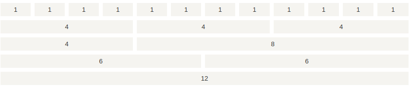

# 容器类
Bootstrap 4 需要一个容器元素来包裹网站的内容。
- .container 类用于固定宽度并支持响应式布局的容器。
- .container-fluid 类用于 100% 宽度，占据全部视口（viewport）的容器。


```
<div class="container">
    <h1>我的第一个 Bootstrap 页面</h1>
    <p>这是一些文本。</p>
</div>

<div class="container-fluid">
    <h1>我的第一个 Bootstrap 页面</h1>
    <p>使用了 .container-fluid，100% 宽度，占据全部视口（viewport）的容器。</p>
</div>
```


# 网格系统
Bootstrap 提供了一套响应式、移动设备优先的流式网格系统，随着屏幕或视口（viewport）尺寸的增加，系统会自动分为最多 12 列。


## 分类
Bootstrap 4 网格系统有以下 5 个类:
- .col- 针对所有设备
- .col-sm- 平板 - 屏幕宽度等于或大于 576px
- .col-md- 桌面显示器 - 屏幕宽度等于或大于 768px)
- .col-lg- 大桌面显示器 - 屏幕宽度等于或大于 992px)
- .col-xl- 超大桌面显示器 - 屏幕宽度等于或大于 1200px)


## 网格系统规则
- 网格每一行需要放在设置了 `.container` (固定宽度) 或 `.container-fluid` (全屏宽度) 类的容器中，这样就可以自动设置一些外边距与内边距。
- 使用行来创建水平的列组。
- 内容需要放置在列中，并且只有列可以是行的直接子节点。
- 预定义的类如 .`row` 和 `.col-sm-4` 可用于快速制作网格布局。
- 列通过填充创建列内容之间的间隙。 这个间隙是通过 `.rows` 类上的负边距设置第一行和最后一列的偏移。
- 网格列是通过跨越指定的 12 个列来创建。 例如，设置三个相等的列，需要使用用三个`.col-sm-4` 来设置。
- Bootstrap 3 和 Bootstrap 4 最大的区别在于 Bootstrap 4 现在使用 `flexbox`（弹性盒子） 而不是浮动。 Flexbox 的一大优势是，没有指定宽度的网格列将自动设置为等宽与等高列 


## 网格的基本结构
`<div class="col-*-*"></div>` 第一个星号 (`*`) 表示响应的设备: sm, md, lg 或 xl, 第二个星号 (`*`) 表示一个数字, 同一行的数字相加为 12。

### 创建相等宽度的列，Bootstrap 自动布局
```
<div class="container-fluid">
  <h1>Hello World!</h1>
  <p>创建三个相等宽度的列! 尝试在 class="row" 的 div 中添加新的 class="col"  div，会显示四个等宽的列。</p>
  <div class="row">
    <div class="col" style="background-color:lavender;">.col</div>
    <div class="col" style="background-color:orange;">.col</div>
    <div class="col" style="background-color:lavender;">.col</div>
  </div>
</div>
```


### 等宽响应式列
```
<div class="col-sm-3">.col-sm-3</div>
<div class="col-sm-3">.col-sm-3</div>
<div class="col-sm-3">.col-sm-3</div>
<div class="col-sm-3">.col-sm-3</div>
```


在移动设备上，即屏幕宽度小于 576px 时，四个列将会上下堆叠排版


### 不等宽响应式列
```
<div class="row">
  <div class="col-sm-4">.col-sm-4</div>
  <div class="col-sm-8">.col-sm-8</div>
</div>
```


在移动设备上，即屏幕宽度小于 576px 时，两个列将会上下堆叠排版:


### 多个平台适应
```
<div class="container-fluid">
  <div class="row">
    <div class="col-sm-3 col-md-6">
      <p>RUNOOB</p>
    </div>
    <div class="col-sm-9 col-md-6">
      <p>菜鸟教程</p>
    </div>
  </div>
</div>
```
在桌面设备的显示器上两个列的宽度各占 50%，如果在平板端则左边的宽度为 25%，右边的宽度为 75%, 在移动手机等小型设备上会堆叠显示。


## 偏移列
- 偏移列通过 `offset-*-*` 类来设置。第一个星号( `*` )可以是 `sm、md、lg、xl`，表示屏幕设备类型，第二个星号( `*` )可以是 1 到 11 的数字。
- 为了在大屏幕显示器上使用偏移，请使用 `.offset-md-*` 类。这些类会把一个列的左外边距（`margin`）增加 `*` 列，其中 `*` 范围是从 1 到 11。


