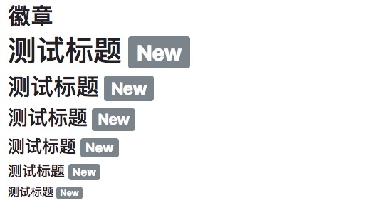
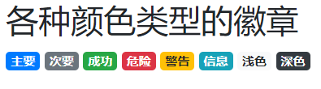
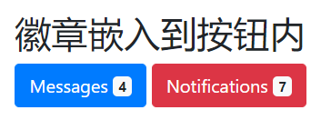

# Badges
徽章（Badges）主要用于突出显示新的或未读的项。如需使用徽章，只需要将 `.badge` 类加上带有指定意义的颜色类 (如 `.badge-secondary`) 添加到 `<span>` 元素上即可。 徽章可以根据父元素的大小的变化而变化:
```
<h1>测试标题 <span class="badge badge-secondary">New</span></h1>
<h2>测试标题 <span class="badge badge-secondary">New</span></h2>
<h3>测试标题 <span class="badge badge-secondary">New</span></h3>
<h4>测试标题 <span class="badge badge-secondary">New</span></h4>
<h5>测试标题 <span class="badge badge-secondary">New</span></h5>
<h6>测试标题 <span class="badge badge-secondary">New</span></h6>
```


# 各种颜色类型的徽章
```
<span class="badge badge-primary">主要</span>
<span class="badge badge-secondary">次要</span>
<span class="badge badge-success">成功</span>
<span class="badge badge-danger">危险</span>
<span class="badge badge-warning">警告</span>
<span class="badge badge-info">信息</span>
<span class="badge badge-light">浅色</span>
<span class="badge badge-dark">深色</span>
```



# 药丸形状徽章
使用 `.badge-pill` 类来设置药丸形状徽章:
```
<span class="badge badge-pill badge-default">默认</span>
<span class="badge badge-pill badge-primary">主要</span>
<span class="badge badge-pill badge-success">成功</span>
<span class="badge badge-pill badge-info">信息</span>
<span class="badge badge-pill badge-warning">警告</span>
<span class="badge badge-pill badge-danger">危险</span>
```


# 徽章插入到元素内
```
<button type="button" class="btn btn-primary">
  Messages <span class="badge badge-light">4</span>
</button>
```


