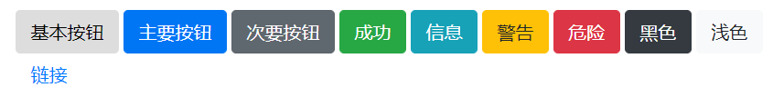
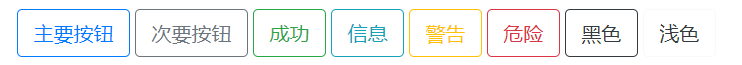
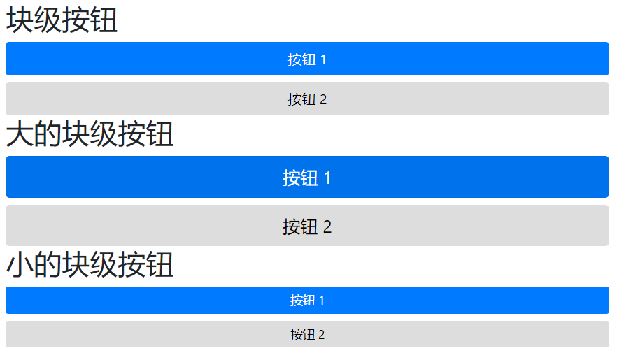
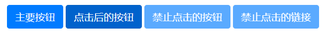
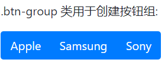
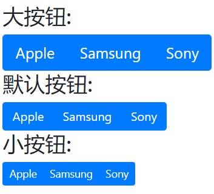
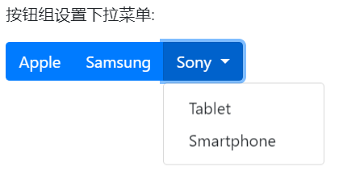
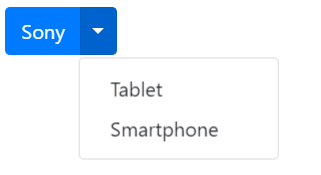
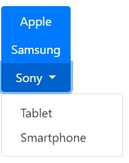

# 按钮 button
不同样式的按钮。
```
<button type="button" class="btn">基本按钮</button>
<button type="button" class="btn btn-primary">主要按钮</button>
<button type="button" class="btn btn-secondary">次要按钮</button>
<button type="button" class="btn btn-success">成功</button>
<button type="button" class="btn btn-info">信息</button>
<button type="button" class="btn btn-warning">警告</button>
<button type="button" class="btn btn-danger">危险</button>
<button type="button" class="btn btn-dark">黑色</button>
<button type="button" class="btn btn-light">浅色</button>
<button type="button" class="btn btn-link">链接</button>
```


按钮类可用于 `<a>`, `<button>`, 或 `<input> `元素上:
```
<a href="#" class="btn btn-info" role="button">链接按钮</a>
<button type="button" class="btn btn-info">按钮</button>
<input type="button" class="btn btn-info" value="输入框按钮">
<input type="submit" class="btn btn-info" value="提交按钮">
```

# 按钮设置边框
```
<button type="button" class="btn btn-outline-primary">主要按钮</button>
<button type="button" class="btn btn-outline-secondary">次要按钮</button>
<button type="button" class="btn btn-outline-success">成功</button>
<button type="button" class="btn btn-outline-info">信息</button>
<button type="button" class="btn btn-outline-warning">警告</button>
<button type="button" class="btn btn-outline-danger">危险</button>
<button type="button" class="btn btn-outline-dark">黑色</button>
<button type="button" class="btn btn-outline-light text-dark">浅色</button>
```



# 不同大小的按钮
```
<button type="button" class="btn btn-primary btn-lg">大号按钮</button>
<button type="button" class="btn btn-primary">默认按钮</button>
<button type="button" class="btn btn-primary btn-sm">小号按钮</button>
```


# 块级按钮
通过添加 `.btn-block` 类可以设置块级按钮：
```
  <h2>块级按钮</h2>
  <button type="button" class="btn btn-primary btn-block">按钮 1</button>
  <button type="button" class="btn btn-default btn-block">按钮 2</button>

  <h2>大的块级按钮</h2>
  <button type="button" class="btn btn-primary btn-lg btn-block">按钮 1</button>
  <button type="button" class="btn btn-default btn-lg btn-block">按钮 2</button>

  <h2>小的块级按钮</h2>
  <button type="button" class="btn btn-primary btn-sm btn-block">按钮 1</button>
  <button type="button" class="btn btn-default btn-sm btn-block">按钮 2</button>
```



# 激活和禁用的按钮
`.active` 类可以设置按钮是可用的， `disabled` 属性可以设置按钮是不可点击的。 注意 `<a>` 元素不支持 `disabled` 属性，你可以通过添加 `.disabled` 类来禁止链接的点击。
```
<button type="button" class="btn btn-primary active">点击后的按钮</button>
<button type="button" class="btn btn-primary" disabled>禁止点击的按钮</button>
<a href="#" class="btn btn-primary disabled">禁止点击的链接</a>
```



# 按钮组
Bootstrap 4 中允许我们将按钮放在同一行上。可以在` <div>` 元素上添加 `.btn-group` 类来创建按钮组。
```
<div class="btn-group">
  <button type="button" class="btn btn-primary">Apple</button>
  <button type="button" class="btn btn-primary">Samsung</button>
  <button type="button" class="btn btn-primary">Sony</button>
</div>
```



## 按钮组的大小
我们可以使用 `.btn-group-lg|sm` 类来设置按钮组的大小。
```
  <div class="btn-group btn-group-lg">
    <button type="button" class="btn btn-primary">Apple</button>
    <button type="button" class="btn btn-primary">Samsung</button>
    <button type="button" class="btn btn-primary">Sony</button>
  </div>
  <h3>默认按钮:</h3>
  <div class="btn-group">
    <button type="button" class="btn btn-primary">Apple</button>
    <button type="button" class="btn btn-primary">Samsung</button>
    <button type="button" class="btn btn-primary">Sony</button>
  </div>
  <h3>小按钮:</h3>
  <div class="btn-group btn-group-sm">
    <button type="button" class="btn btn-primary">Apple</button>
    <button type="button" class="btn btn-primary">Samsung</button>
    <button type="button" class="btn btn-primary">Sony</button>
  </div>
```



## 垂直按钮组
可以使用 `.btn-group-vertical` 类来创建垂直的按钮组：
```
<div class="btn-group-vertical">
  <button type="button" class="btn btn-primary">Apple</button>
  <button type="button" class="btn btn-primary">Samsung</button>
  <button type="button" class="btn btn-primary">Sony</button>
</div>
```


## 内嵌按钮组及下拉菜单
```
<div class="btn-group">
  <button type="button" class="btn btn-primary">Apple</button>
  <button type="button" class="btn btn-primary">Samsung</button>
  <div class="btn-group">
    <button type="button" class="btn btn-primary dropdown-toggle" data-toggle="dropdown">
       Sony
    </button>
    <div class="dropdown-menu">
      <a class="dropdown-item" href="#">Tablet</a>
      <a class="dropdown-item" href="#">Smartphone</a>
    </div>
  </div>
</div>
```



## 拆分按钮下拉菜单
```
<div class="btn-group">
  <button type="button" class="btn btn-primary">Sony</button>
  <button type="button" class="btn btn-primary dropdown-toggle dropdown-toggle-split" data-toggle="dropdown">
    <span class="caret"></span>
  </button>
  <div class="dropdown-menu">
    <a class="dropdown-item" href="#">Tablet</a>
    <a class="dropdown-item" href="#">Smartphone</a>
  </div>
</div>
```



## 垂直按钮组及下拉菜单
```
<div class="btn-group-vertical">
  <button type="button" class="btn btn-primary">Apple</button>
  <button type="button" class="btn btn-primary">Samsung</button>
  <div class="btn-group">
    <button type="button" class="btn btn-primary dropdown-toggle" data-toggle="dropdown">
       Sony
    </button>
    <div class="dropdown-menu">
      <a class="dropdown-item" href="#">Tablet</a>
      <a class="dropdown-item" href="#">Smartphone</a>
    </div>
  </div>
</div>
```

