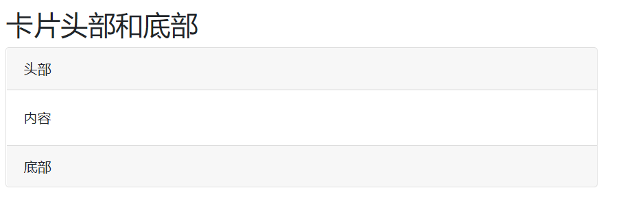
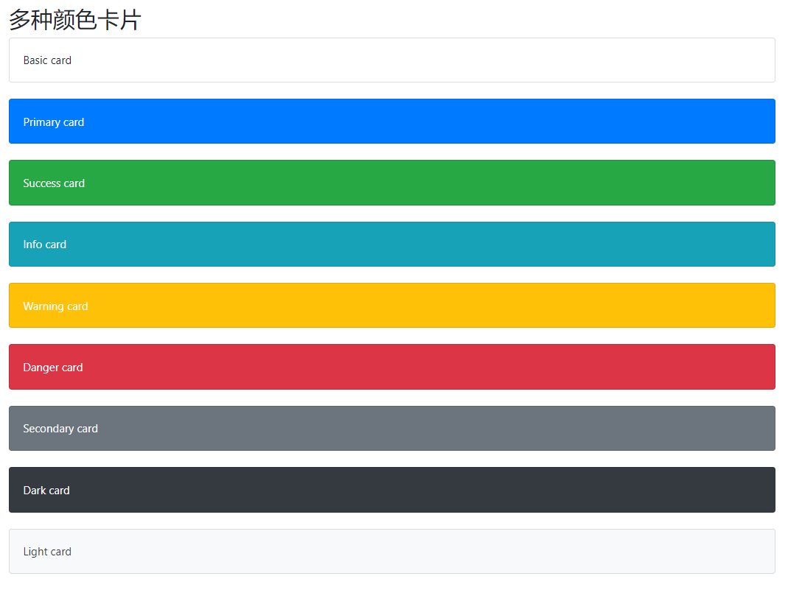

# 卡片
- 通过 Bootstrap4 的 `.card` 与 `.card-body` 类来创建一个简单的卡片，实例如下:
- Bootstrap4 的卡片类似 Bootstrap 3 中的面板、图片缩略图、well。
  

```
<div class="container">
  <h2>简单的卡片</h2>
  <div class="card">
    <div class="card-body">简单的卡片</div>
  </div>
</div>
```


# 头部和底部
`.card-header`类用于创建卡片的头部样式， `.card-footer` 类用于创建卡片的底部样式：
```
<div class="container">
  <h2>卡片头部和底部</h2>
  <div class="card">
    <div class="card-header">头部</div>
    <div class="card-body">内容</div> 
    <div class="card-footer">底部</div>
  </div>
</div>
```





# 多种颜色卡片
Bootstrap 4 提供了多种卡片的背景颜色类： 
- .bg-primary
- .bg-success
- .bg-info
- .bg-warning
- .bg-danger
- .bg-secondary
- .bg-dark
- .bg-light

```
<div class="container">
  <h2>多种颜色卡片</h2>
  <div class="card">
    <div class="card-body">Basic card</div>
  </div>
  <br>
  <div class="card bg-primary text-white">
    <div class="card-body">Primary card</div>
  </div>
  <br>
  <div class="card bg-success text-white">
    <div class="card-body">Success card</div>
  </div>
  <br>
  <div class="card bg-info text-white">
    <div class="card-body">Info card</div>
  </div>
  <br>
  <div class="card bg-warning text-white">
    <div class="card-body">Warning card</div>
  </div>
  <br>
  <div class="card bg-danger text-white">
    <div class="card-body">Danger card</div>
  </div>
  <br>
  <div class="card bg-secondary text-white">
    <div class="card-body">Secondary card</div>
  </div>
  <br>
  <div class="card bg-dark text-white">
    <div class="card-body">Dark card</div>
  </div>
  <br>
  <div class="card bg-light text-dark">
    <div class="card-body">Light card</div>
  </div>
</div>
```



# 标题、文本和链接
我们可以在头部元素上使用 `.card-title` 类来设置卡片的标题 。` .card-text` 类用于设置卡片正文的内容。` .card-link` 类用于给链接设置颜色。

```
<div class="container">
  <h2>标题、文本和链接</h2>
  <div class="card">
    <div class="card-body">
      <h4 class="card-title">Card title</h4>
      <p class="card-text">Some example text. Some example text.</p>
      <a href="#" class="card-link">Card link</a>
      <a href="#" class="card-link">Another link</a>
    </div>
  </div>
</div>
```


# 图片卡片
我们可以给 `` 添加 `.card-img-top`（图片在文字上方） 或 `.card-img-bottom`（图片在文字下方 来设置图片卡片：
```
<div class="container">
  <h2>图片卡片</h2>
  <p>图片在头部 (card-img-top):</p>
  <div class="card" style="width:400px">
    
    <div class="card-body">
      <h4 class="card-title">John Doe</h4>
      <p class="card-text">Some example text some example text. John Doe is an architect and engineer</p>
      <a href="#" class="btn btn-primary">See Profile</a>
    </div>
  </div>
  <br>
  
  <p>图片在底部(card-img-bottom):</p>
  <div class="card" style="width:400px">
    <div class="card-body">
      <h4 class="card-title">Jane Doe</h4>
      <p class="card-text">Some example text some example text. Jane Doe is an architect and engineer</p>
      <a href="#" class="btn btn-primary">See Profile</a>
    </div>
    
  </div>
</div>
```


# 图片背景卡片
如果图片要设置为背景，可以使用 `.card-img-overlay` 类:
```
<div class="container">
  <h2>文字覆盖图片</h2>
  <p>如果图片要设置为背景，可以使用 .card-img-overlay 类:</p>
  <div class="card img-fluid" style="width:500px">
    
    <div class="card-img-overlay">
      <h4 class="card-title">John Doe</h4>
      <p class="card-text">Some example text some example text. Some example text some example text. Some example text some example text. Some example text some example text.</p>
      <a href="#" class="btn btn-primary">See Profile</a>
    </div>
  </div>
</div>
```


