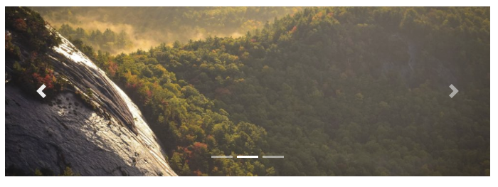
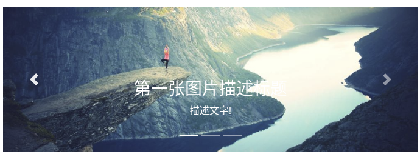

# 轮播
轮播是一个循环的幻灯片：

```
<div id="demo" class="carousel slide" data-ride="carousel">
 
  <!-- 指示符 -->
  <ul class="carousel-indicators">
    <li data-target="#demo" data-slide-to="0" class="active"></li>
    <li data-target="#demo" data-slide-to="1"></li>
    <li data-target="#demo" data-slide-to="2"></li>
  </ul>
 
  <!-- 轮播图片 -->
  <div class="carousel-inner">
    <div class="carousel-item active">
      
    </div>
    <div class="carousel-item">
      
    </div>
    <div class="carousel-item">
      
    </div>
  </div>
 
  <!-- 左右切换按钮 -->
  <a class="carousel-control-prev" href="#demo" data-slide="prev">
    <span class="carousel-control-prev-icon"></span>
  </a>
  <a class="carousel-control-next" href="#demo" data-slide="next">
    <span class="carousel-control-next-icon"></span>
  </a>
 
</div>
```




# 轮播图片上添加描述
在每个 `<div class="carousel-item">` 内添加 `<div class="carousel-caption">` 来设置轮播图片的描述文本：:
```
<!DOCTYPE html>
<html>
<head>
  <title>Bootstrap 实例</title>
  <meta charset="utf-8">
  <meta name="viewport" content="width=device-width, initial-scale=1">
  <link rel="stylesheet" href="https://cdn.staticfile.org/twitter-bootstrap/4.1.0/css/bootstrap.min.css">
  <script src="https://cdn.staticfile.org/jquery/3.2.1/jquery.min.js"></script>
  <script src="https://cdn.staticfile.org/popper.js/1.12.5/umd/popper.min.js"></script>
  <script src="https://cdn.staticfile.org/twitter-bootstrap/4.1.0/js/bootstrap.min.js"></script>
  <style>
  /* Make the image fully responsive */
  .carousel-inner img {
      width: 100%;
      height: 100%;
  }
  </style>
</head>
<body>

<div id="demo" class="carousel slide" data-ride="carousel">
 
  <!-- 指示符 -->
  <ul class="carousel-indicators">
    <li data-target="#demo" data-slide-to="0" class="active"></li>
    <li data-target="#demo" data-slide-to="1"></li>
    <li data-target="#demo" data-slide-to="2"></li>
  </ul>
 
  <!-- 轮播图片 -->
  <div class="carousel-inner">
    <div class="carousel-item active">
      
      <div class="carousel-caption">
        <h3>第一张图片描述标题</h3>
        <p>描述文字!</p>
      </div>
    </div>
    <div class="carousel-item">
      
      <div class="carousel-caption">
        <h3>第二张图片描述标题</h3>
        <p>描述文字!</p>
      </div>
    </div>
    <div class="carousel-item">
      
      <div class="carousel-caption">
        <h3>第三张图片描述标题</h3>
        <p>描述文字!</p>
      </div>
    </div>
  </div>
 
  <!-- 左右切换按钮 -->
  <a class="carousel-control-prev" href="#demo" data-slide="prev">
    <span class="carousel-control-prev-icon"></span>
  </a>
  <a class="carousel-control-next" href="#demo" data-slide="next">
    <span class="carousel-control-next-icon"></span>
  </a>
 
</div>

</body>
</html>
```




- `.carousel`	创建一个轮播
- `.carousel-indicators`	为轮播添加一个指示符，就是轮播图底下的一个个小点，轮播的过程可以显示目前是第几张图。
- `.carousel-inner`	添加要切换的图片
- `.carousel-item`	指定每个图片的内容
- `.carousel-control-prev`	添加左侧的按钮，点击会返回上一张。
- `.carousel-control-next`	添加右侧按钮，点击会切换到下一张。
- `.carousel-control-prev-icon`	与 `.carousel-control-prev` 一起使用，设置左侧的按钮
- `.carousel-control-next-icon`	与 `.carousel-control-next` 一起使用，设置右侧的按钮
- `.slide`	切换图片的过渡和动画效果，如果你不需要这样的效果，可以删除这个类。
