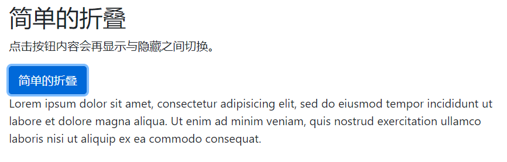
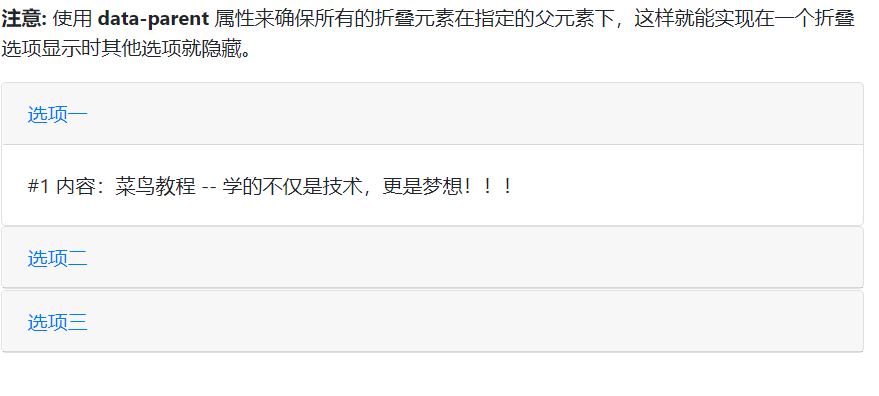

# 折叠
Bootstrap4 折叠可以很容易的实现内容的显示与隐藏。

- `.collapse` 类用于指定一个折叠元素 (实例中的 `<div>`); 点击按钮后会在隐藏与显示之间切换。
- 控制内容的隐藏与显示，需要在` <a>` 或` <button>` 元素上添加 `data-toggle="collapse"` 属性。 `data-target="#id"` 属性是对应折叠的内容 (`<div id="demo">`)。
- 注意: `<a>` 元素上你可以使用 `href` 属性来代替 `data-target` 属性:

```
<div class="container">
  <h2>简单的折叠</h2>
  <p>点击按钮内容会再显示与隐藏之间切换。</p>
  <button type="button" class="btn btn-primary" data-toggle="collapse" data-target="#demo">简单的折叠</button>
  <div id="demo" class="collapse">
    Lorem ipsum dolor sit amet, consectetur adipisicing elit,
    sed do eiusmod tempor incididunt ut labore et dolore magna aliqua. Ut enim ad minim veniam,
    quis nostrud exercitation ullamco laboris nisi ut aliquip ex ea commodo consequat.
  </div>
</div>
```


默认情况下折叠的内容是隐藏的，你可以添加 .show 类让内容默认显示:
```
<div id="demo" class="collapse show">
Lorem ipsum dolor text....
</div>
```


# 手风琴
使用 `data-parent` 属性来确保所有的折叠元素在指定的父元素下，这样就能实现在一个折叠选项显示时其他选项就隐藏。 

```
<div class="container">
  <h2>手风琴实例</h2>
  <p><strong>注意:</strong> 使用 <strong>data-parent</strong> 属性来确保所有的折叠元素在指定的父元素下，这样就能实现在一个折叠选项显示时其他选项就隐藏。</p>
  <div id="accordion">
    <div class="card">
      <div class="card-header">
        <a class="card-link" data-toggle="collapse" href="#collapseOne">
          选项一
        </a>
      </div>
      <div id="collapseOne" class="collapse show" data-parent="#accordion">
        <div class="card-body">
          #1 内容：菜鸟教程 -- 学的不仅是技术，更是梦想！！！
        </div>
      </div>
    </div>
    <div class="card">
      <div class="card-header">
        <a class="collapsed card-link" data-toggle="collapse" href="#collapseTwo">
        选项二
      </a>
      </div>
      <div id="collapseTwo" class="collapse" data-parent="#accordion">
        <div class="card-body">
          #2 内容：菜鸟教程 -- 学的不仅是技术，更是梦想！！！
        </div>
      </div>
    </div>
    <div class="card">
      <div class="card-header">
        <a class="collapsed card-link" data-toggle="collapse" href="#collapseThree">
          选项三
        </a>
      </div>
      <div id="collapseThree" class="collapse" data-parent="#accordion">
        <div class="card-body">
          #3 内容：菜鸟教程 -- 学的不仅是技术，更是梦想！！！
        </div>
      </div>
    </div>
  </div>
</div>
```


