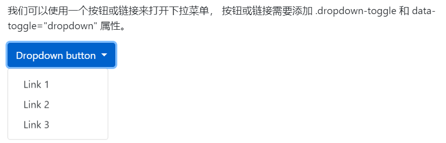
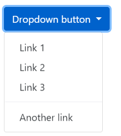
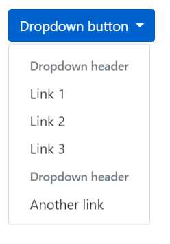
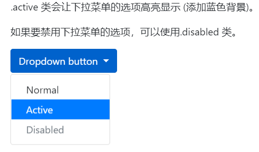
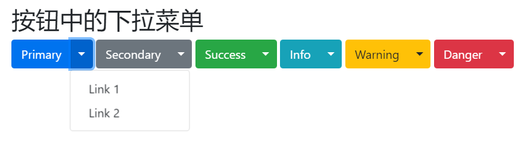

# 下拉菜单
```
<div class="dropdown">
  <button type="button" class="btn btn-primary dropdown-toggle" data-toggle="dropdown">
    Dropdown button
  </button>
  <div class="dropdown-menu">
    <a class="dropdown-item" href="#">Link 1</a>
    <a class="dropdown-item" href="#">Link 2</a>
    <a class="dropdown-item" href="#">Link 3</a>
  </div>
</div>
```



`.dropdown` 类用来指定一个下拉菜单。我们可以使用一个按钮或链接来打开下拉菜单， 按钮或链接需要添加 `.dropdown-toggle` 和 `data-toggle="dropdown" `属性。`<div>` 元素上添加 `.dropdown-menu` 类来设置实际下拉菜单，然后在下拉菜单的选项中添加 `.dropdown-item` 类。


# 下拉菜单中的分割线
`.dropdown-divider` 类用于在下拉菜单中创建一个水平的分割线：
```
<div class="container">
  <h2>下拉菜单中</h2>
  <p>.dropdown-divider 类用于在下拉菜单中创建一个水平的分割线：</p>
  <div class="dropdown">
    <button type="button" class="btn btn-primary dropdown-toggle" data-toggle="dropdown">
      Dropdown button
    </button>
    <div class="dropdown-menu">
      <a class="dropdown-item" href="#">Link 1</a>
      <a class="dropdown-item" href="#">Link 2</a>
      <a class="dropdown-item" href="#">Link 3</a>
      <div class="dropdown-divider"></div>
      <a class="dropdown-item" href="#">Another link</a>
    </div>
  </div>
</div>
  ```




# 下拉菜单中的标题
`.dropdown-header` 类用于在下拉菜单中添加标题：

```
<div class="container">
  <h2>下拉菜单中</h2>
  <p>.dropdown-header 类用于在下拉菜单中添加标题：</p>
  <div class="dropdown">
    <button type="button" class="btn btn-primary dropdown-toggle" data-toggle="dropdown">
      Dropdown button
    </button>
    <div class="dropdown-menu">
      <h5 class="dropdown-header">Dropdown header</h5>
      <a class="dropdown-item" href="#">Link 1</a>
      <a class="dropdown-item" href="#">Link 2</a>
      <a class="dropdown-item" href="#">Link 3</a>
      <h5 class="dropdown-header">Dropdown header</h5>
      <a class="dropdown-item" href="#">Another link</a>
    </div>
  </div>
</div>
```




# 可用项与禁用项
- `.active` 类会让下拉菜单的选项高亮显示 (添加蓝色背景)。
- 如果要禁用下拉菜单的选项，可以使用`.disabled` 类。

```
<div class="container">
  <h2>下拉菜单</h2>
  <p>.active 类会让下拉菜单的选项高亮显示 (添加蓝色背景)。</p>
  <p>如果要禁用下拉菜单的选项，可以使用.disabled 类。</p>
  <div class="dropdown">
    <button type="button" class="btn btn-primary dropdown-toggle" data-toggle="dropdown">
      Dropdown button
    </button>
    <div class="dropdown-menu">
      <a class="dropdown-item" href="#">Normal</a>
      <a class="dropdown-item active" href="#">Active</a>
      <a class="dropdown-item disabled" href="#">Disabled</a>
    </div>
  </div>
</div>
```



# 下拉菜单的定位
如果我们想让下拉菜单右对齐，可以在元素上的 `.dropdown-menu` 类后添加 `.dropdown-menu-right` 类。
```
<div class="container">
  <h2>下拉菜单</h2>
  <p>如果我们想让下拉菜单右对齐，可以在元素上的 .dropdown-menu 类后添加 .dropdown-menu-right 类。</p>
  <div class="dropdown">
    <button type="button" class="btn btn-primary dropdown-toggle" data-toggle="dropdown">
      Dropdown button
    </button>
    <div class="dropdown-menu dropdown-menu-rigth">
      <a class="dropdown-item" href="#">Link 111111111111111</a>
      <a class="dropdown-item" href="#">Link 2</a>
      <a class="dropdown-item" href="#">Link 3</a>
    </div>
  </div>
</div>
```


# 指定向上弹出的下拉菜单
如果你希望下拉菜单向上弹出，可以将 `<div>` 元素的 `class="dropdown"` 替换为 `dropup`:
```
<div class="container">
  <h2>下拉菜单</h2>
  <p> .dropup 类用于设置下拉菜单向上弹出：</p><br>
  <div class="dropup">
    <button type="button" class="btn btn-primary dropdown-toggle" data-toggle="dropdown">
      Dropdown button
    </button>
    <div class="dropdown-menu">
      <a class="dropdown-item" href="#">Link 1</a>
      <a class="dropdown-item" href="#">Link 2</a>
    </div>
  </div>
</div>
```


# 按钮中设置下拉菜单
```
<div class="container">
  <h2>按钮中的下拉菜单</h2>
  <div class="btn-group">
    <button type="button" class="btn btn-primary">Primary</button>
    <button type="button" class="btn btn-primary dropdown-toggle dropdown-toggle-split" data-toggle="dropdown">
      <span class="caret"></span>
    </button>
    <div class="dropdown-menu">
      <a class="dropdown-item" href="#">Link 1</a>
      <a class="dropdown-item" href="#">Link 2</a>
    </div>
  </div>
  
  <div class="btn-group">
    <button type="button" class="btn btn-secondary">Secondary</button>
    <button type="button" class="btn btn-secondary dropdown-toggle dropdown-toggle-split" data-toggle="dropdown">
      <span class="caret"></span>
    </button>
    <div class="dropdown-menu">
      <a class="dropdown-item" href="#">Link 1</a>
      <a class="dropdown-item" href="#">Link 2</a>
    </div>
  </div>

  <div class="btn-group">
    <button type="button" class="btn btn-success">Success</button>
    <button type="button" class="btn btn-success dropdown-toggle dropdown-toggle-split" data-toggle="dropdown">
      <span class="caret"></span>
    </button>
    <div class="dropdown-menu">
      <a class="dropdown-item" href="#">Link 1</a>
      <a class="dropdown-item" href="#">Link 2</a>
    </div>
  </div>

  <div class="btn-group">
    <button type="button" class="btn btn-info">Info</button>
    <button type="button" class="btn btn-info dropdown-toggle dropdown-toggle-split" data-toggle="dropdown">
      <span class="caret"></span>
    </button>
    <div class="dropdown-menu">
      <a class="dropdown-item" href="#">Link 1</a>
      <a class="dropdown-item" href="#">Link 2</a>
    </div>
  </div>

  <div class="btn-group">
    <button type="button" class="btn btn-warning">Warning</button>
    <button type="button" class="btn btn-warning dropdown-toggle dropdown-toggle-split" data-toggle="dropdown">
      <span class="caret"></span>
    </button>
    <div class="dropdown-menu">
      <a class="dropdown-item" href="#">Link 1</a>
      <a class="dropdown-item" href="#">Link 2</a>
    </div>
  </div>

  <div class="btn-group">
    <button type="button" class="btn btn-danger">Danger</button>
    <button type="button" class="btn btn-danger dropdown-toggle dropdown-toggle-split" data-toggle="dropdown">
      <span class="caret"></span>
    </button>
    <div class="dropdown-menu">
      <a class="dropdown-item" href="#">Link 1</a>
      <a class="dropdown-item" href="#">Link 2</a>
    </div>
  </div>
</div>
```


