# 弹性盒子(flexbox)
Bootstrap 4 通过 flex 类来控制页面的布局。
Bootstrap 3 与 Bootstrap 4 最大的区别就是 Bootstrap 4 使用弹性盒子来布局，而不是使用浮动来布局。

使用 `d-flex` 类创建一个弹性盒子容器，并设置三个弹性子元素：
```
<div class="container mt-3">
  <h2>Flex</h2>
  <p>使用 d-flex 类创建一个弹性盒子容器，并设置三个弹性子元素：</p>
  <div class="d-flex p-3 bg-secondary text-white">  
    <div class="p-2 bg-info">Flex item 1</div>
    <div class="p-2 bg-warning">Flex item 2</div>
    <div class="p-2 bg-primary">Flex item 3</div>
  </div>
</div>
```
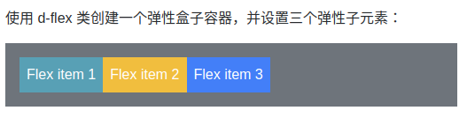


创建显示在同一行上的弹性盒子容器可以使用 `d-inline-flex` 类:

```
<div class="container mt-3">
  <h2>行内 Flex</h2>
  <p>创建显示在同一行上的弹性盒子容器可以使用 d-inline-flex 类:</p>
  <div class="d-inline-flex p-3 bg-secondary text-white">  
    <div class="p-2 bg-info">Flex item 1</div>
    <div class="p-2 bg-warning">Flex item 2</div>
    <div class="p-2 bg-primary">Flex item 3</div>
  </div>
</div>
```

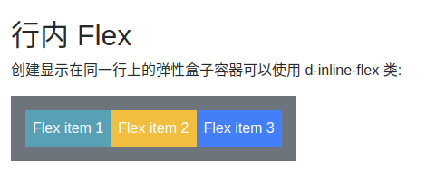


# 水平方向
`.flex-row` 可以设置弹性子元素水平显示，这是默认的。

使用 `.flex-row-reverse` 类用于设置右对齐显示，即与 `.flex-row` 方向相反。

```
<div class="container mt-3">
  <h2>水平方向</h2>
  <p>使用 .flex-row 类设置弹性子元素水平显示：</p>
  <div class="d-flex flex-row bg-secondary mb-3">
    <div class="p-2 bg-info">Flex item 1</div>
    <div class="p-2 bg-warning">Flex item 2</div>
    <div class="p-2 bg-primary">Flex item 3</div>
  </div>
  <p>.flex-row-reverse 设置右对齐方向:</p>
  <div class="d-flex flex-row-reverse bg-secondary">
    <div class="p-2 bg-info">Flex item 1</div>
    <div class="p-2 bg-warning">Flex item 2</div>
    <div class="p-2 bg-primary">Flex item 3</div>
  </div>
</div>
```

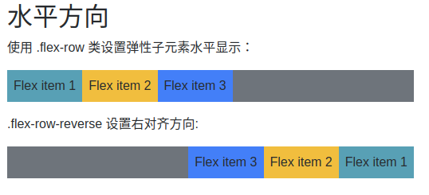


# 垂直方向
`.flex-column` 类用于设置弹性子元素垂直方向显示, `.flex-column-reverse` 用于翻转子元素：
```
<div class="container mt-3">
  <h2>垂直方向</h2>
  <p>.flex-column 类用于设置弹性子元素垂直方向显示：</p>
  <div class="d-flex flex-column mb-3">
    <div class="p-2 bg-info">Flex item 1</div>
    <div class="p-2 bg-warning">Flex item 2</div>
    <div class="p-2 bg-primary">Flex item 3</div>
  </div>
  <p>.flex-column-reverse 类用于设置弹性子元素垂直方向翻转显示：</p>
  <div class="d-flex flex-column-reverse">
    <div class="p-2 bg-info">Flex item 1</div>
    <div class="p-2 bg-warning">Flex item 2</div>
    <div class="p-2 bg-primary">Flex item 3</div>
  </div>
</div>
```
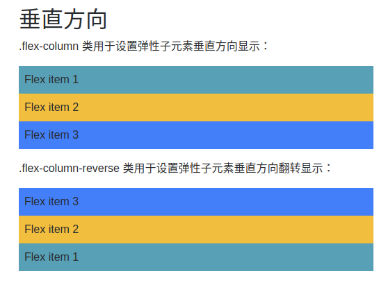


# 内容排列
`.justify-content-*` 类用于修改弹性子元素的排列方式，`*` 号允许的值有：`start` (默认), `end`, `center`, `between` 或 `around`:
```
<div class="container mt-3">
  <h2>内容排列方式</h2>
  <p> .justify-content-* 类用于修改弹性子元素的排列方式，* 号允许的值有：start (默认), end, center, between 或 around:</p>
  <div class="d-flex justify-content-start bg-secondary mb-3">
    <div class="p-2 bg-info">Flex item 1</div>
    <div class="p-2 bg-warning">Flex item 2</div>
    <div class="p-2 bg-primary">Flex item 3</div>
  </div>
  <div class="d-flex justify-content-end bg-secondary mb-3">
    <div class="p-2 bg-info">Flex item 1</div>
    <div class="p-2 bg-warning">Flex item 2</div>
    <div class="p-2 bg-primary">Flex item 3</div>
  </div>
  <div class="d-flex justify-content-center bg-secondary mb-3">
    <div class="p-2 bg-info">Flex item 1</div>
    <div class="p-2 bg-warning">Flex item 2</div>
    <div class="p-2 bg-primary">Flex item 3</div>
  </div>
  <div class="d-flex justify-content-between bg-secondary mb-3">
    <div class="p-2 bg-info">Flex item 1</div>
    <div class="p-2 bg-warning">Flex item 2</div>
    <div class="p-2 bg-primary">Flex item 3</div>
  </div>
  <div class="d-flex justify-content-around bg-secondary mb-3">
    <div class="p-2 bg-info">Flex item 1</div>
    <div class="p-2 bg-warning">Flex item 2</div>
    <div class="p-2 bg-primary">Flex item 3</div>
  </div>
</div>
```

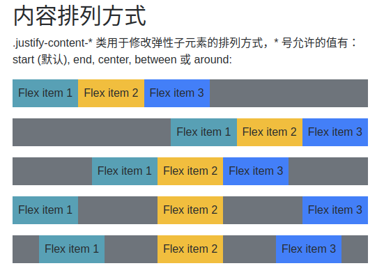


# 等宽
`.flex-fill` 类强制设置各个弹性子元素的宽度是一样的:
```
<div class="container mt-3">
  <h2>等宽</h2>
  <p>.flex-fill 类强制设置各个弹性子元素的宽度是一样的:</p>
  <div class="d-flex mb-3">
    <div class="p-2 flex-fill bg-info">Flex item 1</div>
    <div class="p-2 flex-fill bg-warning">Flex item 2</div>
    <div class="p-2 flex-fill bg-primary">Flex item 3</div>
  </div>
  <p>不使用 .flex-fill 类实例:</p>
  <div class="d-flex mb-3 bg-secondary">
    <div class="p-2 bg-info">Flex item 1</div>
    <div class="p-2 bg-warning">Flex item 2</div>
    <div class="p-2 bg-primary">Flex item 3</div>
  </div>
</div>
```
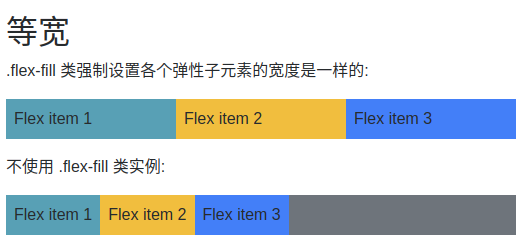


# 扩展
.flex-grow-1 用于设置子元素使用剩下的空间。以下实例中前面两个子元素只设置了它们所需要的空间，最后一个获取剩余空间。 :
```
<div class="container mt-3">
  <h2>扩展</h2>
  <p>.flex-grow-1 用于设置子元素使用剩下的空间：</p>
  <div class="d-flex mb-3">
    <div class="p-2 bg-info">Flex item 1</div>
    <div class="p-2 bg-warning">Flex item 2</div>
    <div class="p-2 flex-grow-1 bg-primary">Flex item 3</div>
  </div>
  <p>不使用 .flex-grow-1 实例:</p>
  <div class="d-flex mb-3 bg-secondary">
    <div class="p-2 bg-info">Flex item 1</div>
    <div class="p-2 bg-warning">Flex item 2</div>
    <div class="p-2 bg-primary">Flex item 3</div>
  </div>
</div>
```

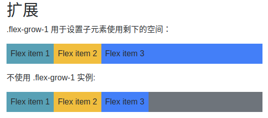

`.flex-shrink-1` 用于设置子元素的收缩规则。


# 排序
`.order` 类可以设置弹性子元素的排序，从 `.order-1` 到 `.order-12`，数字越低权重越高( `.order-1` 排在 `.order-2` 之前) :
```
<div class="container mt-3">
  <h2>排序</h2>
  <p>.order 类可以设置弹性子元素的排序，从 .order-1 到 .order-12，数字越低权重越高:</p>
  <div class="d-flex mb-3">
    <div class="p-2 order-3 bg-info">Flex item 1</div>
    <div class="p-2 order-2 bg-warning">Flex item 2</div>
    <div class="p-2 order-1 bg-primary">Flex item 3</div>
  </div>
</div>
```

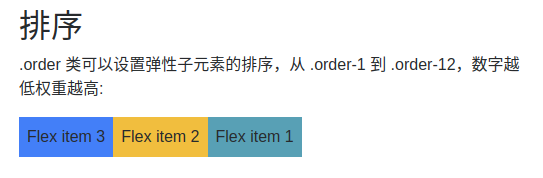


# 外边距
`.mr-auto` 类可以设置子元素右外边距为 `auto`，即 `margin-right: auto!important;`，`.ml-auto` 类可以设置子元素左外边距为 `auto`，即 `margin-left: auto!important;`:
```
<div class="container mt-3">
  <h2>外边距</h2>
  <p>.mr-auto 类可以设置子元素右外边距为 auto，.ml-auto 类可以设置子元素左外边距为 auto，</p>
  <div class="d-flex mb-3 bg-secondary">
    <div class="p-2 mr-auto bg-info">Flex item 1</div>
    <div class="p-2 bg-warning">Flex item 2</div>
    <div class="p-2 bg-primary">Flex item 3</div>
  </div>
  <div class="d-flex mb-3 bg-secondary">
    <div class="p-2  bg-info">Flex item 1</div>
    <div class="p-2 bg-warning">Flex item 2</div>
    <div class="p-2 ml-auto bg-primary">Flex item 3</div>
  </div>
</div>
```

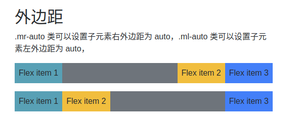


# 包裹
弹性容器中包裹子元素可以使用以下三个类： `.flex-nowrap` (默认), `.flex-wrap` 或 `.flex-wrap-reverse`。设置 flex 容器是单行或者多行。
```
<div class="container mt-3">
  <h2>包裹</h2>
  <p>弹性容器中包裹弹性子元素可以使用以下三个类： .flex-nowrap (默认), .flex-wrap 或 .flex-wrap-reverse:</p>
  <p><code>.flex-wrap:</code></p>
  <div class="d-flex flex-wrap bg-light">
    <div class="p-2 border">Flex item 1</div>
    <div class="p-2 border">Flex item 2</div>
    <div class="p-2 border">Flex item 3</div>
    <div class="p-2 border">Flex item 4</div>
    <div class="p-2 border">Flex item 5</div>
    <div class="p-2 border">Flex item 6</div>
    <div class="p-2 border">Flex item 7</div>
    <div class="p-2 border">Flex item 8</div>
    <div class="p-2 border">Flex item 9</div>
    <div class="p-2 border">Flex item 10</div>
    <div class="p-2 border">Flex item 11</div>
    <div class="p-2 border">Flex item 12</div>
    <div class="p-2 border">Flex item 13 </div>
    <div class="p-2 border">Flex item 14</div>
    <div class="p-2 border">Flex item 15</div>
    <div class="p-2 border">Flex item 16</div>
    <div class="p-2 border">Flex item 17</div>
    <div class="p-2 border">Flex item 18</div>
    <div class="p-2 border">Flex item 19</div>
    <div class="p-2 border">Flex item 20</div>
    <div class="p-2 border">Flex item 21</div>
    <div class="p-2 border">Flex item 22</div>
    <div class="p-2 border">Flex item 23</div>
    <div class="p-2 border">Flex item 24</div>
    <div class="p-2 border">Flex item 25</div>
  </div>
  <br>
  <p><code>.flex-wrap-reverse:</code></p>
  <div class="d-flex flex-wrap-reverse bg-light">
    <div class="p-2 border">Flex item 1</div>
    <div class="p-2 border">Flex item 2</div>
    <div class="p-2 border">Flex item 3</div>
    <div class="p-2 border">Flex item 4</div>
    <div class="p-2 border">Flex item 5</div>
    <div class="p-2 border">Flex item 6</div>
    <div class="p-2 border">Flex item 7</div>
    <div class="p-2 border">Flex item 8</div>
    <div class="p-2 border">Flex item 9</div>
    <div class="p-2 border">Flex item 10</div>
    <div class="p-2 border">Flex item 11</div>
    <div class="p-2 border">Flex item 12</div>
    <div class="p-2 border">Flex item 13 </div>
    <div class="p-2 border">Flex item 14</div>
    <div class="p-2 border">Flex item 15</div>
    <div class="p-2 border">Flex item 16</div>
    <div class="p-2 border">Flex item 17</div>
    <div class="p-2 border">Flex item 18</div>
    <div class="p-2 border">Flex item 19</div>
    <div class="p-2 border">Flex item 20</div>
    <div class="p-2 border">Flex item 21</div>
    <div class="p-2 border">Flex item 22</div>
    <div class="p-2 border">Flex item 23</div>
    <div class="p-2 border">Flex item 24</div>
    <div class="p-2 border">Flex item 25</div>
  </div>
  <br>
  <p><code>.flex-nowrap:</code></p>
  <div class="d-flex flex-nowrap bg-light">
    <div class="p-2 border">Flex item 1</div>
    <div class="p-2 border">Flex item 2</div>
    <div class="p-2 border">Flex item 3</div>
    <div class="p-2 border">Flex item 4</div>
    <div class="p-2 border">Flex item 5</div>
    <div class="p-2 border">Flex item 6</div>
    <div class="p-2 border">Flex item 7</div>
    <div class="p-2 border">Flex item 8</div>
    <div class="p-2 border">Flex item 9</div>
    <div class="p-2 border">Flex item 10</div>
    <div class="p-2 border">Flex item 11</div>
    <div class="p-2 border">Flex item 12</div>
    <div class="p-2 border">Flex item 13 </div>
    <div class="p-2 border">Flex item 14</div>
    <div class="p-2 border">Flex item 15</div>
    <div class="p-2 border">Flex item 16</div>
    <div class="p-2 border">Flex item 17</div>
    <div class="p-2 border">Flex item 18</div>
    <div class="p-2 border">Flex item 19</div>
    <div class="p-2 border">Flex item 20</div>
    <div class="p-2 border">Flex item 21</div>
    <div class="p-2 border">Flex item 22</div>
    <div class="p-2 border">Flex item 23</div>
    <div class="p-2 border">Flex item 24</div>
    <div class="p-2 border">Flex item 25</div>
    <div class="p-2 border">Flex item 26</div>
    <div class="p-2 border">Flex item 27</div>
    <div class="p-2 border">Flex item 28</div>
    <div class="p-2 border">Flex item 29</div>
    <div class="p-2 border">Flex item 30</div>
    <div class="p-2 border">Flex item 31</div>
    <div class="p-2 border">Flex item 32</div>
    <div class="p-2 border">Flex item 33</div>
    <div class="p-2 border">Flex item 34</div>
    <div class="p-2 border">Flex item 35</div>
  </div>
  <br>
</div>
```

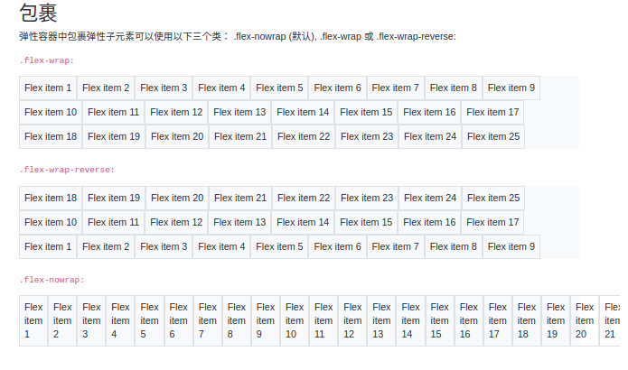


# 内容对齐
我们可以使用 `.align-content-*` 来控制在垂直方向上如何去堆叠子元素，包含的值有：
- `.align-content-start` (默认)
- `.align-content-end`
- `.align-content-center`
- `.align-content-between`
- `.align-content-around`  
- `.align-content-stretch`

这些类在只有一行的弹性子元素中是无效的。

```
<div class="container mt-3">
  <h2>内容对齐</h2>
  <p>我们可以使用 .align-content-* 来控制子元素在垂直方向的对齐方式。</p>
  <p><strong>注意:</strong> 这个实例在小型设备上效果不好。这些类在只有一行的弹性子元素中是无效的。</p>
  <p>.align-content-start (默认):</p>
  <div class="d-flex flex-wrap align-content-start bg-light" style="height:300px">
    <div class="p-2 border">Flex item 1</div>
    <div class="p-2 border">Flex item 2</div>
    <div class="p-2 border">Flex item 3</div>
    <div class="p-2 border">Flex item 4</div>
    <div class="p-2 border">Flex item 5</div>
    <div class="p-2 border">Flex item 6</div>
    <div class="p-2 border">Flex item 7</div>
    <div class="p-2 border">Flex item 8</div>
    <div class="p-2 border">Flex item 9</div>
    <div class="p-2 border">Flex item 10</div>
    <div class="p-2 border">Flex item 11</div>
    <div class="p-2 border">Flex item 12</div>
    <div class="p-2 border">Flex item 13 </div>
    <div class="p-2 border">Flex item 14</div>
    <div class="p-2 border">Flex item 15</div>
    <div class="p-2 border">Flex item 16</div>
    <div class="p-2 border">Flex item 17</div>
    <div class="p-2 border">Flex item 18</div>
    <div class="p-2 border">Flex item 19</div>
    <div class="p-2 border">Flex item 20</div>
    <div class="p-2 border">Flex item 21</div>
    <div class="p-2 border">Flex item 22</div>
    <div class="p-2 border">Flex item 23</div>
    <div class="p-2 border">Flex item 24</div>
    <div class="p-2 border">Flex item 25</div>
  </div>
  <br>
  <p>.align-content-end:</p>
  <div class="d-flex flex-wrap align-content-end bg-light" style="height:300px">
    <div class="p-2 border">Flex item 1</div>
    <div class="p-2 border">Flex item 2</div>
    <div class="p-2 border">Flex item 3</div>
    <div class="p-2 border">Flex item 4</div>
    <div class="p-2 border">Flex item 5</div>
    <div class="p-2 border">Flex item 6</div>
    <div class="p-2 border">Flex item 7</div>
    <div class="p-2 border">Flex item 8</div>
    <div class="p-2 border">Flex item 9</div>
    <div class="p-2 border">Flex item 10</div>
    <div class="p-2 border">Flex item 11</div>
    <div class="p-2 border">Flex item 12</div>
    <div class="p-2 border">Flex item 13 </div>
    <div class="p-2 border">Flex item 14</div>
    <div class="p-2 border">Flex item 15</div>
    <div class="p-2 border">Flex item 16</div>
    <div class="p-2 border">Flex item 17</div>
    <div class="p-2 border">Flex item 18</div>
    <div class="p-2 border">Flex item 19</div>
    <div class="p-2 border">Flex item 20</div>
    <div class="p-2 border">Flex item 21</div>
    <div class="p-2 border">Flex item 22</div>
    <div class="p-2 border">Flex item 23</div>
    <div class="p-2 border">Flex item 24</div>
    <div class="p-2 border">Flex item 25</div>
  </div>
  <br>
  <p>.align-content-center:</p>
  <div class="d-flex flex-wrap align-content-center bg-light" style="height:300px">
    <div class="p-2 border">Flex item 1</div>
    <div class="p-2 border">Flex item 2</div>
    <div class="p-2 border">Flex item 3</div>
    <div class="p-2 border">Flex item 4</div>
    <div class="p-2 border">Flex item 5</div>
    <div class="p-2 border">Flex item 6</div>
    <div class="p-2 border">Flex item 7</div>
    <div class="p-2 border">Flex item 8</div>
    <div class="p-2 border">Flex item 9</div>
    <div class="p-2 border">Flex item 10</div>
    <div class="p-2 border">Flex item 11</div>
    <div class="p-2 border">Flex item 12</div>
    <div class="p-2 border">Flex item 13 </div>
    <div class="p-2 border">Flex item 14</div>
    <div class="p-2 border">Flex item 15</div>
    <div class="p-2 border">Flex item 16</div>
    <div class="p-2 border">Flex item 17</div>
    <div class="p-2 border">Flex item 18</div>
    <div class="p-2 border">Flex item 19</div>
    <div class="p-2 border">Flex item 20</div>
    <div class="p-2 border">Flex item 21</div>
    <div class="p-2 border">Flex item 22</div>
    <div class="p-2 border">Flex item 23</div>
    <div class="p-2 border">Flex item 24</div>
    <div class="p-2 border">Flex item 25</div>
  </div>
  <br>
  <p>.align-content-around:</p>
  <div class="d-flex flex-wrap align-content-around bg-light" style="height:300px">
    <div class="p-2 border">Flex item 1</div>
    <div class="p-2 border">Flex item 2</div>
    <div class="p-2 border">Flex item 3</div>
    <div class="p-2 border">Flex item 4</div>
    <div class="p-2 border">Flex item 5</div>
    <div class="p-2 border">Flex item 6</div>
    <div class="p-2 border">Flex item 7</div>
    <div class="p-2 border">Flex item 8</div>
    <div class="p-2 border">Flex item 9</div>
    <div class="p-2 border">Flex item 10</div>
    <div class="p-2 border">Flex item 11</div>
    <div class="p-2 border">Flex item 12</div>
    <div class="p-2 border">Flex item 13 </div>
    <div class="p-2 border">Flex item 14</div>
    <div class="p-2 border">Flex item 15</div>
    <div class="p-2 border">Flex item 16</div>
    <div class="p-2 border">Flex item 17</div>
    <div class="p-2 border">Flex item 18</div>
    <div class="p-2 border">Flex item 19</div>
    <div class="p-2 border">Flex item 20</div>
    <div class="p-2 border">Flex item 21</div>
    <div class="p-2 border">Flex item 22</div>
    <div class="p-2 border">Flex item 23</div>
    <div class="p-2 border">Flex item 24</div>
    <div class="p-2 border">Flex item 25</div>
  </div>
  <br>
  <p>.align-content-stretch:</p>
  <div class="d-flex flex-wrap align-content-stretch bg-light" style="height:300px">
    <div class="p-2 border">Flex item 1</div>
    <div class="p-2 border">Flex item 2</div>
    <div class="p-2 border">Flex item 3</div>
    <div class="p-2 border">Flex item 4</div>
    <div class="p-2 border">Flex item 5</div>
    <div class="p-2 border">Flex item 6</div>
    <div class="p-2 border">Flex item 7</div>
    <div class="p-2 border">Flex item 8</div>
    <div class="p-2 border">Flex item 9</div>
    <div class="p-2 border">Flex item 10</div>
    <div class="p-2 border">Flex item 11</div>
    <div class="p-2 border">Flex item 12</div>
    <div class="p-2 border">Flex item 13 </div>
    <div class="p-2 border">Flex item 14</div>
    <div class="p-2 border">Flex item 15</div>
    <div class="p-2 border">Flex item 16</div>
    <div class="p-2 border">Flex item 17</div>
    <div class="p-2 border">Flex item 18</div>
    <div class="p-2 border">Flex item 19</div>
    <div class="p-2 border">Flex item 20</div>
    <div class="p-2 border">Flex item 21</div>
    <div class="p-2 border">Flex item 22</div>
    <div class="p-2 border">Flex item 23</div>
    <div class="p-2 border">Flex item 24</div>
    <div class="p-2 border">Flex item 25</div>
  </div>
  <br>
</div>
```

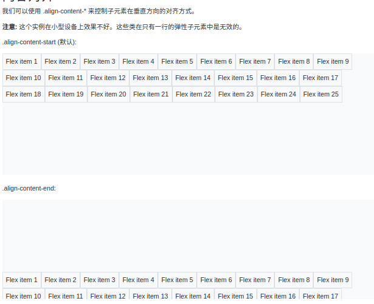
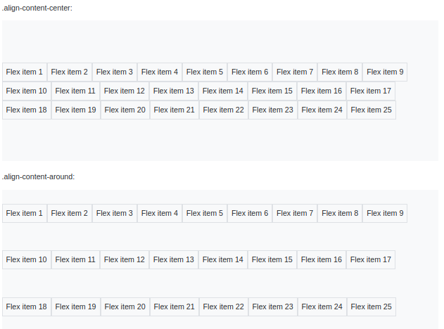
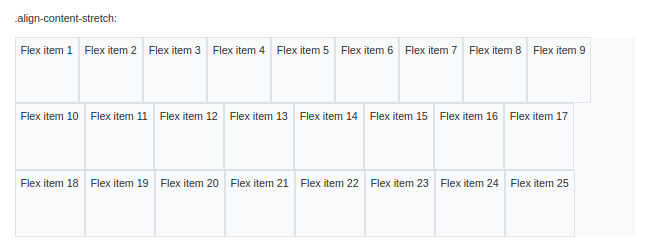


# 子元素对齐
如果要设置单行的子元素对齐可以使用 `.align-items-*` 类来控制，包含的值有：
- .align-items-start
- .align-items-end
- .align-items-center
- .align-items-baseline
- .align-items-stretch (默认)
```
div class="container mt-3">
  <h2>子元素对齐</h2>
  <p>如果要设置单行的子元素对齐可以使用 .align-content-* 类来控制。</p>
  <p>.align-items-start:</p>
  <div class="d-flex align-items-start bg-light" style="height:150px">
    <div class="p-2 border">Flex item 1</div>
    <div class="p-2 border">Flex item 2</div>
    <div class="p-2 border">Flex item 3</div>
  </div>
  <br>
  <p>.align-items-end:</p>
  <div class="d-flex align-items-end bg-light" style="height:150px">
    <div class="p-2 border">Flex item 1</div>
    <div class="p-2 border">Flex item 2</div>
    <div class="p-2 border">Flex item 3</div>
  </div>
  <br>
  <p>.align-items-center:</p>
  <div class="d-flex align-items-center bg-light" style="height:150px">
    <div class="p-2 border">Flex item 1</div>
    <div class="p-2 border">Flex item 2</div>
    <div class="p-2 border">Flex item 3</div>
  </div>
  <br>
  <p>.align-items-baseline:</p>
  <div class="d-flex align-items-baseline bg-light" style="height:150px">
    <div class="p-2 border">Flex item 1</div>
    <div class="p-2 border">Flex item 2</div>
    <div class="p-2 border">Flex item 3</div>
  </div>
  <br>
  <p>.align-items-stretch (默认):</p>
  <div class="d-flex align-items-stretch bg-light" style="height:150px">
    <div class="p-2 border">Flex item 1</div>
    <div class="p-2 border">Flex item 2</div>
    <div class="p-2 border">Flex item 3</div>
  </div>
  <br>
</div>
```

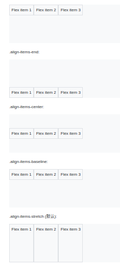


# 指定子元素对齐
如果要设置指定子元素对齐对齐可以使用 `.align-self-*` 类来控制，包含的值有：
- .align-self-start
- .align-self-end
- .align-self-center
- .align-self-baseline
- .align-self-stretch (默认)
```
<div class="container mt-3">
  <h2>Align Self</h2>
  <p>如果要设置指定子元素对齐对齐可以使用 .align-self-* 类来控制。</p>
  <p>.align-self-start:</p>
  <div class="d-flex bg-light" style="height:150px">
    <div class="p-2 border">Flex item 1</div>
    <div class="p-2 border align-self-start">Flex item 2</div>
    <div class="p-2 border">Flex item 3</div>
  </div>
  <br>
  <p>.align-self-end:</p>
  <div class="d-flex bg-light" style="height:150px">
    <div class="p-2 border">Flex item 1</div>
    <div class="p-2 border align-self-end">Flex item 2</div>
    <div class="p-2 border">Flex item 3</div>
  </div>
  <br>
  <p>.align-self-center:</p>
  <div class="d-flex bg-light" style="height:150px">
    <div class="p-2 border">Flex item 1</div>
    <div class="p-2 border align-self-center">Flex item 2</div>
    <div class="p-2 border">Flex item 3</div>
  </div>
  <br>
  <p>.align-self-baseline:</p>
  <div class="d-flex bg-light" style="height:150px">
    <div class="p-2 border">Flex item 1</div>
    <div class="p-2 border align-self-baseline">Flex item 2</div>
    <div class="p-2 border">Flex item 3</div>
  </div>
  <br>
  <p>.align-self-stretch (默认):</p>
  <div class="d-flex bg-light" style="height:150px">
    <div class="p-2 border">Flex item 1</div>
    <div class="p-2 border align-self-stretch">Flex item 2</div>
    <div class="p-2 border">Flex item 3</div>
  </div>
  <br>
</div>
```
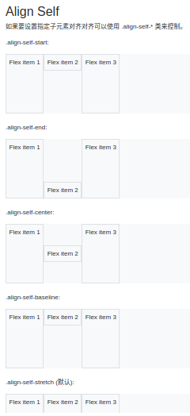


# 响应式 flex 类
我们可以根据不同的设备，设置 flex 类，从而实现页面响应式布局，以下表格中的 * 号可以的值有：sm, md, lg 或 xl, 对应的是小型设备、中型设备，大型设备，超大型设备。

## 弹性容器
- .d-*-flex	根据不同的屏幕设备创建弹性盒子容器
- .d-*-inline-flex	根据不同的屏幕设备创建行内弹性盒子容器

## 方向
- .flex-*-row	根据不同的屏幕设备在水平方向显示弹性子元素
- .flex-*-row-reverse	根据不同的屏幕设备在水平方向显示弹性子元素，且右对齐
- .flex-*-column	根据不同的屏幕设备在垂直方向显示弹性子元素
- .flex-*-column-reverse	根据不同的屏幕设备在垂直方向显示弹性子元素，且方向相反

## 内容对齐
- .justify-content-*-start	根据不同屏幕设备在开始位置显示弹性子元素 (左对齐)
- .justify-content-*-end	根据不同屏幕设备在尾部显示弹性子元素 (右对齐)
- .justify-content-*-center	根据不同屏幕设备在 flex 容器中居中显示子元素
- .justify-content-*-between	根据不同屏幕设备使用 "between" 显示弹性子元素
- .justify-content-*-around	根据不同屏幕设备使用 "around" 显示弹性子元素

## 等宽
- .flex-*-fill	根据不同的屏幕设备强制等宽

## 扩展
- .flex-*-grow-0	不同的屏幕设备不设置扩展	 
- .flex-*-grow-1	不同的屏幕设备设置扩展	 

## 收缩
- .flex-*-shrink-0	不同的屏幕设备不设置收缩	 
- .flex-*-shrink-1	不同的屏幕设备设置收缩	 

## 包裹
- .flex-*-nowrap	不同的屏幕设备不设置包裹元素
- .flex-*-wrap	不同的屏幕设备设置包裹元素
- .flex-*-wrap-reverse	不同的屏幕设备反转包裹元素

## 内容排列
- .align-content-*-start	根据不同屏幕设备在起始位置堆叠元素
- .align-content-*-end	根据不同屏幕设备在结束位置堆叠元素
- .align-content-*-center	根据不同屏幕设备在中间位置堆叠元素
- .align-content-*-around	根据不同屏幕设备，使用 "around" 堆叠元素
- .align-content-*-stretch	根据不同屏幕设备，通过伸展元素来堆叠

## 元素对齐
- .align-items-*-start	根据不同屏幕设备，让元素在头部显示在同一行。
- .align-items-*-end	根据不同屏幕设备，让元素在尾部显示在同一行。
- .align-items-*-center	根据不同屏幕设备，让元素在中间位置显示在同一行。
- .align-items-*-baseline	根据不同屏幕设备，让元素在基线上显示在同一行。
- .align-items-*-stretch	根据不同屏幕设备，让元素延展高度并显示在同一行。

## 单独一个子元素的对齐方式
- .align-self-*-start	据不同屏幕设备，让单独一个子元素显示在头部。
- .align-self-*-end	据不同屏幕设备，让单独一个子元素显示在尾部
- .align-self-*-center	据不同屏幕设备，让单独一个子元素显示在居中位置
- .align-self-*-baseline	据不同屏幕设备，让单独一个子元素显示在基线位置
- .align-self-*-stretch	据不同屏幕设备，延展一个单独子元素
