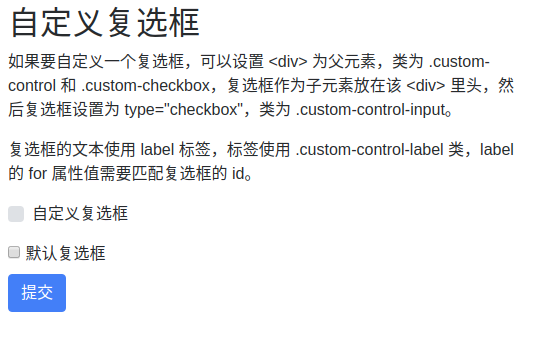
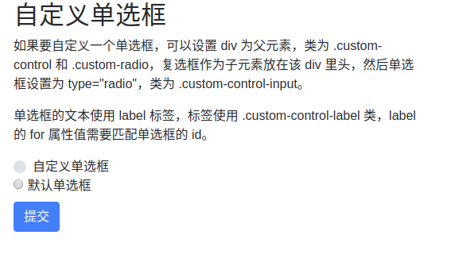
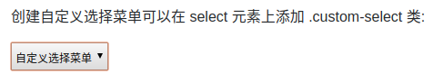
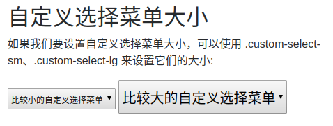
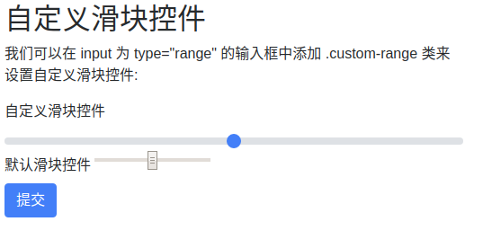
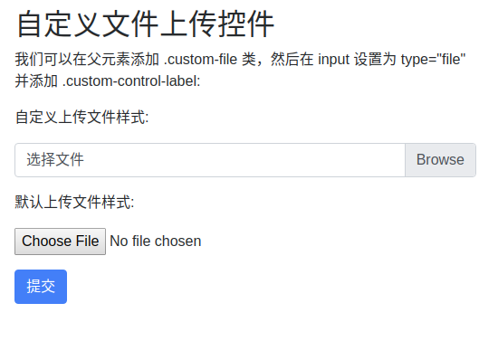

# 表单 form
Bootstrap 通过一些简单的 HTML 标签和扩展的类即可创建出不同样式的表单。

表单元素 `<input>`, `<textarea>`, 和 `<select>` `elements` 在使用 `.form-control` 类的情况下，宽度都是设置为 100%。


# 表单布局
- 堆叠表单 (全屏宽度)：垂直方向
- 内联表单：水平方向


## 堆叠表单

```
<div class="container">
  <h2>堆叠表单</h2>
  <form>
    <div class="form-group">
      <label for="email">Email:</label>
      <input type="email" class="form-control" id="email" placeholder="Enter email">
    </div>
    <div class="form-group">
      <label for="pwd">Password:</label>
      <input type="password" class="form-control" id="pwd" placeholder="Enter password">
    </div>
    <div class="form-check">
      <label class="form-check-label">
        <input class="form-check-input" type="checkbox"> Remember me
      </label>
    </div>
    <button type="submit" class="btn btn-primary">Submit</button>
  </form>
</div>
```


## 内联表单
所有内联表单中的元素都是左对齐的。

注意：在屏幕宽度小于 576px 时为垂直堆叠，如果屏幕宽度大于等于576px时表单元素才会显示在同一个水平线上。

内联表单需要在 `<form>` 元素上添加 `.form-inline`类


# 表单控件
Bootstrap4 支持以下表单控件：
- input
- textarea
- checkbox
- radio
- select

## Input
Bootstrap 支持所有的 HTML5 输入类型: 
- text
- password
- datetime
- datetime-local
- date
- month
- time
- week
- number
- email
- url
- search
- tel
- color

如果 `input` 的 `type` 属性未正确声明，输入框的样式将不会显示。
```
<div class="container">
  <h2>表单控件: input</h2>
  <p>以下实例使用两个 input 元素，一个是 text，一个是 password ：</p>
  <form>
    <div class="form-group">
      <label for="usr">用户名:</label>
      <input type="text" class="form-control" id="usr">
    </div>
    <div class="form-group">
      <label for="pwd">密码:</label>
      <input type="password" class="form-control" id="pwd">
    </div>
  </form>
</div>
```


## textarea

```
<div class="container">
  <h2>表单控件: textarea</h2>
  <p>以下实例演示了 textarea 的样式。</p>
  <form>
    <div class="form-group">
      <label for="comment">评论:</label>
      <textarea class="form-control" rows="5" id="comment"></textarea>
    </div>
  </form>
</div>
```


## 复选框(checkbox)

```
<div class="container">
  <h2>表单控件: checkbox</h2>
  <p>以下实例包含了三个选项。最后一个是禁用的：</p>
  <form>
    <div class="form-check">
      <label class="form-check-label">
        <input type="checkbox" class="form-check-input" value="">Option 1
      </label>
    </div>
    <div class="form-check">
      <label class="form-check-label">
        <input type="checkbox" class="form-check-input" value="">Option 2
      </label>
    </div>
    <div class="form-check disabled">
      <label class="form-check-label">
        <input type="checkbox" class="form-check-input" value="" disabled>Option 3
      </label>
    </div>
  </form>
</div>
```


使用 `.form-check-inline` 类可以让选项显示在同一行上：


## 单选框(Radio)
单选框用于让用户从一系列预设置的选项中进行选择，只能选一个。
```
<div class="container">
  <h2>表单控件: radio</h2>
  <p>以下实例包含了三个选项。最后一个是禁用的：</p>
  <form>
    <div class="radio">
      <label><input type="radio" name="optradio">Option 1</label>
    </div>
    <div class="radio">
      <label><input type="radio" name="optradio">Option 2</label>
    </div>
    <div class="radio disabled">
      <label><input type="radio" name="optradio" disabled>Option 3</label>
    </div>
  </form>
</div>
```


## select 下拉菜单

```
<div class="container">
  <h2>表单控件: select</h2>
  <p>以下表单包含了两个下拉菜单 (select 列表):</p>
  <form>
    <div class="form-group">
      <label for="sel1">单选下拉菜单:</label>
      <select class="form-control" id="sel1">
        <option>1</option>
        <option>2</option>
        <option>3</option>
        <option>4</option>
      </select>
      <br>
      <label for="sel2">多选下拉菜单(按住 shift 键，可以选取多个选项):</label>
      <select multiple class="form-control" id="sel2">
        <option>1</option>
        <option>2</option>
        <option>3</option>
        <option>4</option>
        <option>5</option>
      </select>
    </div>
  </form>
</div>
```


# 输入框组 input group
- 我们可以使用 `.input-group` 类来向表单输入框中添加更多的样式，如图标、文本或者按钮。
- 使用 `.input-group-prepend` 类可以在输入框的的前面添加文本信息， `.input-group-append` 类添加在输入框的后面。
- 最后，我们还需要使用 `.input-group-text` 类来设置文本的样式。

```
<div class="container mt-3">
  <h3>输入框组</h3>
  <p> .input-group .input-group 类来向表单输入框中添加更多的样式，如图标、文本或者按钮，.input-group-prepend 类添加在前面，.input-group-append 添加在后面。</p>
  <p>使用 .input-group-text 类来设置文本的样式。</p>
  
  <form action="/action_page.php">
    <div class="input-group mb-3">
      <div class="input-group-prepend">
        <span class="input-group-text">@</span>
      </div>
      <input type="text" class="form-control" placeholder="Username" id="usr" name="username">
    </div>

    <div class="input-group mb-3">
      <input type="text" class="form-control" placeholder="Your Email" id="mail" name="email">
      <div class="input-group-append">
        <span class="input-group-text">@runoob.com</span>
      </div>
    </div>
    <button type="submit" class="btn btn-primary">Submit</button>
  </form>
</div>
```


## 输入框大小
使用 `.input-group-sm` 类来设置小的输入框， `.input-group-lg` 类设置大的输入框：

```
<div class="container mt-3">
  <h1>输入框大小</h1>
  <p>使用 .input-group-sm 类来设置小的输入框， .input-group-lg 类设置大的输入框：</p>
  <form>
    <div class="input-group mb-3 input-group-sm">
      <div class="input-group-prepend">
        <span class="input-group-text">Small</span>
      </div>
      <input type="text" class="form-control">
    </div>
  </form>
  <form>
    <div class="input-group mb-3">
      <div class="input-group-prepend">
        <span class="input-group-text">Default</span>
      </div>
      <input type="text" class="form-control">
    </div>
  </form>
  <form>
    <div class="input-group mb-3 input-group-lg">
      <div class="input-group-prepend">
        <span class="input-group-text">Large</span>
      </div>
      <input type="text" class="form-control">
    </div>
  </form>
</div>
```


## 多个输入框和文本
```
<div class="container mt-3">
  <h3>多个输入框和文本</h3>
  
  <form>
    <div class="input-group mb-3">
      <div class="input-group-prepend">
        <span class="input-group-text">Person</span>
      </div>
      <input type="text" class="form-control" placeholder="First Name">
      <input type="text" class="form-control" placeholder="Last Name">
    </div>  
  </form>
  
  <form>
    <div class="input-group mb-3">
      <div class="input-group-prepend">
        <span class="input-group-text">One</span>
        <span class="input-group-text">Two</span>
        <span class="input-group-text">Three</span>
      </div>
      <input type="text" class="form-control">
    </div>
  </form>
</div>
```


## 复选框与单选框
```
<div class="container mt-3">
  <h3>复选框与单选框</h3>
  <p>文本信息可以使用复选框与单选框替代：</p>
  <form>
    <div class="input-group mb-3">
      <div class="input-group-prepend">
        <div class="input-group-text">
          <input type="checkbox"> 
        </div>
      </div>
      <input type="text" class="form-control" placeholder="RUNOOB">
    </div>
  </form>
  
  <form>
    <div class="input-group mb-3">
      <div class="input-group-prepend">
        <div class="input-group-text">
          <input type="radio"> 
        </div>
      </div>
      <input type="text" class="form-control" placeholder="GOOGLE">
    </div>
  </form>
</div>
```


## 输入框添加按钮组
```
<div class="container mt-3">
  <h1>输入框添加按钮组</h1>
  <div class="input-group mb-3">
    <div class="input-group-prepend">
      <button class="btn btn-outline-secondary" type="button">Basic Button</button>  
    </div>
    <input type="text" class="form-control" placeholder="Some text">
  </div>

  <div class="input-group mb-3">
    <input type="text" class="form-control" placeholder="Search">
    <div class="input-group-append">
      <button class="btn btn-success" type="submit">Go</button>  
     </div>
  </div>

  <div class="input-group mb-3">
    <input type="text" class="form-control" placeholder="Something clever..">
    <div class="input-group-append">
      <button class="btn btn-primary" type="button">OK</button>  
      <button class="btn btn-danger" type="button">Cancel</button>  
     </div>
  </div>
</div>
```


## 设置下拉菜单
输入框中添加下拉菜单不需要使用 `.dropdown` 类。
```
<div class="container mt-3">
  <h3>设置下拉菜单</h3>
  <p>输入框中添加下拉菜单不需要使用 .dropdown 类。</p>
  <form>
    <div class="input-group mt-3 mb-3">
      <div class="input-group-prepend">
        <button type="button" class="btn btn-outline-secondary dropdown-toggle" data-toggle="dropdown">
          选择网站
        </button>
        <div class="dropdown-menu">
          <a class="dropdown-item" href="https://www.google.com">GOOGLE</a>
          <a class="dropdown-item" href="https://www.runoob.com">RUNOOB</a>
          <a class="dropdown-item" href="https://www.taobao.com">TAOBAO</a>
        </div>
      </div>
      <input type="text" class="form-control" placeholder="网站地址">
    </div>
  </form>
</div>
```


## 输入框组标签
在输入框组通过在输入框组外围的 `label` 来设置标签，标签的 `for` 属性需要与输入框组的 `id` 对应，点击标签后可以聚焦输入框：

```
<div class="container mt-3">
  <h2>输入框组标签</h2>
  <p>在输入框组通过在输入框组外围的 label 来设置标签，标签的 for 属性需要与输入框组的 id 对应。</p>
  <p>点击标签后可以聚焦输入框：</p>
  <form>
    <label for="demo">这里输入您的邮箱:</label>
    <div class="input-group mb-3">
      <input type="text" class="form-control" placeholder="Email" id="demo" name="email">
      <div class="input-group-append">
        <span class="input-group-text">@runoob.com</span>
      </div>
    </div>
  </form>
</div>
```


# 自定义表单
## 自定义复选框
- 如果要自定义一个复选框，可以设置 `<div>` 为父元素，类为 `.custom-control` 和 `.custom-checkbox`，复选框作为子元素放在该 `<div>` 里头，然后复选框设置为 `type="checkbox"`，类为 `.custom-control-input`
- 复选框的文本使用 `label` 标签，标签使用 `.custom-control-label` 类，`label` 的 `for` 属性值需要匹配复选框的 `id`

```
<div class="container mt-3">
  <h2>自定义复选框</h2>
  <p>如果要自定义一个复选框，可以设置 &lt;div&gt; 为父元素，类为 .custom-control 和 .custom-checkbox，复选框作为子元素放在该 &lt;div&gt; 里头，然后复选框设置为 type="checkbox"，类为 .custom-control-input。</p>
  <p>复选框的文本使用 label 标签，标签使用 .custom-control-label 类，label 的 for 属性值需要匹配复选框的 id。</p>
  <form action="/action_page.php">
    <div class="custom-control custom-checkbox mb-3">
      <input type="checkbox" class="custom-control-input" id="customCheck" name="example1">
      <label class="custom-control-label" for="customCheck">自定义复选框</label>
    </div>
    <input type="checkbox" id="defaultCheck" name="example2">
    <label for="defaultCheck">默认复选框</label>
    <br>
    <button type="submit" class="btn btn-primary">提交</button>
  </form>
</div>
```




## 自定义单选框
- 如果要自定义一个单选框，可以设置 `<div>` 为父元素，类为 `.custom-control` 和 `.custom-radio`，单选框作为子元素放在该 `<div>` 里头，然后单选框设置为 `type="radio"`，类为 `.custom-control-input`。
- 单选框的文本使用 `label` 标签，标签使用 `.custom-control-label` 类，`label` 的 `for` 属性值需要匹配单选框的 `id`。

```
<div class="container mt-3">
  <h2>自定义单选框</h2>
  <p>如果要自定义一个单选框，可以设置 div 为父元素，类为 .custom-control 和 .custom-radio，复选框作为子元素放在该 div 里头，然后单选框设置为 type="radio"，类为 .custom-control-input。</p>
  <p>单选框的文本使用 label 标签，标签使用 .custom-control-label 类，label 的 for 属性值需要匹配单选框的 id。</p>
  <form action="/action_page.php">
    <div class="custom-control custom-radio">
      <input type="radio" class="custom-control-input" id="customRadio" name="example1">
      <label class="custom-control-label" for="customRadio">自定义单选框</label>
    </div>    
    <input type="radio" id="defaultRadio" name="example2">
    <label for="defaultRadio">默认单选框</label>
    <br>
    <button type="submit" class="btn btn-primary">提交</button>
  </form>
</div>
```




## 自定义控件显示在同一行
我们可以在外部元素上使用 `.custom-control-inline` 类来包裹自定义表单控件，这样自定义表单控件就能显示在同一行：
```
<div class="container mt-3">
  <h2>自定义控件显示在同一行</h2>
  <p>我们可以在外部元素上使用 .custom-control-inline 类来包裹自定义表单控件，这样自定义表单控件就能显示在同一行：</p>
  <form action="/action_page.php">
    <div class="custom-control custom-radio custom-control-inline">
      <input type="radio" class="custom-control-input" id="customRadio1" name="example1">
      <label class="custom-control-label" for="customRadio1">自定义单选框 1</label>
    </div>
    <div class="custom-control custom-radio custom-control-inline">
      <input type="radio" class="custom-control-input" id="customRadio2" name="example2">
      <label class="custom-control-label" for="customRadio2">自定义单选框 2</label>
    </div>
    <button type="submit" class="btn btn-primary">提交</button>
  </form>
</div>
```


## 自定义选择菜单
创建自定义选择菜单可以在 `<select>` 元素上添加 `.custom-select` 类:
```
<div class="container mt-3">
  <h2>自定义选择菜单</h2>
  <p>创建自定义选择菜单可以在 select 元素上添加 .custom-select 类:</p>
  <form>
  <select name="cars" class="custom-select-sm">
    <option selected>自定义选择菜单</option>
    <option value="Google">Google</option>
    <option value="Runoob">Runoob</option>
    <option value="Taobao">Taobao</option>
  </select>
 </form>
</div>
```



如果我们要设置自定义选择菜单大小，可以使用 `.custom-select-sm、.custom-select-lg` 来设置它们的大小:

```
<div class="container mt-3">
  <h2>自定义选择菜单大小</h2>
  <p>如果我们要设置自定义选择菜单大小，可以使用 .custom-select-sm、.custom-select-lg 来设置它们的大小:</p>
  <form>
    <!-- 小 -->
    <select name="cars" class="custom-select-sm">
      <option selected>比较小的自定义选择菜单</option>
      <option value="Google">Google</option>
      <option value="Runoob">Runoob</option>
      <option value="Taobao">Taobao</option>
    </select>
   
    <!-- 大 -->
    <select name="cars" class="custom-select-lg">
      <option selected>比较大的自定义选择菜单</option>
      <option value="Google">Google</option>
      <option value="Runoob">Runoob</option>
      <option value="Taobao">Taobao</option>
    </select>
  </form>
</div>
```




## 自定义滑块控件
我们可以在 `input` 为 `type="range"` 的输入框中添加 `.custom-range` 类来设置自定义滑块控件:
```
<div class="container mt-3">
  <h2>自定义滑块控件</h2>
  <p>我们可以在 input 为 type="range" 的输入框中添加 .custom-range 类来设置自定义滑块控件:</p>
  <form action="/action_page.php">
    <label for="customRange">自定义滑块控件</label>
    <input type="range" class="custom-range" id="customRange" name="points1">
    <label for="defaultRange">默认滑块控件</label>
    <input type="range" id="defaultRange" name="points2">
    <p><button type="submit" class="btn btn-primary">提交</button></p>
  </form>
</div>
```




## 自定义文件上传控件
- 我们可以在父元素添加 `.custom-file` 类，然后在 input 设置为 `type="file"` 并添加 `.custom-file-input`:
- 上传控件的文本使用 `label` 标签，标签使用 `.custom-file-label` 类，`label` 的 `for` 属性值需要匹配复选框的 `id`。
```
<div class="container mt-3">
  <h2>自定义文件上传控件</h2>
  <p>我们可以在父元素添加 .custom-file 类，然后在 input 设置为 type="file" 并添加 .custom-control-label:</p>
  <form action="/action_page.php">
    <p>自定义上传文件样式:</p>
    <div class="custom-file mb-3">
      <input type="file" class="custom-file-input" id="customFile" name="filename">
      <label class="custom-file-label" for="customFile">选择文件</label>
    </div>
    
    <p>默认上传文件样式:</p>
    <input type="file" id="myFile" name="filename2">
  
    <div class="mt-3">
      <button type="submit" class="btn btn-primary">提交</button>
    </div>
  </form>
</div>
```



