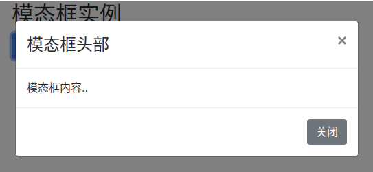
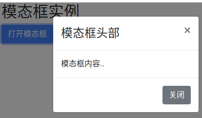
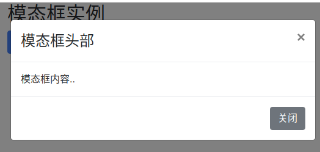

# 模态框
模态框（Modal）是覆盖在父窗体上的子窗体。通常，目的是显示来自一个单独的源的内容，可以在不离开父窗体的情况下有一些互动。子窗体可提供信息交互等。

```
<div class="container">
  <h2>模态框实例</h2>
  <!-- 按钮：用于打开模态框 -->
  <button type="button" class="btn btn-primary" data-toggle="modal" data-target="#myModal">
    打开模态框
  </button>
   
  <!-- 模态框 -->
  <div class="modal fade" id="myModal">
    <div class="modal-dialog">
      <div class="modal-content">
   
        <!-- 模态框头部 -->
        <div class="modal-header">
          <h4 class="modal-title">模态框头部</h4>
          <button type="button" class="close" data-dismiss="modal">&times;</button>
        </div>
   
        <!-- 模态框主体 -->
        <div class="modal-body">
          模态框内容..
        </div>
   
        <!-- 模态框底部 -->
        <div class="modal-footer">
          <button type="button" class="btn btn-secondary" data-dismiss="modal">关闭</button>
        </div>
   
      </div>
    </div>
  </div>
  
</div>
```




# 模态框尺寸
- 我们可以通过添加 `.modal-sm` 类来创建一个小模态框，`.modal-lg` 类可以创建一个大模态框。
- 尺寸类放在 `<div>`元素的 `.modal-dialog` 类后 

```
<div class="modal-dialog modal-sm">
<div class="modal-dialog modal-lg">
```





