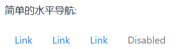
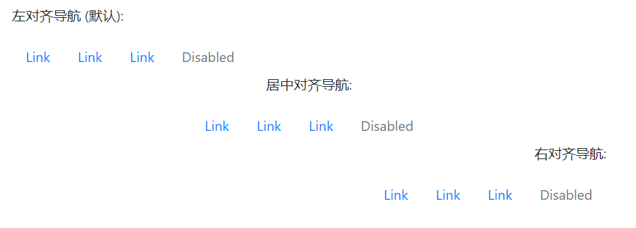
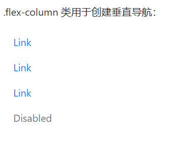
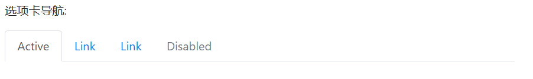
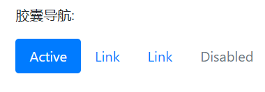
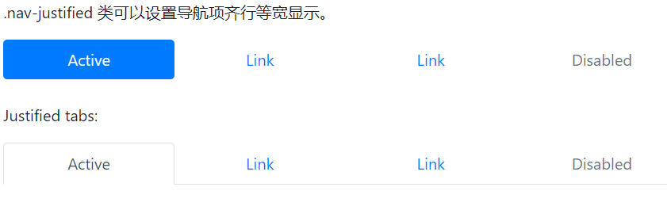
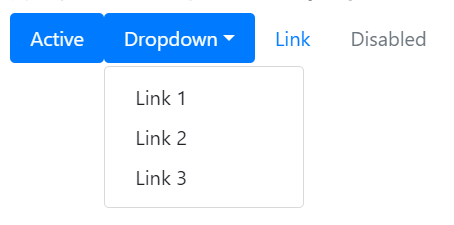
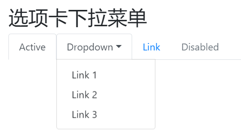
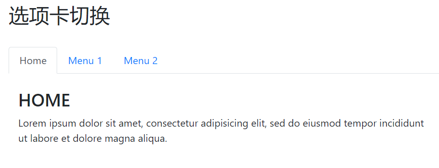
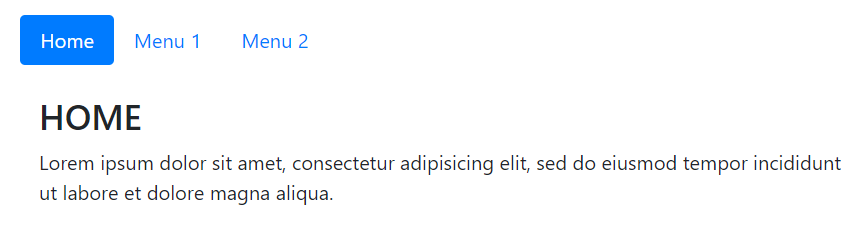

# 简单的水平导航
如果你想创建一个简单的水平导航栏，可以在 `<ul>` 元素上添加 `.nav`类，在每个 `<li>` 选项上添加 `.nav-item` 类，在每个链接上添加 `.nav-link` 类:
```
<div class="container">
  <h2>导航</h2>
  <p>简单的水平导航:</p>
  <ul class="nav">
    <li class="nav-item">
      <a class="nav-link" href="#">Link</a>
    </li>
    <li class="nav-item">
      <a class="nav-link" href="#">Link</a>
    </li>
    <li class="nav-item">
      <a class="nav-link" href="#">Link</a>
    </li>
    <li class="nav-item">
      <a class="nav-link disabled" href="#">Disabled</a>
    </li>
  </ul>
</div>
```



# 导航对齐方式
- `.justify-content-center` 类设置导航居中显示
- ` .justify-content-end` 类设置导航右对齐。
```
<div class="container">
  <h2>导航</h2>
  <p>左对齐导航 (默认):</p>
  <ul class="nav">
    <li class="nav-item">
      <a class="nav-link" href="#">Link</a>
    </li>
    <li class="nav-item">
      <a class="nav-link" href="#">Link</a>
    </li>
    <li class="nav-item">
      <a class="nav-link" href="#">Link</a>
    </li>
    <li class="nav-item">
      <a class="nav-link disabled" href="#">Disabled</a>
    </li>
  </ul>
  
  <p class="text-center">居中对齐导航:</p>
  <ul class="nav justify-content-center">
    <li class="nav-item">
      <a class="nav-link" href="#">Link</a>
    </li>
    <li class="nav-item">
      <a class="nav-link" href="#">Link</a>
    </li>
    <li class="nav-item">
      <a class="nav-link" href="#">Link</a>
    </li>
    <li class="nav-item">
      <a class="nav-link disabled" href="#">Disabled</a>
    </li>
  </ul>
    
  <p class="text-right">右对齐导航:</p>
  <ul class="nav justify-content-end">
    <li class="nav-item">
      <a class="nav-link" href="#">Link</a>
    </li>
    <li class="nav-item">
      <a class="nav-link" href="#">Link</a>
    </li>
    <li class="nav-item">
      <a class="nav-link" href="#">Link</a>
    </li>
    <li class="nav-item">
      <a class="nav-link disabled" href="#">Disabled</a>
    </li>
  </ul>
</div>
```




# 垂直导航
`.flex-column` 类用于创建垂直导航：
```
<div class="container">
  <h2>垂直导航</h2>
  <p>.flex-column 类用于创建垂直导航：</p>
  <ul class="nav flex-column">
    <li class="nav-item">
      <a class="nav-link" href="#">Link</a>
    </li>
    <li class="nav-item">
      <a class="nav-link" href="#">Link</a>
    </li>
    <li class="nav-item">
      <a class="nav-link" href="#">Link</a>
    </li>
    <li class="nav-item">
      <a class="nav-link disabled" href="#">Disabled</a>
    </li>
  </ul>
</div>
```




# 选项卡
使用 `.nav-tabs` 类可以将导航转化为选项卡。然后对于选中的选项使用 `.active` 类来标记。
```
<div class="container">
  <h2>选项卡</h2>
  <p>选项卡导航:</p>
  <ul class="nav nav-tabs">
    <li class="nav-item">
      <a class="nav-link active" href="#">Active</a>
    </li>
    <li class="nav-item">
      <a class="nav-link" href="#">Link</a>
    </li>
    <li class="nav-item">
      <a class="nav-link" href="#">Link</a>
    </li>
    <li class="nav-item">
      <a class="nav-link disabled" href="#">Disabled</a>
    </li>
  </ul>
</div>
```




# 胶囊导航
`.nav-pills` 类可以将导航项设置成胶囊形状。
```
<div class="container">
  <h2>胶囊</h2>
  <p>胶囊导航:</p>
  <ul class="nav nav-pills">
    <li class="nav-item">
      <a class="nav-link active" href="#">Active</a>
    </li>
    <li class="nav-item">
      <a class="nav-link" href="#">Link</a>
    </li>
    <li class="nav-item">
      <a class="nav-link" href="#">Link</a>
    </li>
    <li class="nav-item">
      <a class="nav-link disabled" href="#">Disabled</a>
    </li>
  </ul>
</div>
```




# 导航等宽
`.nav-justified` 类可以设置导航项齐行等宽显示。

```
<div class="container">
  <h2>导航等宽</h2>
  <p>.nav-justified 类可以设置导航项齐行等宽显示。</p>
  <ul class="nav nav-pills nav-justified">
    <li class="nav-item">
      <a class="nav-link active" href="#">Active</a>
    </li>
    <li class="nav-item">
      <a class="nav-link" href="#">Link</a>
    </li>
    <li class="nav-item">
      <a class="nav-link" href="#">Link</a>
    </li>
    <li class="nav-item">
      <a class="nav-link disabled" href="#">Disabled</a>
    </li>
  </ul><br>

  <p>Justified tabs:</p>
  <ul class="nav nav-tabs nav-justified">
    <li class="nav-item">
      <a class="nav-link active" href="#">Active</a>
    </li>
    <li class="nav-item">
      <a class="nav-link" href="#">Link</a>
    </li>
    <li class="nav-item">
      <a class="nav-link" href="#">Link</a>
    </li>
    <li class="nav-item">
      <a class="nav-link disabled" href="#">Disabled</a>
    </li>
  </ul>
</div>
```




# 胶囊下拉菜单
```
<div class="container">
  <h2>胶囊导航带下拉菜单</h2>
  <ul class="nav nav-pills">
    <li class="nav-item">
      <a class="nav-link active" href="#">Active</a>
    </li>
    <li class="nav-item dropdown">
      <a class="nav-link dropdown-toggle" data-toggle="dropdown" href="#">Dropdown</a>
      <div class="dropdown-menu">
        <a class="dropdown-item" href="#">Link 1</a>
        <a class="dropdown-item" href="#">Link 2</a>
        <a class="dropdown-item" href="#">Link 3</a></div>
    </li>
    <li class="nav-item">
      <a class="nav-link" href="#">Link</a>
    </li>
    <li class="nav-item">
      <a class="nav-link disabled" href="#">Disabled</a>
    </li>
  </ul>
</div>
```




# 选项卡下拉菜单
```
<div class="container">
  <h2>选项卡下拉菜单</h2>
  <ul class="nav nav-tabs">
    <li class="nav-item">
      <a class="nav-link active" href="#">Active</a>
    </li>
    <li class="nav-item dropdown">
      <a class="nav-link dropdown-toggle" data-toggle="dropdown" href="#">Dropdown</a>
      <div class="dropdown-menu">
        <a class="dropdown-item" href="#">Link 1</a>
        <a class="dropdown-item" href="#">Link 2</a>
        <a class="dropdown-item" href="#">Link 3</a></div>
    </li>
    <li class="nav-item">
      <a class="nav-link" href="#">Link</a>
    </li>
    <li class="nav-item">
      <a class="nav-link disabled" href="#">Disabled</a>
    </li>
  </ul>
</div>
```




# 选项卡切换
如果你要设置选项卡是动态可切换的，可以在每个链接上添加 `data-toggle="tab"` 属性。 然后在每个选项对应的内容的上添加 `.tab-pane` 类。
如果你希望有淡入效果可以在 `.tab-pane` 后添加 `.fade`类:
```
<div class="container">
  <h2>选项卡切换</h2>
  <br>
  <!-- Nav tabs -->
  <ul class="nav nav-tabs" role="tablist">
    <li class="nav-item">
      <a class="nav-link active" data-toggle="tab" href="#home">Home</a>
    </li>
    <li class="nav-item">
      <a class="nav-link" data-toggle="tab" href="#menu1">Menu 1</a>
    </li>
    <li class="nav-item">
      <a class="nav-link" data-toggle="tab" href="#menu2">Menu 2</a>
    </li>
  </ul>

  <!-- Tab panes -->
  <div class="tab-content">
    <div id="home" class="container tab-pane active"><br>
      <h3>HOME</h3>
      <p>Lorem ipsum dolor sit amet, consectetur adipisicing elit, sed do eiusmod tempor incididunt ut labore et dolore magna aliqua.</p>
    </div>
    <div id="menu1" class="container tab-pane fade"><br>
      <h3>Menu 1</h3>
      <p>Ut enim ad minim veniam, quis nostrud exercitation ullamco laboris nisi ut aliquip ex ea commodo consequat.</p>
    </div>
    <div id="menu2" class="container tab-pane fade"><br>
      <h3>Menu 2</h3>
      <p>Sed ut perspiciatis unde omnis iste natus error sit voluptatem accusantium doloremque laudantium, totam rem aperiam.</p>
    </div>
  </div>
</div>
```



# 胶囊状选项卡切换
胶囊状动态选项卡只需要将以上实例的代码中 `data-toggle` 属性设置为 `data-toggle="pill"`
```
<div class="container">
  <h2>胶囊选项卡切换</h2>
  <br>
  <!-- Nav pills -->
  <ul class="nav nav-pills" role="tablist">
    <li class="nav-item">
      <a class="nav-link active" data-toggle="pill" href="#home">Home</a>
    </li>
    <li class="nav-item">
      <a class="nav-link" data-toggle="pill" href="#menu1">Menu 1</a>
    </li>
    <li class="nav-item">
      <a class="nav-link" data-toggle="pill" href="#menu2">Menu 2</a>
    </li>
  </ul>

  <!-- Tab panes -->
  <div class="tab-content">
    <div id="home" class="container tab-pane active"><br>
      <h3>HOME</h3>
      <p>Lorem ipsum dolor sit amet, consectetur adipisicing elit, sed do eiusmod tempor incididunt ut labore et dolore magna aliqua.</p>
    </div>
    <div id="menu1" class="container tab-pane fade"><br>
      <h3>Menu 1</h3>
      <p>Ut enim ad minim veniam, quis nostrud exercitation ullamco laboris nisi ut aliquip ex ea commodo consequat.</p>
    </div>
    <div id="menu2" class="container tab-pane fade"><br>
      <h3>Menu 2</h3>
      <p>Sed ut perspiciatis unde omnis iste natus error sit voluptatem accusantium doloremque laudantium, totam rem aperiam.</p>
    </div>
  </div>
</div>
```



