# 导航栏
我们可以使用 `.navbar` 类来创建一个标准的导航栏，后面紧跟: `.navbar-expand-xl|lg|md|sm` 类来创建响应式的导航栏 (大屏幕水平铺开，小屏幕垂直堆叠)。

导航栏上的选项可以使用 `<ul>` 元素并添加 `class="navbar-nav"` 类。 然后在 `<li>` 元素上添加 `.nav-item `类， `<a>` 元素上使用` .nav-link `类:

```
<nav class="navbar navbar-expand-sm bg-light">
  <ul class="navbar-nav">
    <li class="nav-item">
      <a class="nav-link" href="#">Link 1</a>
    </li>
    <li class="nav-item">
      <a class="nav-link" href="#">Link 2</a>
    </li>
    <li class="nav-item">
      <a class="nav-link" href="#">Link 3</a>
    </li>
  </ul>
</nav>
<br>

<div class="container-fluid">
  <h3>简单的导航栏实例</h3>
  <p>导航栏一般放在页面的顶部。</p>
  <p>我们可以使用 .navbar 类来创建一个标准的导航栏，后面紧跟: .navbar-expand-xl|lg|md|sm 类来创建响应式的导航栏 (大屏幕水平铺开，小屏幕垂直堆叠)。</p>
</div>
```

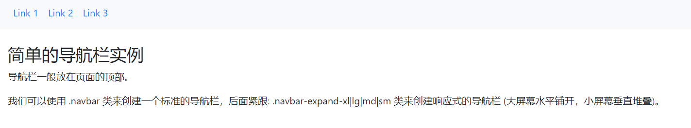


# 垂直导航栏
通过删除 `.navbar-expand-xl|lg|md|sm` 类来创建垂直导航栏:
```
<nav class="navbar bg-light">
  <ul class="navbar-nav">
    <li class="nav-item">
      <a class="nav-link" href="#">Link 1</a>
    </li>
    <li class="nav-item">
      <a class="nav-link" href="#">Link 2</a>
    </li>
    <li class="nav-item">
      <a class="nav-link" href="#">Link 3</a>
    </li>
  </ul>
</nav>
<br>

<div class="container-fluid">
  <h3>垂直导航栏</h3>
  <p>导航栏一般在页面头部。</p>
</div>
```

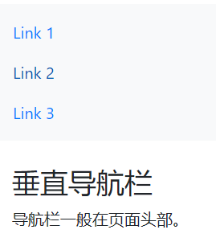


# 不同颜色导航栏
可以使用以下类来创建不同颜色导航栏：
- .bg-primary
- .bg-success
- .bg-info
- .bg-warning
- .bg-danger
- .bg-secondary
- .bg-dark
- .bg-light

```
<div class="container">
  <h3>不同颜色导航栏</h3>
  <p>对于暗色背景需要设置文本颜色为浅色的，对于浅色背景需要设置文本颜色为深色的。</p>
</div>

<nav class="navbar navbar-expand-sm bg-light navbar-light">
  <ul class="navbar-nav">
    <li class="nav-item active">
      <a class="nav-link" href="#">Active</a>
    </li>
    <li class="nav-item">
      <a class="nav-link" href="#">Link</a>
    </li>
    <li class="nav-item">
      <a class="nav-link" href="#">Link</a>
    </li>
    <li class="nav-item">
      <a class="nav-link disabled" href="#">Disabled</a>
    </li>
  </ul>
</nav>

<nav class="navbar navbar-expand-sm bg-dark navbar-dark">
  <ul class="navbar-nav">
    <li class="nav-item active">
      <a class="nav-link" href="#">Active</a>
    </li>
    <li class="nav-item">
      <a class="nav-link" href="#">Link</a>
    </li>
    <li class="nav-item">
      <a class="nav-link" href="#">Link</a>
    </li>
    <li class="nav-item">
      <a class="nav-link disabled" href="#">Disabled</a>
    </li>
  </ul>
</nav>

<nav class="navbar navbar-expand-sm bg-primary navbar-dark">
  <ul class="navbar-nav">
    <li class="nav-item active">
      <a class="nav-link" href="#">Active</a>
    </li>
    <li class="nav-item">
      <a class="nav-link" href="#">Link</a>
    </li>
    <li class="nav-item">
      <a class="nav-link" href="#">Link</a>
    </li>
    <li class="nav-item">
      <a class="nav-link disabled" href="#">Disabled</a>
    </li>
  </ul>
</nav>

<nav class="navbar navbar-expand-sm bg-success navbar-dark">
  <ul class="navbar-nav">
    <li class="nav-item active">
      <a class="nav-link" href="#">Active</a>
    </li>
    <li class="nav-item">
      <a class="nav-link" href="#">Link</a>
    </li>
    <li class="nav-item">
      <a class="nav-link" href="#">Link</a>
    </li>
    <li class="nav-item">
      <a class="nav-link disabled" href="#">Disabled</a>
    </li>
  </ul>
</nav>

<nav class="navbar navbar-expand-sm bg-info navbar-dark">
  <ul class="navbar-nav">
    <li class="nav-item active">
      <a class="nav-link" href="#">Active</a>
    </li>
    <li class="nav-item">
      <a class="nav-link" href="#">Link</a>
    </li>
    <li class="nav-item">
      <a class="nav-link" href="#">Link</a>
    </li>
    <li class="nav-item">
      <a class="nav-link disabled" href="#">Disabled</a>
    </li>
  </ul>
</nav>

<nav class="navbar navbar-expand-sm bg-warning navbar-dark">
  <ul class="navbar-nav">
    <li class="nav-item active">
      <a class="nav-link" href="#">Active</a>
    </li>
    <li class="nav-item">
      <a class="nav-link" href="#">Link</a>
    </li>
    <li class="nav-item">
      <a class="nav-link" href="#">Link</a>
    </li>
    <li class="nav-item">
      <a class="nav-link disabled" href="#">Disabled</a>
    </li>
  </ul>
</nav>

<nav class="navbar navbar-expand-sm bg-danger navbar-dark">
  <ul class="navbar-nav">
    <li class="nav-item active">
      <a class="nav-link" href="#">Active</a>
    </li>
    <li class="nav-item">
      <a class="nav-link" href="#">Link</a>
    </li>
    <li class="nav-item">
      <a class="nav-link" href="#">Link</a>
    </li>
    <li class="nav-item">
      <a class="nav-link disabled" href="#">Disabled</a>
    </li>
  </ul>
</nav>

<nav class="navbar navbar-expand-sm bg-secondary navbar-dark">
  <ul class="navbar-nav">
    <li class="nav-item active">
      <a class="nav-link" href="#">Active</a>
    </li>
    <li class="nav-item">
      <a class="nav-link" href="#">Link</a>
    </li>
    <li class="nav-item">
      <a class="nav-link" href="#">Link</a>
    </li>
    <li class="nav-item">
      <a class="nav-link disabled" href="#">Disabled</a>
    </li>
  </ul>
</nav>
```

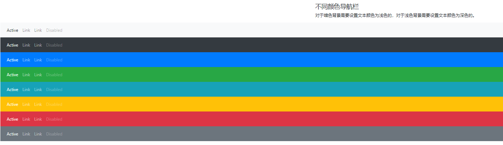

激活和禁用状态: 可以在 `<a>` 元素上添加 `.active` 类来高亮显示选中的选项。 `.disabled` 类用于设置该链接是不可点击的。


# 品牌/Logo
`.navbar-brand` 类用于高亮显示品牌/Logo:
```
<nav class="navbar navbar-expand-sm bg-dark navbar-dark">
  <!-- Brand/logo -->
  <a class="navbar-brand" href="#">Logo</a>
  
  <!-- Links -->
  <ul class="navbar-nav">
    <li class="nav-item">
      <a class="nav-link" href="#">Link 1</a>
    </li>
    <li class="nav-item">
      <a class="nav-link" href="#">Link 2</a>
    </li>
    <li class="nav-item">
      <a class="nav-link" href="#">Link 3</a>
    </li>
  </ul>
</nav>

<div class="container-fluid">
  <h3>品牌/Logo</h3>
  <p>.navbar-brand 类用于高亮显示品牌/Logo:</p>
</div>
```

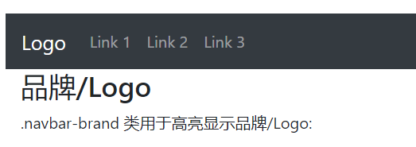

如果使用图片，可以使用 `.navbar-brand` 类来设置图片自适应导航栏。
```
<nav class="navbar navbar-expand-sm bg-dark navbar-dark">
  <!-- Brand/logo -->
  <a class="navbar-brand" href="#">
    
  </a>
  
  <!-- Links -->
  <ul class="navbar-nav">
    <li class="nav-item">
      <a class="nav-link" href="#">Link 1</a>
    </li>
    <li class="nav-item">
      <a class="nav-link" href="#">Link 2</a>
    </li>
    <li class="nav-item">
      <a class="nav-link" href="#">Link 3</a>
    </li>
  </ul>
</nav>

<div class="container-fluid">
  <h3>品牌 / Logo</h3>
  <p>果使用图片，可以使用 .navbar-brand 类来设置图片自适应导航栏。</p>
</div>
```

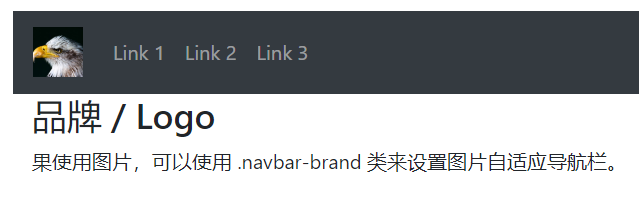


# 折叠导航栏
要创建折叠导航栏，可以在按钮上添加 `class="navbar-toggler"`, `data-toggle="collapse"` 与 `data-target="#thetarget"` 类。然后在设置了` class="collapse navbar-collapse"` 类的 `div` 上包裹导航内容（链接）, `div` 元素上的 `id` 匹配按钮 `data-target` 的上指定的 `id`:
```
<nav class="navbar navbar-expand-md bg-dark navbar-dark">
  <a class="navbar-brand" href="#">Navbar</a>
  <button class="navbar-toggler" type="button" data-toggle="collapse" data-target="#collapsibleNavbar">
    <span class="navbar-toggler-icon"></span>
  </button>
  <div class="collapse navbar-collapse" id="collapsibleNavbar">
    <ul class="navbar-nav">
      <li class="nav-item">
        <a class="nav-link" href="#">Link</a>
      </li>
      <li class="nav-item">
        <a class="nav-link" href="#">Link</a>
      </li>
      <li class="nav-item">
        <a class="nav-link" href="#">Link</a>
      </li>    
    </ul>
  </div>  
</nav>
<br>

<div class="container">
  <h3>折叠导航栏</h3>
  <p>通常，小屏幕上我们都会折叠导航栏，通过点击来显示导航选项。</p>
  <p>提示: 如果你删除 .navbar-expand-md 类，导航链接会一直隐藏，且切换按钮会一直显示。</p>
</div>
```

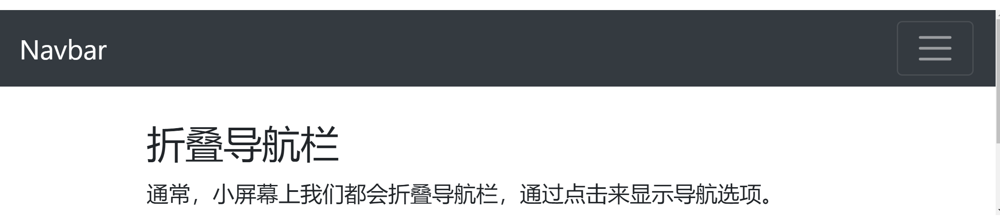

如果你删除 `.navbar-expand-md` 类，导航链接会一直隐藏，且切换按钮会一直显示。


# 导航栏使用下拉菜单
```
<nav class="navbar navbar-expand-sm bg-dark navbar-dark">
  <!-- Brand -->
  <a class="navbar-brand" href="#">Logo</a>

  <!-- Links -->
  <ul class="navbar-nav">
    <li class="nav-item">
      <a class="nav-link" href="#">Link 1</a>
    </li>
    <li class="nav-item">
      <a class="nav-link" href="#">Link 2</a>
    </li>

    <!-- Dropdown -->
    <li class="nav-item dropdown">
      <a class="nav-link dropdown-toggle" href="#" id="navbardrop" data-toggle="dropdown">
        Dropdown link
      </a>
      <div class="dropdown-menu">
        <a class="dropdown-item" href="#">Link 1</a>
        <a class="dropdown-item" href="#">Link 2</a>
        <a class="dropdown-item" href="#">Link 3</a>
      </div>
    </li>
  </ul>
</nav>
<br>
  
<div class="container">
  <h3>导航栏使用下拉菜单</h3>
  <p>导航栏上可以设置下拉菜单。</p>
</div>
```

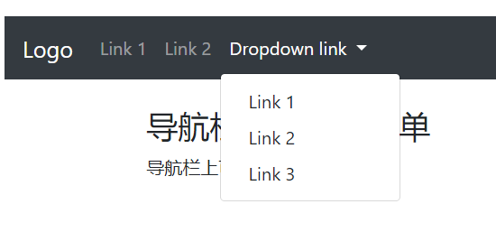


# 导航栏的表单与按钮
导航栏的表单 `<form>` 元素使用 `class="form-inline"` 类来排版输入框与按钮：
```
<nav class="navbar navbar-expand-sm bg-dark navbar-dark">
  <form class="form-inline">
    <input class="form-control" type="text" placeholder="Search">
    <button class="btn btn-success" type="button">Search</button>
  </form>
</nav>
<br>

<div class="container">
  <h3>导航栏的表单</h3>
  <p>导航栏的表单 form 元素使用 class="form-inline" 类来排版输入框与按钮：</p>
</div>
```


你也可以使用其他的输入框类，如 `.input-group-addon` 类用于在输入框前添加小标签。
```
<nav class="navbar navbar-expand-sm bg-dark navbar-dark">
  <form class="form-inline">
    <div class="input-group">
      <span class="input-group-addon">@</span>
      <input type="text" class="form-control" placeholder="Username">
    </div>    
  </form>
</nav>
<br>

<div class="container">
  <h3>导航表单</h3>
  <p> .input-group-addon 类用于在输入框前添加小标签。</p>
</div>
```

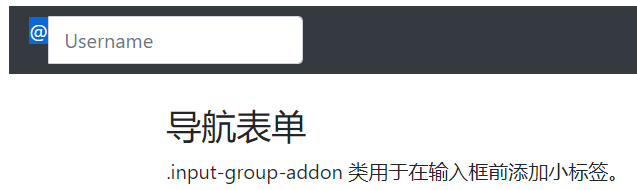


# 导航栏文本
使用 `.navbar-text` 类来设置导航栏上非链接文本，可以保证水平对齐，颜色与内边距一样。
```
<nav class="navbar navbar-expand-sm bg-dark navbar-dark">
  <!-- Links -->
  <ul class="navbar-nav">
    <li class="nav-item">
      <a class="nav-link" href="#">Link 1</a>
    </li>
    <li class="nav-item">
      <a class="nav-link" href="#">Link 2</a>
    </li>
  </ul>
  <!-- Navbar text-->
  <span class="navbar-text">
    Navbar text
  </span>
</nav>
<br>

<div class="container">
  <h3>导航栏文本</h3>
  <p>使用 .navbar-text 类来设置导航栏上非链接文本，可以保证水平对齐，颜色与内边距一样。</p>
</div>
```


# 固定导航栏
导航栏可以固定在头部或者底部。我们使用 `.fixed-top` 类来实现导航栏的固定：
```
<nav class="navbar navbar-expand-sm bg-dark navbar-dark fixed-top">
  <a class="navbar-brand" href="#">Logo</a>
  <ul class="navbar-nav">
    <li class="nav-item">
      <a class="nav-link" href="#">Link</a>
    </li>
    <li class="nav-item">
      <a class="nav-link" href="#">Link</a>
    </li>
  </ul>
</nav>

<div class="container-fluid" style="margin-top:80px">
  <h3>固定导航栏</h3>
  <p>导航栏可以固定在头部或者底部。</p>
  <h1>滚动页面查看效果。</h1>
</div>
```


`.fixed-bottom` 类用于设置导航栏固定在底部：
```
<nav class="navbar navbar-expand-sm bg-dark navbar-dark fixed-bottom">
  <a class="navbar-brand" href="#">Logo</a>
  <ul class="navbar-nav">
    <li class="nav-item">
      <a class="nav-link" href="javascript:void(0)">Link</a>
    </li>
    <li class="nav-item">
      <a class="nav-link" href="javascript:void(0)">Link</a>
    </li>
  </ul>
</nav>

<div class="container-fluid">
  <h3>底部固定导航栏</h3>
  <p>导航栏可以固定在头部或者底部。</p>
  <h1>滚动页面查看效果。</h1>
</div>
```

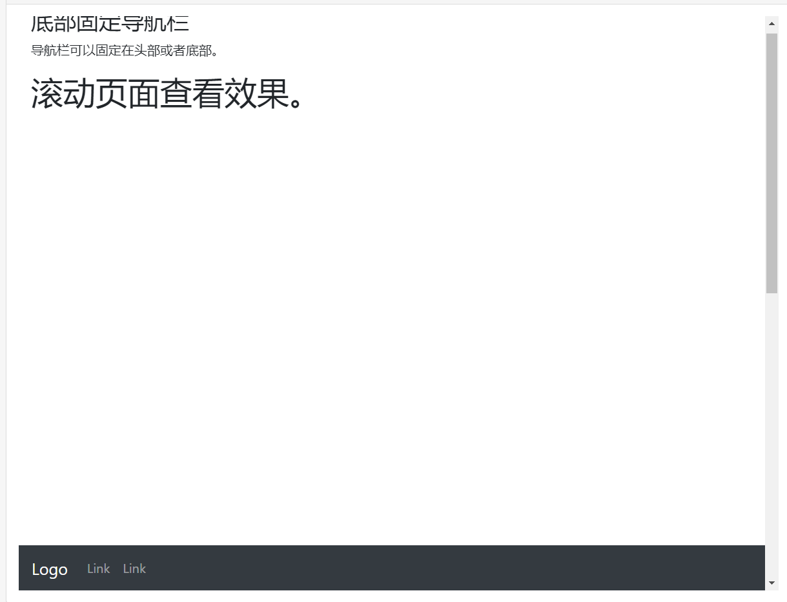


# 面包屑导航
- 面包屑导航是一种基于网站层次信息的显示方式。以博客为例，面包屑导航可以显示发布日期、类别或标签。它们表示当前页面在导航层次结构内的位置，是在用户界面中的一种导航辅助。
- Bootstrap 中的面包屑导航是一个简单的带有 `.breadcrumb class` 的无序列表。分隔符会通过 `CSS（bootstrap.min.css）`中的 `::before` 和 `content` 来添加，下面所示的 `class` 自动被添加：

```
.breadcrumb-item + .breadcrumb-item::before {
  display: inline-block;
  padding-right: 0.5rem;
  color: #6c757d;
  content: "/";
}
```

## 面包屑导航实例

```
<ol class="breadcrumb">
  <li class="breadcrumb-item active">Home</li>
</ol>
<ol class="breadcrumb">
  <li class="breadcrumb-item"><a href="#">Home</a></li>
  <li class="breadcrumb-item active">Library</li>
</ol>
<ol class="breadcrumb">
  <li class="breadcrumb-item"><a href="#">Home</a></li>
  <li class="breadcrumb-item"><a href="#">Library</a></li>
  <li class="breadcrumb-item active">Data</li>
</ol>
```

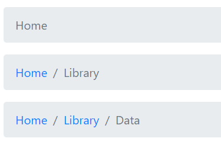


不用列表形式：
```
<nav class="breadcrumb">
  <a class="breadcrumb-item" href="#">Home</a>
  <a class="breadcrumb-item" href="#">Library</a>
  <a class="breadcrumb-item" href="#">Data</a>
  <span class="breadcrumb-item active">Bootstrap</span>
</nav>
```

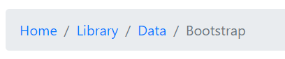

