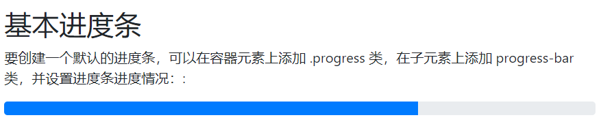

# 进度条
创建一个基本的进度条的步骤如下：
- 添加一个带有 `.progress` 类的 `<div>`
- 接着，在上面的 `<div>` 内，添加一个带有 `class .progress-bar` 的空的 `<div>`
- 添加一个带有百分比表示的宽度的 `style` 属性，例如 `style="width:70%"` 表示进度条在 `70%` 的位置。

```
<div class="progress">
  <div class="progress-bar" style="width:70%"></div>
</div>
```




# 进度条高度
进度条高度默认为 16px。我们可以使用 CSS 的 height 属性来修改他：
```
<div class="progress" style="height:20px;">
  <div class="progress-bar" style="width:40%;"></div>
</div>
```


# 进度条标签
可以在进度条内添加文本，如进度的百分比：
```
<div class="progress">
  <div class="progress-bar" style="width:70%">70%</div>
</div>
```


# 进度条颜色
```
<div class="progress">
  <div class="progress-bar bg-success" style="width:40%"></div>
</div>
 
<div class="progress">
  <div class="progress-bar bg-info" style="width:50%"></div>
</div>
 
<div class="progress">
  <div class="progress-bar bg-warning" style="width:60%"></div>
</div>
 
<div class="progress">
  <div class="progress-bar bg-danger" style="width:70%"></div>
</div>
```

# 条纹的进度条
可以使用 `.progress-bar-striped` 类来设置条纹进度条：
```
<div class="progress">
  <div class="progress-bar progress-bar-striped" style="width:40%"></div>
</div>
```


# 动画进度条
使用 `.progress-bar-animated` 类可以为进度条添加动画：
```
<div class="progress-bar progress-bar-striped progress-bar-animated" style="width: 40%"></div>
```


# 混合色彩进度条
```
<div class="progress">
  <div class="progress-bar bg-success" style="width:40%">
    Free Space
  </div>
  <div class="progress-bar bg-warning" style="width:10%">
    Warning
  </div>
  <div class="progress-bar bg-danger" style="width:20%">
    Danger
  </div>
</div>
```


