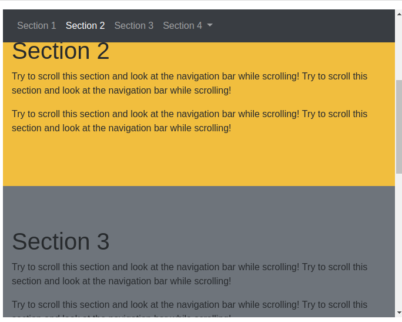
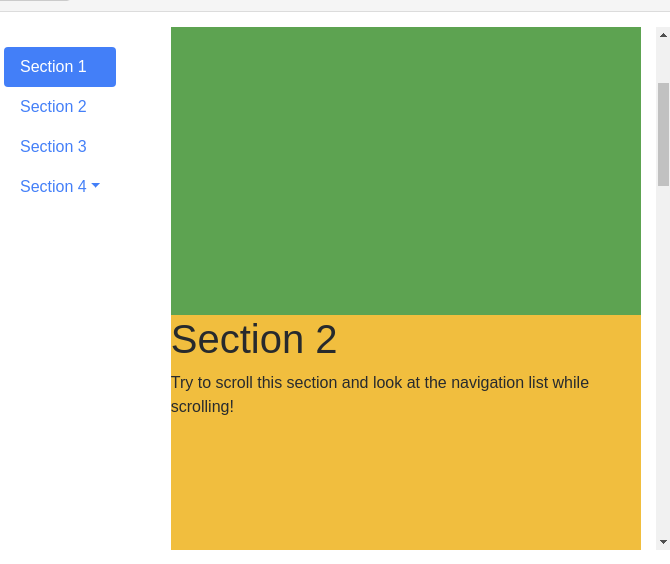

# 滚动监听(Scrollspy)
滚动监听（Scrollspy）插件，即自动更新导航插件，会根据滚动条的位置自动更新对应的导航目标。其基本的实现是随着您的滚动。


```
<!DOCTYPE html>
<html>
<head>
  <title>Bootstrap 实例</title>
  <meta charset="utf-8">
  <meta name="viewport" content="width=device-width, initial-scale=1">
  <link rel="stylesheet" href="https://cdn.staticfile.org/twitter-bootstrap/4.1.0/css/bootstrap.min.css">
  <script src="https://cdn.staticfile.org/jquery/3.2.1/jquery.min.js"></script>
  <script src="https://cdn.staticfile.org/popper.js/1.12.5/umd/popper.min.js"></script>
  <script src="https://cdn.staticfile.org/twitter-bootstrap/4.1.0/js/bootstrap.min.js"></script>
  <style>
  body {
      position: relative; 
  }
  </style>
</head>
<body data-spy="scroll" data-target=".navbar" data-offset="50">

<nav class="navbar navbar-expand-sm bg-dark navbar-dark fixed-top">  
  <ul class="navbar-nav">
    <li class="nav-item">
      <a class="nav-link" href="#section1">Section 1</a>
    </li>
    <li class="nav-item">
      <a class="nav-link" href="#section2">Section 2</a>
    </li>
    <li class="nav-item">
      <a class="nav-link" href="#section3">Section 3</a>
    </li>
    <li class="nav-item dropdown">
      <a class="nav-link dropdown-toggle" href="#" id="navbardrop" data-toggle="dropdown">
        Section 4
      </a>
      <div class="dropdown-menu">
        <a class="dropdown-item" href="#section41">Link 1</a>
        <a class="dropdown-item" href="#section42">Link 2</a>
      </div>
    </li>
  </ul>
</nav>

<div id="section1" class="container-fluid bg-success" style="padding-top:70px;padding-bottom:70px">
  <h1>Section 1</h1>
  <p>Try to scroll this section and look at the navigation bar while scrolling! Try to scroll this section and look at the navigation bar while scrolling!</p>
  <p>Try to scroll this section and look at the navigation bar while scrolling! Try to scroll this section and look at the navigation bar while scrolling!</p>
</div>
<div id="section2" class="container-fluid bg-warning" style="padding-top:70px;padding-bottom:70px">
  <h1>Section 2</h1>
  <p>Try to scroll this section and look at the navigation bar while scrolling! Try to scroll this section and look at the navigation bar while scrolling!</p>
  <p>Try to scroll this section and look at the navigation bar while scrolling! Try to scroll this section and look at the navigation bar while scrolling!</p>
</div>
<div id="section3" class="container-fluid bg-secondary" style="padding-top:70px;padding-bottom:70px">
  <h1>Section 3</h1>
  <p>Try to scroll this section and look at the navigation bar while scrolling! Try to scroll this section and look at the navigation bar while scrolling!</p>
  <p>Try to scroll this section and look at the navigation bar while scrolling! Try to scroll this section and look at the navigation bar while scrolling!</p>
</div>
<div id="section41" class="container-fluid bg-danger" style="padding-top:70px;padding-bottom:70px">
  <h1>Section 4 Submenu 1</h1>
  <p>Try to scroll this section and look at the navigation bar while scrolling! Try to scroll this section and look at the navigation bar while scrolling!</p>
  <p>Try to scroll this section and look at the navigation bar while scrolling! Try to scroll this section and look at the navigation bar while scrolling!</p>
</div>
<div id="section42" class="container-fluid bg-info" style="padding-top:70px;padding-bottom:70px">
  <h1>Section 4 Submenu 2</h1>
  <p>Try to scroll this section and look at the navigation bar while scrolling! Try to scroll this section and look at the navigation bar while scrolling!</p>
  <p>Try to scroll this section and look at the navigation bar while scrolling! Try to scroll this section and look at the navigation bar while scrolling!</p>
</div>

</body>
</html>
```




向您想要监听的元素（通常是 `body`）添加 `data-spy="scroll"` 。

然后添加 `data-target` 属性，它的值为导航栏的 `id` 或 `class (.navbar)`。这样就可以联系上可滚动区域。

注意可滚动项元素上的 `id` （`<div id="section1">`） 必须匹配导航栏上的链接选项 （`<a href="#section1">`)。

可选项`data-offset` 属性用于计算滚动位置时，距离顶部的偏移像素。 默认为 `10 px`。

设置相对定位: 使用 `data-spy="scroll"` 的元素需要将其 `CSS position` 属性设置为 `relative` 才能起作用。

以下实例设置了垂直滚动监听：

```
<!DOCTYPE html>
<html>
<head>
  <title>Bootstrap 实例</title>
  <meta charset="utf-8">
  <meta name="viewport" content="width=device-width, initial-scale=1">
  <link rel="stylesheet" href="https://cdn.staticfile.org/twitter-bootstrap/4.1.0/css/bootstrap.min.css">
  <script src="https://cdn.staticfile.org/jquery/3.2.1/jquery.min.js"></script>
  <script src="https://cdn.staticfile.org/popper.js/1.12.5/umd/popper.min.js"></script>
  <script src="https://cdn.staticfile.org/twitter-bootstrap/4.1.0/js/bootstrap.min.js"></script>
  <style>
  body {
      position: relative;
  }
  ul.nav-pills {
      top: 20px;
      position: fixed;
  }
  div.col-8 div {
      height: 500px;
  }
  </style>
</head>
<body data-spy="scroll" data-target="#myScrollspy" data-offset="1">

<div class="container-fluid">
  <div class="row">
    <nav class="col-sm-3 col-4" id="myScrollspy">
      <ul class="nav nav-pills flex-column">
        <li class="nav-item">
          <a class="nav-link active" href="#section1">Section 1</a>
        </li>
        <li class="nav-item">
          <a class="nav-link" href="#section2">Section 2</a>
        </li>
        <li class="nav-item">
          <a class="nav-link" href="#section3">Section 3</a>
        </li>
        <li class="nav-item dropdown">
          <a class="nav-link dropdown-toggle" data-toggle="dropdown" href="#">Section 4</a>
          <div class="dropdown-menu">
            <a class="dropdown-item" href="#section41">Link 1</a>
            <a class="dropdown-item" href="#section42">Link 2</a>
          </div>
        </li>
      </ul>
    </nav>
    <div class="col-sm-9 col-8">
      <div id="section1" class="bg-success">    
        <h1>Section 1</h1>
        <p>Try to scroll this section and look at the navigation list while scrolling!</p>
      </div>
      <div id="section2" class="bg-warning"> 
        <h1>Section 2</h1>
        <p>Try to scroll this section and look at the navigation list while scrolling!</p>
      </div>        
      <div id="section3" class="bg-secondary">         
        <h1>Section 3</h1>
        <p>Try to scroll this section and look at the navigation list while scrolling!</p>
      </div>
      <div id="section41" class="bg-danger">         
        <h1>Section 4-1</h1>
        <p>Try to scroll this section and look at the navigation list while scrolling!</p>
      </div>      
      <div id="section42" class="bg-info">         
        <h1>Section 4-2</h1>
        <p>Try to scroll this section and look at the navigation list while scrolling!</p>
      </div>
    </div>
  </div>
</div>

</body>
</html>
```




