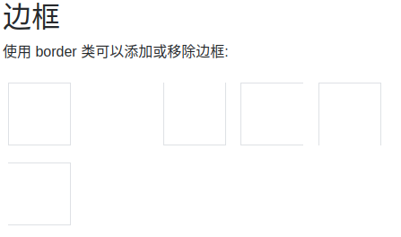
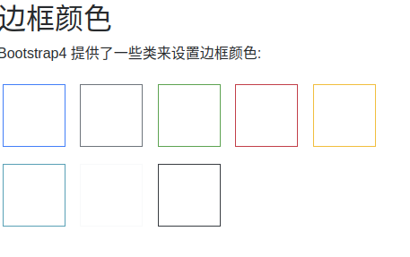
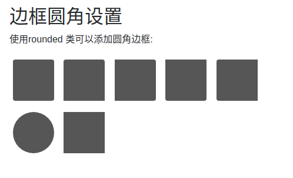
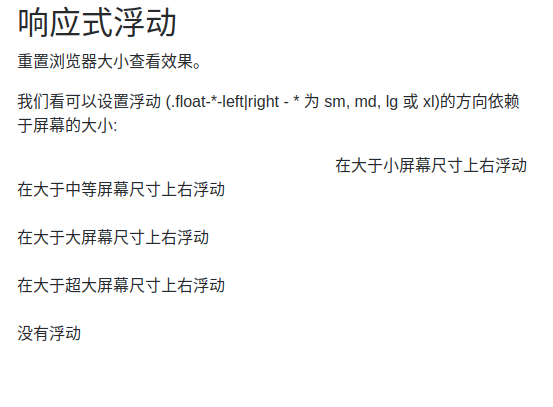
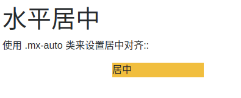
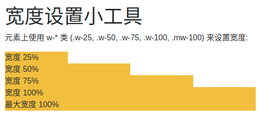

# 边框
使用 border 类可以添加或移除边框:

```
<!DOCTYPE html>
<html>
<head>
  <title>Bootstrap 实例</title>
  <meta charset="utf-8">
  <meta name="viewport" content="width=device-width, initial-scale=1">
  <link rel="stylesheet" href="https://cdn.staticfile.org/twitter-bootstrap/4.1.0/css/bootstrap.min.css">
  <script src="https://cdn.staticfile.org/jquery/3.2.1/jquery.min.js"></script>
  <script src="https://cdn.staticfile.org/popper.js/1.12.5/umd/popper.min.js"></script>
  <script src="https://cdn.staticfile.org/twitter-bootstrap/4.1.0/js/bootstrap.min.js"></script>
 <style>
  .border {
    display: inline-block;
    width: 70px;
    height: 70px;
    margin: 6px;
  }
  </style>
</head>
<body>

<div class="container">
  <h2>边框</h2>
  <p>使用 border 类可以添加或移除边框:</p> 
  <span class="border"></span>
  <span class="border border-0"></span>
  <span class="border border-top-0"></span>
  <span class="border border-right-0"></span>
  <span class="border border-bottom-0"></span>
  <span class="border border-left-0"></span>
</div>

</body>
</html>
```




# 边框颜色

```
<!DOCTYPE html>
<html>
<head>
  <title>Bootstrap 实例</title>
  <meta charset="utf-8">
  <meta name="viewport" content="width=device-width, initial-scale=1">
  <link rel="stylesheet" href="https://cdn.staticfile.org/twitter-bootstrap/4.1.0/css/bootstrap.min.css">
  <script src="https://cdn.staticfile.org/jquery/3.2.1/jquery.min.js"></script>
  <script src="https://cdn.staticfile.org/popper.js/1.12.5/umd/popper.min.js"></script>
  <script src="https://cdn.staticfile.org/twitter-bootstrap/4.1.0/js/bootstrap.min.js"></script>
  <style>
  .border {
    display: inline-block;
    width: 70px;
    height: 70px;
    margin: 6px;
  }
  </style>
</head>
<body>

<div class="container">
  <h2>边框颜色</h2>
  <p>Bootstrap4 提供了一些类来设置边框颜色:</p> 
  <span class="border border-primary"></span>
  <span class="border border-secondary"></span>
  <span class="border border-success"></span>
  <span class="border border-danger"></span>
  <span class="border border-warning"></span>
  <span class="border border-info"></span>
  <span class="border border-light"></span>
  <span class="border border-dark"></span>
  <span class="border border-white"></span>
</div>

</body>
</html>
```




# 边框圆角设置
使用`rounded` 类可以添加圆角边框:
```
<!DOCTYPE html>
<html>
<head>
  <title>Bootstrap 实例</title>
  <meta charset="utf-8">
  <meta name="viewport" content="width=device-width, initial-scale=1">
  <link rel="stylesheet" href="https://cdn.staticfile.org/twitter-bootstrap/4.1.0/css/bootstrap.min.css">
  <script src="https://cdn.staticfile.org/jquery/3.2.1/jquery.min.js"></script>
  <script src="https://cdn.staticfile.org/popper.js/1.12.5/umd/popper.min.js"></script>
  <script src="https://cdn.staticfile.org/twitter-bootstrap/4.1.0/js/bootstrap.min.js"></script>
  <style>
  span {
    display: inline-block;
    width: 70px;
    height: 70px;
    margin: 6px;
    background-color: #555;
  }
  </style>
</head>
<body>

<div class="container">
  <h2>边框圆角设置</h2>
  <p>使用rounded 类可以添加圆角边框:</p> 
  <span class="rounded"></span>
  <span class="rounded-top"></span>
  <span class="rounded-right"></span>
  <span class="rounded-bottom"></span>
  <span class="rounded-left"></span>
  <span class="rounded-circle"></span>
  <span class="rounded-0"></span>
</div>

</body>
</html>
```




# 浮动
`.float-right` 类用于设置元素右浮动， `.float-left` 设置元素左浮动, `.clearfix` 类用于清除浮动:
```
<!DOCTYPE html>
<html>
<head>
  <title>Bootstrap 实例</title>
  <meta charset="utf-8">
  <meta name="viewport" content="width=device-width, initial-scale=1">
  <link rel="stylesheet" href="https://cdn.staticfile.org/twitter-bootstrap/4.1.0/css/bootstrap.min.css">
  <script src="https://cdn.staticfile.org/jquery/3.2.1/jquery.min.js"></script>
  <script src="https://cdn.staticfile.org/popper.js/1.12.5/umd/popper.min.js"></script>
  <script src="https://cdn.staticfile.org/twitter-bootstrap/4.1.0/js/bootstrap.min.js"></script>
</head>
<body>

<div class="container">
  <h2>浮动</h2>
  <p>.float-right 类用于设置元素右浮动， .float-left 设置元素左浮动, .clearfix 类用于清除浮动:</p> 
  <div class="clearfix">
    <span class="float-left">左浮动</span>
    <span class="float-right">右浮动</span>
  </div>
</div>

</body>
</html>
```


# 响应式浮动
我们看可以设置浮动 (`.float-*-left|right - *` 为 `sm, md, lg 或 xl`)的方向依赖于屏幕的大小:

```
<!DOCTYPE html>
<html>
<head>
  <title>Bootstrap 实例</title>
  <meta charset="utf-8">
  <meta name="viewport" content="width=device-width, initial-scale=1">
  <link rel="stylesheet" href="https://cdn.staticfile.org/twitter-bootstrap/4.1.0/css/bootstrap.min.css">
  <script src="https://cdn.staticfile.org/jquery/3.2.1/jquery.min.js"></script>
  <script src="https://cdn.staticfile.org/popper.js/1.12.5/umd/popper.min.js"></script>
  <script src="https://cdn.staticfile.org/twitter-bootstrap/4.1.0/js/bootstrap.min.js"></script>
</head>
<body>

<div class="container">
  <h2>响应式浮动</h2>
  <p>重置浏览器大小查看效果。</p>
  <p>我们看可以设置浮动 (.float-*-left|right - * 为 sm, md, lg 或 xl)的方向依赖于屏幕的大小:</p> 
  <div class="float-sm-right">在大于小屏幕尺寸上右浮动</div><br>
  <div class="float-md-right">在大于中等屏幕尺寸上右浮动</div><br>
  <div class="float-lg-right">在大于大屏幕尺寸上右浮动</div><br>
  <div class="float-xl-right">在大于超大屏幕尺寸上右浮动</div><br>
  <div class="float-none">没有浮动</div>
</div>

</body>
</html>
```




# 居中对齐
使用 `.mx-auto` 类来设置居中对齐:
```
<!DOCTYPE html>
<html>
<head>
  <title>Bootstrap 实例</title>
  <meta charset="utf-8">
  <meta name="viewport" content="width=device-width, initial-scale=1">
  <link rel="stylesheet" href="https://cdn.staticfile.org/twitter-bootstrap/4.1.0/css/bootstrap.min.css">
  <script src="https://cdn.staticfile.org/jquery/3.2.1/jquery.min.js"></script>
  <script src="https://cdn.staticfile.org/popper.js/1.12.5/umd/popper.min.js"></script>
  <script src="https://cdn.staticfile.org/twitter-bootstrap/4.1.0/js/bootstrap.min.js"></script>
</head>
<body>

<div class="container">
  <h1>水平居中</h1>
  <p>使用 .mx-auto 类来设置居中对齐::</p>
  <div class="mx-auto bg-warning" style="width:150px">居中</div>
</div>

</body>
</html>
```




# 宽度
元素上使用 `w-*` 类 (`.w-25`, `.w-50`, `.w-75`, `.w-100`, `.mw-100`) 来设置宽度:
```
<div class="container">
  <h1>宽度设置小工具</h1>
  <p>元素上使用 w-* 类 (.w-25, .w-50, .w-75, .w-100, .mw-100) 来设置宽度:</p>
  <div class="w-25 bg-warning">宽度 25%</div>
  <div class="w-50 bg-warning">宽度 50%</div>
  <div class="w-75 bg-warning">宽度 75%</div>
  <div class="w-100 bg-warning">宽度 100%</div>
  <div class="mw-100 bg-warning">最大宽度 100%</div>
</div>
```




# 高度
元素上使用 `h-*` 类 (`.h-25, .h-50, .h-75, .h-100, .mh-100`) 来设置高度:

```
<div class="container">
  <h1>高度小工具</h1>
  <p>元素上使用 h-* 类 (.h-25, .h-50, .h-75, .h-100, .mh-100) 来设置高度:</p>
  <div style="height:200px;background-color:#ddd">
    <div class="h-25 d-inline-block p-2 bg-warning">高度 25%</div>
    <div class="h-50 d-inline-block p-2 bg-warning">高度 50%</div>
    <div class="h-75 d-inline-block p-2 bg-warning">高度 75%</div>
    <div class="h-100 d-inline-block p-2 bg-warning">高度 100%</div>
    <div class="mh-100 d-inline-block p-2 bg-warning" style="height:500px">最大高度 100%</div>
  </div>
</div>
```


