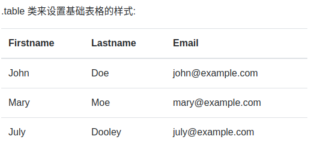
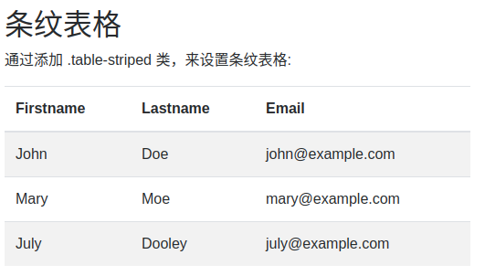
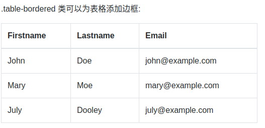
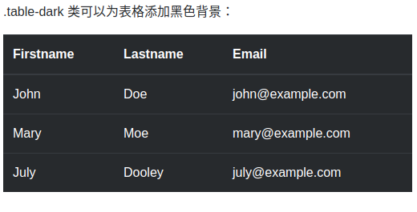
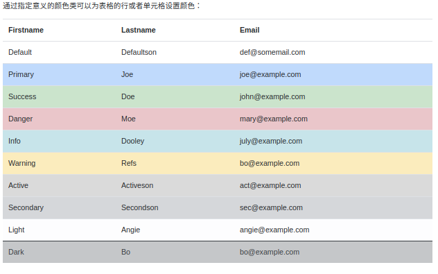
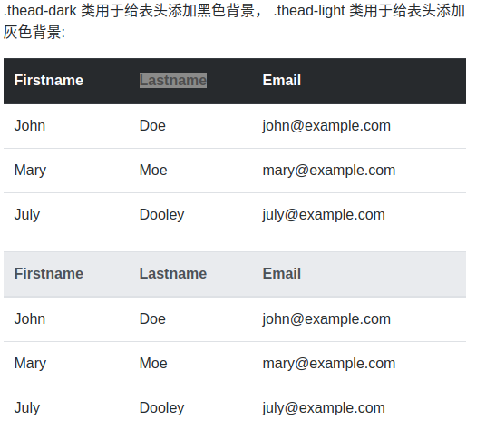
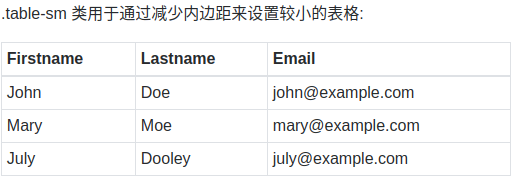
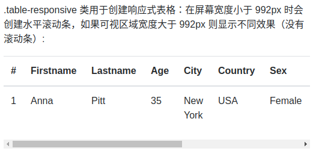

# 基础表格
Bootstrap4 通过 `.table` 类来设置基础表格的样式，实例如下:
```
<table class="table">
    <thead>
      <tr>
        <th>Firstname</th>
        <th>Lastname</th>
        <th>Email</th>
      </tr>
    </thead>
    <tbody>
      <tr>
        <td>John</td>
        <td>Doe</td>
        <td>john@example.com</td>
      </tr>
      <tr>
        <td>Mary</td>
        <td>Moe</td>
        <td>mary@example.com</td>
      </tr>
      <tr>
        <td>July</td>
        <td>Dooley</td>
        <td>july@example.com</td>
      </tr>
    </tbody>
</table>
```



# 条纹表格
通过添加 `.table-striped` 类，您将在 `<tbody>` 内的行上看到条纹，如下面的实例所示：
```
<table class="table table-striped">
    <thead>
      <tr>
        <th>Firstname</th>
        <th>Lastname</th>
        <th>Email</th>
      </tr>
    </thead>
    <tbody>
      <tr>
        <td>John</td>
        <td>Doe</td>
        <td>john@example.com</td>
      </tr>
      <tr>
        <td>Mary</td>
        <td>Moe</td>
        <td>mary@example.com</td>
      </tr>
      <tr>
        <td>July</td>
        <td>Dooley</td>
        <td>july@example.com</td>
      </tr>
    </tbody>
</table>
```



# 带边框表格
.table-bordered 类可以为表格添加边框

```
<table class="table table-bordered">
    <thead>
      <tr>
        <th>Firstname</th>
        <th>Lastname</th>
        <th>Email</th>
      </tr>
    </thead>
    <tbody>
      <tr>
        <td>John</td>
        <td>Doe</td>
        <td>john@example.com</td>
      </tr>
      <tr>
        <td>Mary</td>
        <td>Moe</td>
        <td>mary@example.com</td>
      </tr>
      <tr>
        <td>July</td>
        <td>Dooley</td>
        <td>july@example.com</td>
      </tr>
    </tbody>
</table>
```



# 鼠标悬停状态表格
`.table-hover` 类可以为表格的每一行添加鼠标悬停效果（灰色背景）：


# 黑色背景表格
`.table-dark` 类可以为表格添加黑色背景：




# 黑色条纹表格
联合使用 `.table-dark` 和 `.table-striped` 类可以创建黑色的条纹表格：

# 鼠标悬停效果 - 黑色背景表格
联合使用 `.table-dark` 和 `.table-hover` 类可以设置黑色背景表格的鼠标悬停效果：


# 指定意义的颜色类
通过指定意义的颜色类可以为表格的行或者单元格设置颜色：
```
<table class="table">
    <thead>
      <tr>
        <th>Firstname</th>
        <th>Lastname</th>
        <th>Email</th>
      </tr>
    </thead>
    <tbody>
      <tr>
        <td>Default</td>
        <td>Defaultson</td>
        <td>def@somemail.com</td>
      </tr>      
      <tr class="table-primary">
        <td>Primary</td>
        <td>Joe</td>
        <td>joe@example.com</td>
      </tr>
      <tr class="table-success">
        <td>Success</td>
        <td>Doe</td>
        <td>john@example.com</td>
      </tr>
      <tr class="table-danger">
        <td>Danger</td>
        <td>Moe</td>
        <td>mary@example.com</td>
      </tr>
      <tr class="table-info">
        <td>Info</td>
        <td>Dooley</td>
        <td>july@example.com</td>
      </tr>
      <tr class="table-warning">
        <td>Warning</td>
        <td>Refs</td>
        <td>bo@example.com</td>
      </tr>
      <tr class="table-active">
        <td>Active</td>
        <td>Activeson</td>
        <td>act@example.com</td>
      </tr>
      <tr class="table-secondary">
        <td>Secondary</td>
        <td>Secondson</td>
        <td>sec@example.com</td>
      </tr>
      <tr class="table-light">
        <td>Light</td>
        <td>Angie</td>
        <td>angie@example.com</td>
      </tr>
      <tr class="table-dark text-dark">
        <td>Dark</td>
        <td>Bo</td>
        <td>bo@example.com</td>
      </tr>
    </tbody>
</table>
```



# 表头颜色
在 Bootstrap v4.0.0-beta.2 中`.thead-dark` 类用于给表头添加黑色背景， `.thead-light` 类用于给表头添加灰色背景:
```
<table class="table">
    <thead class="thead-dark">
      <tr>
        <th>Firstname</th>
        <th>Lastname</th>
        <th>Email</th>
      </tr>
    </thead>
    <tbody>
      <tr>
        <td>John</td>
        <td>Doe</td>
        <td>john@example.com</td>
      </tr>
      <tr>
        <td>Mary</td>
        <td>Moe</td>
        <td>mary@example.com</td>
      </tr>
      <tr>
        <td>July</td>
        <td>Dooley</td>
        <td>july@example.com</td>
      </tr>
    </tbody>
  </table>
  <table class="table">
    <thead class="thead-light">
      <tr>
        <th>Firstname</th>
        <th>Lastname</th>
        <th>Email</th>
      </tr>
    </thead>
    <tbody>
      <tr>
        <td>John</td>
        <td>Doe</td>
        <td>john@example.com</td>
      </tr>
      <tr>
        <td>Mary</td>
        <td>Moe</td>
        <td>mary@example.com</td>
      </tr>
      <tr>
        <td>July</td>
        <td>Dooley</td>
        <td>july@example.com</td>
      </tr>
    </tbody>
</table>
```




# 较小的表格
.table-sm 类用于通过减少内边距来设置较小的表格:
```
<table class="table table-bordered table-sm">
    <thead>
      <tr>
        <th>Firstname</th>
        <th>Lastname</th>
        <th>Email</th>
      </tr>
    </thead>
    <tbody>
      <tr>
        <td>John</td>
        <td>Doe</td>
        <td>john@example.com</td>
      </tr>
      <tr>
        <td>Mary</td>
        <td>Moe</td>
        <td>mary@example.com</td>
      </tr>
      <tr>
        <td>July</td>
        <td>Dooley</td>
        <td>july@example.com</td>
      </tr>
    </tbody>
</table>
```



# 响应式表格
`.table-responsive` 类用于创建响应式表格：在屏幕宽度小于 992px 时会创建水平滚动条，如果可视区域宽度大于 992px 则显示不同效果（没有滚动条）:

```
<div class="table-responsive">
<table class="table">
    <thead>
      <tr>
        <th>#</th>
        <th>Firstname</th>
        <th>Lastname</th>
        <th>Age</th>
        <th>City</th>
        <th>Country</th>
        <th>Sex</th>
        <th>Example</th>
        <th>Example</th>
        <th>Example</th>
        <th>Example</th>
      </tr>
    </thead>
    <tbody>
      <tr>
        <td>1</td>
        <td>Anna</td>
        <td>Pitt</td>
        <td>35</td>
        <td>New York</td>
        <td>USA</td>
        <td>Female</td>
        <td>Yes</td>
        <td>Yes</td>
        <td>Yes</td>
        <td>Yes</td>
      </tr>
    </tbody>
</table>
</div>
```



通过以下类设定在指定屏幕宽度下显示滚动条：
- .table-responsive-sm	< 576px
- .table-responsive-md	< 768px
- .table-responsive-lg	< 992px
- .table-responsive-xl	< 1200px
