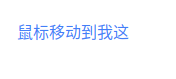
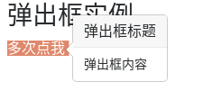
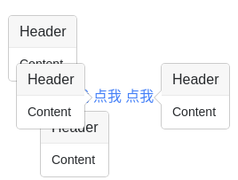
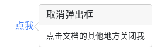

# 提示框 data-toggle tooltip
提示框是一个小小的弹窗，在鼠标移动到元素上显示，鼠标移到元素外就消失。

通过向元素添加 `data-toggle="tooltip"` 来来创建提示框。`title` 属性的内容为提示框显示的内容：

```
<div class="container">
  <h3>提示框实例</h3><br>
  <a href="#" data-toggle="tooltip" title="我是提示内容!">鼠标移动到我这</a>
</div>

<script>
$(document).ready(function(){
    $('[data-toggle="tooltip"]').tooltip();   
});
</script>
```




## 指定提示框的位置
默认情况下提示框显示在元素上方。可以使用 `data-placement` 属性来设定提示框显示的方向: `top`, `bottom`, `left` 或 `right`:
                


# 弹出框
弹出框控件类似于提示框，它在鼠标点击到元素后显示，与提示框不同的是它可以显示更多的内容。

通过向元素添加 `data-toggle="popover"` 来来创建弹出框。`title` 属性的内容为弹出框的标题，`data-content` 属性显示了弹出框的文本内容：

```
<div class="container">
  <h3>弹出框实例</h3>
  <a href="#" data-toggle="popover" title="弹出框标题" data-content="弹出框内容">多次点我</a>
</div>

<script>
$(document).ready(function(){
    $('[data-toggle="popover"]').popover();   
});
</script>
```




## 指定弹出框的位置
可以使用 `data-placement` 属性来设定弹出框显示的方向: `top`, `bottom`, `left` 或 `right`:

```
<div class="container">
  <h3>弹出框实例</h3> <br><br><br><br><br><br>
  <a href="#" title="Header" data-toggle="popover" data-placement="top" data-content="Content">点我</a>
  <a href="#" title="Header" data-toggle="popover" data-placement="bottom" data-content="Content">点我</a>
  <a href="#" title="Header" data-toggle="popover" data-placement="left" data-content="Content">点我</a>
  <a href="#" title="Header" data-toggle="popover" data-placement="right" data-content="Content">点我</a>
</div>

<script>
$(document).ready(function(){
    $('[data-toggle="popover"]').popover();   
});
</script>
```




## 关闭弹出框
默认情况下，弹出框在再次点击指定元素后就会关闭，你可以使用 `data-trigger="focus"` 属性来设置在鼠标点击元素外部区域来关闭弹出框：

```
<div class="container">
  <h3>弹出框实例</h3> <br>
  <a href="#" title="取消弹出框" data-toggle="popover" data-trigger="focus" data-content="点击文档的其他地方关闭我">点我</a>
</div>

<script>
$(document).ready(function(){
    $('[data-toggle="popover"]').popover();   
});
</script>
```




提示:如果你想实现在鼠标移动到元素上显示，移除后消失的效果，可以使用 `data-trigger` 属性，并设置值为 `"hover"`:

```
<div class="container">
  <h3>弹出框实例</h3> <br>
  <a href="#" title="Header" data-toggle="popover" data-trigger="hover" data-content="一些内容">鼠标移动到我这</a>
</div>

<script>
$(document).ready(function(){
    $('[data-toggle="popover"]').popover();   
});
</script>
```
