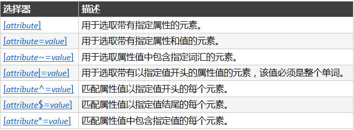

# 外部样式表
当样式需要被应用到很多页面的时候，外部样式表将是理想的选择。使用外部样式表，你就可以通过更改一个文件来改变整个站点的外观。
```
<head>
<link rel="stylesheet" type="text/css" href="mystyle.css">
</head>
```

# 内部样式表
当单个文件需要特别样式时，就可以使用内部样式表。你可以在 head 部分通过`<style>` 标签定义内部样式表。
```
<head>
<style type="text/css">
body {background-color: red}
p {margin-left: 20px}
</style>
</head>
```

# 内联样式
当特殊的样式需要应用到个别元素时，就可以使用内联样式。 使用内联样式的方法是在相关的标签中使用样式属性。样式属性可以包含任何 CSS 属性。
```
<p style="color: red; margin-left: 20px">
This is a paragraph
</p>
```


# 框模型


# CSS 规则
CSS 规则由两个主要的部分构成
1. 选择器 
2. 一条或多条声明，每条声明由一个属性和一个值组成 `selector {declaration1; declaration2; ... declarationN }`

CSS 对大小写不敏感。不过存在一个例外：如果涉及到与 HTML 文档一起工作的话，class 和 id 名称对大小写是敏感的。


## 选择器分组
可以对选择器进行分组，这样，被分组的选择器就可以分享相同的声明。
```
h1,h2,h3,h4,h5,h6 {
  color: green;
}
```


## 继承
根据 CSS，子元素从父元素继承属性。


## 派生选择器
派生选择器允许你根据文档的上下文关系来确定某个标签的样式。通过合理地使用派生选择器，我们可以使 HTML 代码变得更加整洁。
希望列表中的 strong 元素变为斜体字，而不是通常的粗体字，可以这样定义一个派生选择器：
```
li strong {
    font-style: italic;
    font-weight: normal;
  }
```


## id 选择器
- id 选择器可以为标有特定 id 的 HTML 元素指定特定的样式。
- id 选择器以 "#" 来定义。
- id 选择器常常用于建立派生选择器。
- id 选择器作为派生选择器也可以被使用很多次
- id 选择器即使不被用来创建派生选择器，它也可以独立发挥作用
```
#red {color:red;}
#green {color:green;}
<p id="red">这个段落是红色。</p>
<p id="green">这个段落是绿色。</p>
```

## 类选择器
- 在 CSS 中，类选择器以一个点号显示：`.center {text-align: center}`
- 和 id 一样，`class` 也可被用作派生选择器
- 元素也可以基于它们的类而被选择


## 属性选择器
对带有指定属性的 HTML 元素设置样式。属性选择器在为不带有 class 或 id 的表单设置样式时特别有用


