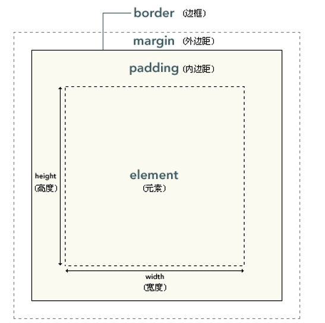

# 外部样式表
当样式需要被应用到很多页面的时候，外部样式表将是理想的选择。使用外部样式表，你就可以通过更改一个文件来改变整个站点的外观。
```
<head>
<link rel="stylesheet" type="text/css" href="mystyle.css">
</head>
```


# 内部样式表
当单个文件需要特别样式时，就可以使用内部样式表。你可以在 head 部分通过`<style>` 标签定义内部样式表。
```
<head>
<style type="text/css">
body {background-color: red}
p {margin-left: 20px}
</style>
</head>
```


# 内联样式
当特殊的样式需要应用到个别元素时，就可以使用内联样式。 使用内联样式的方法是在相关的标签中使用样式属性。样式属性可以包含任何 CSS 属性。
```
<p style="color: red; margin-left: 20px">
This is a paragraph
</p>
```


# 框模型



