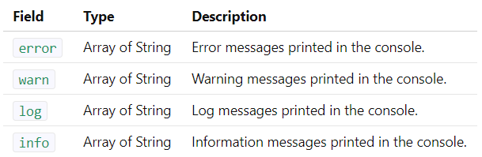

# API

https://devexpress.github.io/testcafe/documentation/test-api/test-code-structure.html


# Structure

## Fixtures

TestCafe tests must be organized into categories called fixtures. A
JavaScript, TypeScript or CoffeeScript file with TestCafe tests can
contain one or more fixtures.

```
fixture( fixtureName )
fixture `fixtureName`
```

This function returns the fixture object that allows you to configure
the fixture - specify the start webpage, metadata and initialization and
clean-up code for tests included in the fixture.

## Tests

```
test( testName, fn(t) )

fixture `MyFixture`;

test('Test1', async t => {
    /* Test 1 Code */
});

test('Test2', async t => {
    /* Test 2 Code */
});
```

### Test Controller

A test controller object t exposes the test API's methods. That is why
it is passed to each function that is expected to contain server-side
test code (like test, beforeEach or afterEach).

Using Test Controller Outside of Test Code

```
import { Selector, t } from 'testcafe';

class Page {
    constructor () {
        this.loginInput    = Selector('#login');
        this.passwordInput = Selector('#password');
        this.signInButton  = Selector('#sign-in-button');
    }
    async login () {
        await t
            .typeText(this.loginInput, 'MyLogin')
            .typeText(this.passwordInput, 'Pa$$word')
            .click(this.signInButton);
    }
}

export default new Page();
```

TestCafe implicitly resolves test context and provides the right test
controller.

### Setting Test Speed

Factor specifies the test speed. Must be a number between 1 (the
fastest) and 0.01 (the slowest).

```
t.setTestSpeed( factor )
```

### Setting Page Load Timeout

The page load timeout defines the time passed after the
`DOMContentLoaded` event within which the `window.load` event should be
raised.

```
t.setPageLoadTimeout( duration )
```

Page load timeout (in milliseconds). 0 to skip waiting for the
window.load event.

## Specifying the Start Webpage

You can specify the web page where all tests in a fixture start using
the fixture.page function.

```
fixture.page( url )
fixture.page `url`
```

Similarly, you can specify a start page for individual tests using the
test.page function that overrides the fixture.page.

```
test.page( url )
test.page `url`
```

Test page override fixture page.

```
fixture `MyFixture`
    .page `http://devexpress.github.io/testcafe/example`;

test('Test1', async t => {
    // Starts at http://devexpress.github.io/testcafe/example
});

test
    .page `http://devexpress.github.io/testcafe/blog/`
    ('Test2', async t => {
        // Starts at http://devexpress.github.io/testcafe/blog/
    });
```

If the start page is not specified, it defaults to about:blank.

## Specifying Testing Metadata

To define metadata, use the meta method. You can call this method for a
fixture and a test.

```
fixture.meta('key1', 'value1')
test.meta('key2', 'value2')
fixture.meta({ key1: 'value1', key2: 'value2', key3: 'value3' })
test.meta({ key4: 'value1', key5: 'value2', key6: 'value3' })
```

- Run Tests by Metadata
- Using Metadata in Reports

## Initialization and Clean-Up

### Test Hooks

You can specify a hook for each test in a fixture using the beforeEach
and afterEach methods in the fixture declaration.

```
fixture.beforeEach( fn(t) )
fixture.afterEach( fn(t) )
test.before( fn(t) )
test.after( fn(t) )
```

If `test.before` or `test.after` is specified, it overrides the
corresponding `fixture.beforeEach` and `fixture.afterEach` hook, so that
the latter are not executed.

```
fixture `My fixture`
    .page `http://example.com`
    .beforeEach( async t => {
        /* test initialization code */
    })
    .afterEach( async t => {
        /* test finalization code */
    });

test
    .before( async t => {
        /* test initialization code */
    })
    ('MyTest', async t => { /* ... */ })
    .after( async t => {
        /* test finalization code */
    });
```

### Sharing Variables Between Test Hooks and Test Code

You can share variables between test hook functions and test code by
using the test context object. Test context is available through the
`t.ctx` property.

```
fixture `Fixture1`
    .beforeEach(async t  => {
        t.ctx.someProp = 123;
    });

test
    ('Test1', async t => {
        console.log(t.ctx.someProp); // > 123
    })
    .after(async t => {
         console.log(t.ctx.someProp); // > 123
    });
```

### Fixture Hooks

Fixture hooks are executed before the first test in a fixture is started
and after the last test is finished. Unlike test hooks, fixture hooks
are executed between test runs and do not have access to the tested
page. Use them to perform server-side operations like preparing the
server that hosts the tested app.

```
fixture.before( fn(ctx) )
fixture.after( fn(ctx) )
```

fn: An asynchronous hook function that contains initialization or
clean-up code.

```
fixture `My fixture`
    .page `http://example.com`
    .before( async ctx => {
        /* fixture initialization code */
    })
    .after( async ctx => {
        /* fixture finalization code */
    });
```

### Sharing Variables Between Fixture Hooks and Test Code

Hook functions passed to fixture.before and fixture.after methods take a
ctx parameter that contains fixture context. You can add properties to
this parameter to share the value or object with test code.

```
fixture `Fixture1`
    .before(async ctx  => {
        ctx.someProp = 123;
    })
    .after(async ctx  => {
        console.log(ctx.someProp); // > 123
    });
```

To access fixture context from tests, use the `t.fixtureCtx` property.

```
t.fixtureCtx
```

Test code can read from t.fixtureCtx, assign to its properties or add
new ones, but it cannot overwrite the entire t.fixtureCtx object.

```
fixture `Fixture1`
    .before(async ctx  => {
        ctx.someProp = 123;
    })
    .after(async ctx  => {
        console.log(ctx.newProp); // > abc
    });

test('Test1', async t => {
    console.log(t.fixtureCtx.someProp); // > 123
});

test('Test2', async t => {
    t.fixtureCtx.newProp = 'abc';
});
```

## Skipping Tests

TestCafe allows you to specify that a particular test or fixture should
be skipped when running tests. Use the fixture.skip and test.skip
methods for this.

```
fixture.skip
test.skip
```

You can also use the only method to specify that only a particular test
or fixture should run while all others should be skipped.

```
fixture.only
test.only
```

If several tests or fixtures are marked with only, all the marked tests
and fixtures are run.

```
fixture.skip `Fixture1`; // All tests in this fixture are skipped

test('Fixture1Test1', () => {});
test('Fixture1Test2', () => {});

fixture `Fixture2`;

test('Fixture2Test1', () => {});
test.skip('Fixture2Test2', () => {}); // This test is skipped
test('Fixture2Test3', () => {});
```

```
fixture.only `Fixture1`;
test('Fixture1Test1', () => {});
test('Fixture1Test2', () => {});

fixture `Fixture2`;

test('Fixture2Test1', () => {});
test.only('Fixture2Test2', () => {});
test('Fixture2Test3', () => {});

// Only tests in Fixture1 and the Fixture2Test2 test are run
```

## Inject Scripts into Tested Pages

TestCafe allows you to inject custom scripts into pages visited during
the tests. You can add scripts that mock browser API or provide helper
functions.

```
fixture.clientScripts( script[, script2[, ...[, scriptN]]] )
test.clientScripts( script[, script2[, ...[, scriptN]]] )
```

You can use the page option to specify pages into which scripts should
be injected. Otherwise, TestCafe injects scripts into all pages visited
during the test or fixture.

```
fixture `My fixture`
    .page `http://example.com`
    .clientScripts('assets/jquery.js');
test
    ('My test', async t => { /* ... */ })
    .clientScripts({ module: 'async' });
test
    ('My test', async t => { /* ... */ })
    .clientScripts({
        page: /\/user\/profile\//,
        content: 'Geolocation.prototype.getCurrentPosition = () => new Positon(0, 0);'
    });
```

## Disable Page Caching

You can disable page caching to keep items in these storages after
navigation. Use the fixture.disablePageCaching and
test.disablePageCaching methods to disable caching during a particular
fixture or test.

```
fixture.disablePageCaching
test.disablePageCaching
```

```
fixture
    .disablePageCaching `My fixture`
    .page `https://example.com`;
test
    .disablePageCaching
    ('My test', async t => { /* ... */ });
```


# Obtaining Data From the Client

https://devexpress.github.io/testcafe/documentation/test-api/obtaining-data-from-the-client/

# Intercepting HTTP Requests

## Log HTTP Requests

## Mock HTTP Requests

## Create a Custom HTTP Request Hook

## Select Requests to be Handled by the Hook

## Attach Hooks to Tests and Fixtures


# Built-In Waiting Mechanisms


# Authentication

Many test scenarios involve the activity of more than one user. TestCafe
addresses these scenarios by providing a convenient way to isolate
authentication test actions and apply them easily whenever you need to
switch the user account.


# Pausing the Test

Use the test controller's wait function to pause a test for a specified
period of time.

```
t.wait( timeout )
```

# Handling Native Dialogs


# Working with `<iframes>`


# Debugging

## Client-Side Debugging

TestCafe provides the t.debug method that pauses the test and allows you
to debug using the browser's developer tools.

```
t.debug()
```

# Identify the Browser and Platform

Use the `t.browser` property to access user agent data.


# Accessing Console Messages
The tested web application or a framework it uses may output log, warning, error and information messages into the browser console. TestCafe allows you to access them from test code using the t.getBrowserConsoleMessages method.
```
t.getBrowserConsoleMessages()
```
