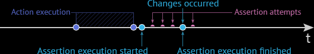

# Assertion Structure

To construct assertions, use the test controller's `expect` method.

This method accepts the actual value. You can pass a value, a Selector's
DOM node state property or a client function promise. TestCafe
automatically waits for node state properties to obtain a value and for
client functions to execute.

```
await t.expect( actual ).eql( expected, message, options );
```

```
import { Selector } from 'testcafe';


fixture `Example page`
   .page `http://devexpress.github.io/testcafe/example/`;


test('Check property of element', async t => {
   const developerNameInput = Selector('#developer-name');

   await t
       .expect(developerNameInput.value).eql('', 'input is empty')
       .typeText(developerNameInput, 'Peter Parker')
       .expect(developerNameInput.value).contains('Peter', 'input contains text "Peter"');
});
```

# Smart Assertion Query Mechanism

TestCafe uses the smart assertion query mechanism if the assertion
receives a Selector's DOM node state property or client function promise
as an actual value: if an assertion did not pass, the test does not fail
immediately. The assertion retries to pass multiple times, and each time
it requests the actual property value. The test fails if the assertion
could not complete successfully within a timeout:


# Assertion options

## options.timeout

The time (in milliseconds) an assertion can take to pass before the test
fails if a selector property or client function promise was used in
assertion.

Default value: The timeout is specified using the runner.run API method
or the assertion-timeout command line option.

```
await t.expect(Selector('#elementId').innerText).eql('text', 'check element text', { timeout: 500 });
```

## options.allowUnawaitedPromise

By default, only promises the selectors and client functions return can
be passed as the assertion's actual value. If you pass a regular
unawaited promise, TestCafe throws an error.

If you need to assert a regular promise, set the allowUnawaitedPromise
option to true.

```
await t.expect(doSomethingAsync()).ok('check that a promise is returned', { allowUnawaitedPromise: true });
```

# Assertion API
https://devexpress.github.io/testcafe/documentation/test-api/assertions/assertion-api.html

| API                      | Syntax                                                                   | Explanation                                                                           |
|:-------------------------|:-------------------------------------------------------------------------|:--------------------------------------------------------------------------------------|
| Deep Equal               | `await t.expect( actual ).eql( expected, message, options );`            | Asserts that actual is equal to expected.                                             |
| Not Deep Equal           | `await t.expect( actual ).notEql( unexpected, message, options );`       | Assert that actual is not equal to unexpected.                                        |
| Ok                       | `await t.expect( actual ).ok( message, options );`                       | Asserts that actual is true.                                                          |
| Not Ok                   | `await t.expect( actual ).notOk( message, options );`                    | Asserts that actual is false.                                                         |
| Contains                 | `await t.expect( actual ).contains( expected, message, options );`       | Asserts that actual contains expected.                                                |
| Not Contains             | `await t.expect( actual ).notContains( expected, message, options );`    | Asserts that actual does not contain expected.                                        |
| Type of                  | `await t.expect( actual ).typeOf( typeName, message, options );`         | Asserts that the actual type is typeName.                                             |
| Not Type of              | `await t.expect( actual ).notTypeOf( typeName, message, options );`      | Asserts that the actual type is not typeName.                                         |
| Greater than             | `await t.expect( actual ).gt( expected, message, options );`             | Asserts that actual is greater than expected.                                         |
| Greater than or Equal to | `await t.expect( actual ).gte( expected, message, options );`            | Asserts that actual is greater than or equal to expected.                             |
| Less than                | `await t.expect( actual ).lt( expected, message, options );`             | Asserts that actual is less than expected.                                            |
| Less than or Equal to    | `await t.expect( actual ).lte( expected, message, options );`            | Asserts that actual is less than or equal to expected.                                |
| Within                   | `await t.expect( actual ).within( start, finish, message, options );`    | Asserts that actual is within a range from start to finish. Bounds are inclusive.     |
| Not Within               | `await t.expect( actual ).notWithin( start, finish, message, options );` | Asserts that actual is not within a range from start to finish. Bounds are inclusive. |
| Match                    | `await t.expect( actual ).match( re, message, options );`                | Asserts that actual matches the re regular expression.                                |
| Not Match                | `await t.expect( actual ).notMatch( re, message, options );`             | Asserts that actual does not match the re regular expression                          |


