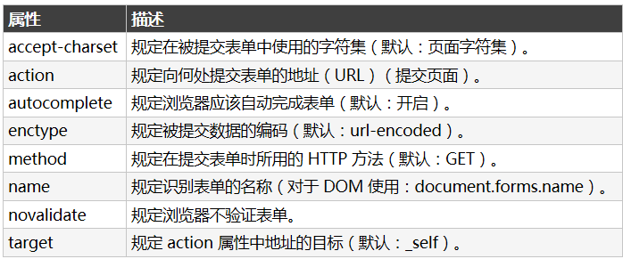
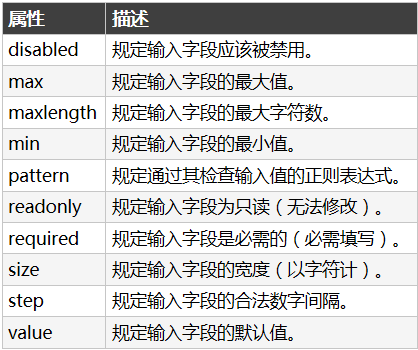
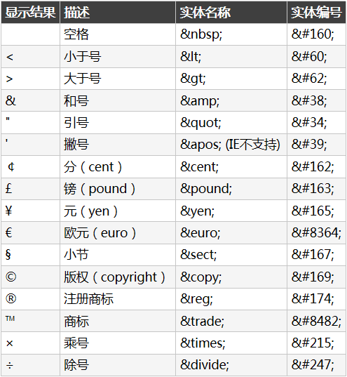

# 整体
```html
<!DOCTYPE HTML>
<html>
<head>
    ...
</head>
<body>
	...
</body>
</html>
```

# Header
- `<head>` 元素是所有头部元素的容器。`<head>` 内的元素可包含脚本，指示浏览器在何处可以找到样式表，提供元信息，等等
- 以下标签都可以添加到 head 部分：`<title>、<base>、<link>、<meta>、<script> 以及 <style>`
- `<title> `元素能够定义浏览器工具栏中的标题
- `<base>` 标签为页面上的所有链接规定默认地址或默认目标（target）
- `<link>` 标签定义文档与外部资源之间的关系
- `<style>` 标签用于为 HTML 文档定义样式信息
- `<meta`> 标签提供关于 HTML 文档的元数据。`meta` 元素被用于规定页面的描述、关键词、文档的作者、最后修改时间以及其他元数据
- `<script>` 标签用于定义客户端脚本

# Script
```
<script type="text/javascript">
	document.write("<h1>Hello World!</h1>")
</script> 
```
`<noscript>` 标签提供无法使用脚本时的替代内容，比方在浏览器禁用脚本时，或浏览器不支持客户端脚本时


# Background
- `<body>` 拥有两个配置背景的标签。背景可以是颜色或者图像
- 背景颜色（`Bgcolor`）背景颜色属性将背景设置为某种颜色。属性值可以是十六进制数、RGB 值或颜色名。` bgcolor="#000000" "rgb(0,0,0)" "black"`
- 背景（`Background`）背景属性将背景设置为图像。属性值为图像的URL。如果图像尺寸小于浏览器窗口，那么图像将在整个浏览器窗口进行复制


# Tag
- 注释 `<!-- ... -->`
- 标题  `<h1> - <h6>`
- 水平线 `<hr/>`
- 换行 `<br></br>`  可以只用一个闭合的`</br>`
- 段落 `<p></p>`
- 链接 `<a href=""></a>` 加上`target="_blank"`可以在新标签页打开链接,用`name="label"`就可以从其他地方`<a href="#label">`跳过来
- 图片 `` `alt="Big Boat"`用`alt`替换文本属性可以告诉用户图片失去的信息
- 节或区域 `<div> ` div占用的位置是一行
- 行内的小块或区域 `<span>` span不会占用一行,内容有多宽就占用多宽的空间距离


# Table
-  `<table>` 
- `<tr>`行
- `<td>`单元格。td指表格数据table data
- `<th>`表头
- `<caption>`标题
- `border`边框宽度
- `&nbsp;`空单元格,占位
- `<thead>`页眉
- `<tbody>`主体
- `<tfoot>`页脚
- `<col>`列的属性
- `<colgroup>`表格列的组


# list
- 无序列表 始于 `<ul>` 标签。每个列表项始于 `<li>`
- 有序列表 始于 `<ol>` 标签。每个列表项始于 `<li>` 标签
- 自定义列表 以 `<dl>` 标签开始。每个自定义列表项以 `<dt>` 开始。每个自定义列表项的描述以 `<dd>` 开始


# input
input元素: 复选框、单选按钮、提交按钮等等。`<input>` 元素是最重要的表单元素。有很多形态，根据不同的 `type` 属性
- `<input type="text">` 文本输入的单行输入字段：
- `<input type="radio">` 单选按钮
- `<input type="checkbox">` 复选框
- `<input type="password">` 密码字段
- `<input type="date">` 日期
- `<input type="color">` 颜色
- `<input type="range">` 范围值
- `<input type="month">` 月年
- `<input type="week">` 周年
- `<input type="time">` 时间（无时区）
- `<input type="datetime">` 日期和时间（有时区）
- `<input type="datetime-local">` 日期和时间（无时区）
- `<input type="email">` 电子邮件地址
- `<input type="search">` 搜索（搜索字段的表现类似常规文本字段）
- `<input type="tel">` 电话号码
- `<input type="url">`  URL 地址
- `<input type="number">` 数字值，能够对数字做出限制。min,max
- `<input type="button">` 按钮
- `<input type="submit">` 提交
- form的`action` 属性在提交表单时执行的动作。`<form action="action_page.php" method="GET">`
- `<select>` 下拉列表，`<option>` 待选择的选项。 `selected` 属性来定义预定义选项
- `<textarea>` 多行输入字段（文本域）
- `<button>` 可点击的按钮 `<button type="button" onclick="alert('Hello World!')">Click Me!</button>`
- HTML5 `<datalist>` 元素为 `<input>` 元素规定预定义选项列表。用户会在他们输入数据时看到预定义选项的下拉列表。`<input>` 元素的 list 属性必须引用 `<datalist>` 元素的 id 属性
- 如果要正确地被提交，每个输入字段必须设置一个 `name` 属性
- 用 `<fieldset>` 组合表单数据 `<fieldset>` 元素组合表单中的相关数据 `<legend>` 元素为 `<fieldset>` 标题


## input attribute 列表



## input attribute 限制



# Attribute
- tag可以添加属性`name, id, class, style, title, …, name="value"` 
- style属性`style style="font-family:verdana;color:red;font-size:20px;"`
- `font-family、color 以及 font-size` 属性分别定义元素中文本的字体系列、颜色和字体尺寸，`text-align` 属性规定了元素中文本的水平对齐方式


# 文本格式
- `<b>`粗体文本
- `<big>`大号字
- `<em>`着重文字
- `<i>`斜体字
- `<small>`小号字
- `<strong>`加重语气
- `<sub>`下标字
- `<sup>`上标字
- `<ins>`插入字
- `<del>`删除字


# “计算机输出”标签
- `<code>`	定义计算机代码。`<code>` 元素不保留多余的空格和折行，如需解决该问题，您必须在 `<pre>` 元素中包围代码
- `<kbd>`	定义键盘码
- `<samp>`	定义计算机代码样本
- `<tt>`	定义打字机代码
- `<var>`	定义变量
- `<pre>`	定义预格式文本


# 引用、引用和术语定义
- `<q>`	定义短的引用语。浏览器通常会为 <q> 元素包围引号
- `<blockquote>`	定义长的引用。浏览器通常会对 <blockquote> 元素进行缩进处理
- `<abbr>`	定义缩写
- `<acronym>`	定义首字母缩写
- `<address>`	定义地址。此元素通常以斜体显示。大多数浏览器会在此元素前后添加折行
- `<bdo>`	定义文字方向
- `<cite>`	定义引用、引证。浏览器通常会以斜体显示 <cite> 元素
- `<dfn>`	定义一个定义项目


# 经验
- 块级元素能够用作其他 HTML 元素的容器。例子：`<h1>, <p>, <ul>, <table>，<div>`
- 内联元素在显示时通常不会以新行开始。例子：`<b>, <td>, <a>, ，<span>`
- 设置 `<div>` 元素的类，使我们能够为相同的 `<div>` 元素设置相同的类：
- 设置 `<span>` 元素的类，能够为相同的 `<span>` 元素设置相同的样式


# 框架
- 框架结构标签（`<frameset>`）定义如何将窗口分割为框架
- 每个 `frameset` 定义了一系列行或列
- `rows/columns` 的值规定了每行或每列占据屏幕的面积
- 框架标签`（Frame）Frame` 标签定义了放置在每个框架中的 HTML 文档


# iframe 在网页内显示网页
- `height` 和 `width` 属性用于规定 `iframe` 的高度和宽度
- `frameborder` 属性规定是否显示 `iframe` 周围的边框。设置属性值为 "0" 就可以移除边框
	


# HTML 实体
- 在 HTML 中，某些字符是预留的。如果希望正确地显示预留字符，我们必须在 HTML 源代码中使用字符实体。如需显示小于号，我们必须这样写：`&lt; 或 &#60;`
- HTML 中的常用字符实体是不间断空格`(&nbsp;)`



