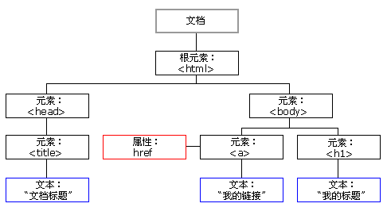
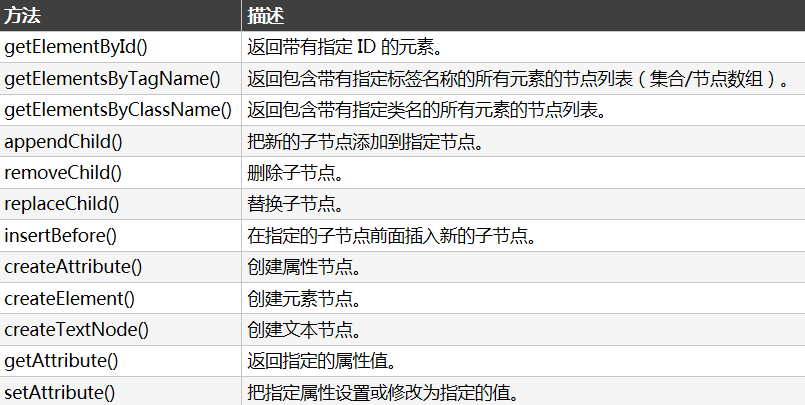

# HTML DOM（Document Object Model） 树



- 在 HTML DOM 中，所有事物都是节点。DOM 是被视为节点树的 HTML。
- HTML 文档中的所有内容都是节点
- 通过 HTML DOM，树中的所有节点均可通过 JavaScript 进行访问。所有 HTML 元素（节点）均可被修改，也可以创建或删除节点。


## HTML DOM 方法
所有 HTML 元素被定义为对象，而编程接口则是对象方法和对象属性。




## HTML DOM 属性
属性是节点（HTML 元素）的值，您能够获取或设置。

### nodeName 属性
- nodeName 属性规定节点的名称。
- nodeName 是只读的
- 元素节点的 nodeName 与标签名相同
- 属性节点的 nodeName 与属性名相同
- 文本节点的 nodeName 始终是 #text
- 文档节点的 nodeName 始终是 #document
- nodeName 始终包含 HTML 元素的大写字母标签名。

### nodeValue 属性
- nodeValue 属性规定节点的值。
- 元素节点的 nodeValue 是 undefined 或 null
- 文本节点的 nodeValue 是文本本身
- 属性节点的 nodeValue 是属性值

### nodeType 属性
- nodeType 属性返回节点的类型。nodeType 是只读的。
- 比较重要的节点类型有：

| 元素类型 | NodeType |
|----------|----------|
| 元素     | 1        |
| 属性     | 2        |
| 文本     | 3        |
| 注释     | 8        |
| 文档     | 9        |


## HTML DOM 访问
访问 HTML 元素等同于访问节点。能够以不同的方式来访问 HTML 元素：
- 通过使用 getElementById() 方法
- 通过使用 getElementsByTagName() 方法
- 通过使用 getElementsByClassName() 方法


## HTML DOM - 修改
修改 HTML = 改变元素、属性、样式和事件。修改 HTML DOM 意味着许多不同的方面：
- 改变 HTML 内容
- 改变 CSS 样式
- 改变 HTML 属性
- 创建新的 HTML 元素
- 删除已有的 HTML 元素
- 改变事件（处理程序）


### 创建 HTML 内容
改变元素内容的最简答的方法是使用 innerHTML 属性。
```
<html>
<body>
<p id="p1">Hello World!</p>
<script>
document.getElementById("p1").innerHTML="New text!";
</script>
</body>
</html>
```

### 改变 HTML 样式
`document.getElementById("p2").style.color="blue";`


### 创建新的 HTML 元素
如需向 HTML DOM 添加新元素，您首先必须创建该元素（元素节点），然后把它追加到已有的元素上。
``` html
<div id="d1">
<p id="p1">This is a paragraph.</p>
<p id="p2">This is another paragraph.</p>
</div>

<script>
var para=document.createElement("p");
var node=document.createTextNode("This is new.");
para.appendChild(node);

var element=document.getElementById("d1");
element.appendChild(para);
</script>
```

### 创建新的 HTML 元素 - appendChild()
如需向 HTML DOM 添加新元素，您首先必须创建该元素，然后把它追加到已有的元素上。

### 创建新的 HTML 元素 - insertBefore()

### 删除已有的 HTML 元素
如需删除 HTML 元素，您必须清楚该元素的父元素.这里提供一个常用的解决方法：找到您需要删除的子元素，然后使用 `parentNode` 属性来查找其父元素
```
var child=document.getElementById("p1");
child.parentNode.removeChild(child);
```

### 替换 HTML 元素 - replaceChild() 


## 事件
HTML DOM 允许您在事件发生时执行代码。当 HTML 元素”有事情发生“时，浏览器就会生成事件
- 当用户点击鼠标时
- 当网页已加载时
- 当图片已加载时
- 当鼠标移动到元素上时
- 当输入字段被改变时
- 当 HTML 表单被提交时
- 当用户触发按键时

### onload 和 onunload 事件
- 当用户进入或离开页面时，会触发 onload 和 onunload 事件。
- onload 件可用于检查访客的浏览器类型和版本，以便基于这些信息来加载不同版本的网页。
- onload 和 onunload 事件可用于处理 cookies。

### onchange 事件
- onchange 事件常用于输入字段的验证。
- 下面的例子展示了如何使用 onchange。当用户改变输入字段的内容时，将调用 `upperCase()` 函数。`<input type="text" id="fname" onchange="upperCase()">`

### onmouseover 和 onmouseout 事件
- onmouseover 和 onmouseout 事件可用于在鼠标指针移动到或离开元素时触发函数。

### onmousedown、onmouseup 以及 onclick 事件
- onmousedown、onmouseup 以及 onclick 事件是鼠标点击的全部过程。首先当某个鼠标按钮被点击时，触发 onmousedown 事件，然后，当鼠标按钮被松开时，会触发 onmouseup 事件，最后，当鼠标点击完成时，触发 onclick 事件。


## HTML DOM - 导航
### HTML DOM 节点列表
- g`etElementsByTagName()` 方法返回节点列表。节点列表是一个节点数组。下面的代码选取文档中的所有 `<p>` 节点：
```
var x=document.getElementsByTagName("p");
```
- 可以通过下标号访问这些节点。如需访问第二个 `<p>`，您可以这么写`y=x[1];`
- `length` 属性定义节点列表中节点的数量。可以使用 `length` 属性来循环节点列表

### 导航节点关系
- 能够使用三个节点属性：`parentNode`、`firstChild` 以及 `lastChild` ，在文档结构中进行导航。
- `firstChild` 属性可用于访问元素的文本

### DOM 根节点
这里有两个特殊的属性，可以访问全部文档：
- `document.documentElement` - 全部文档
- `document.body` - 文档的主体


### childNodes 和 nodeValue
- 除了 `innerHTML` 属性，您也可以使用 `childNodes` 和 `nodeValue` 属性来获取元素的内容。

