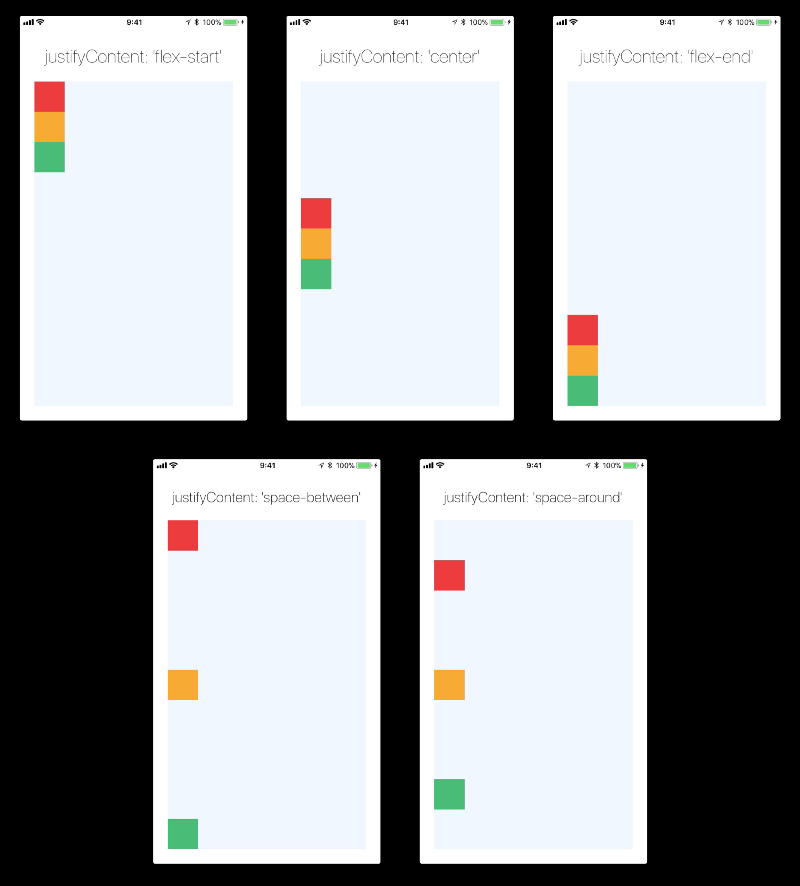
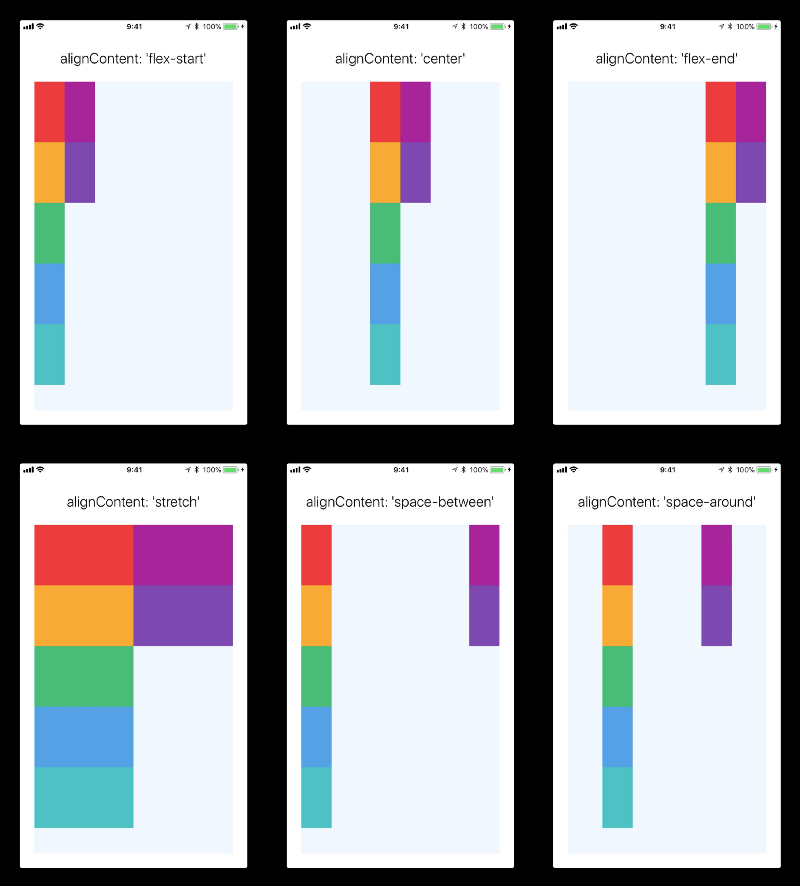
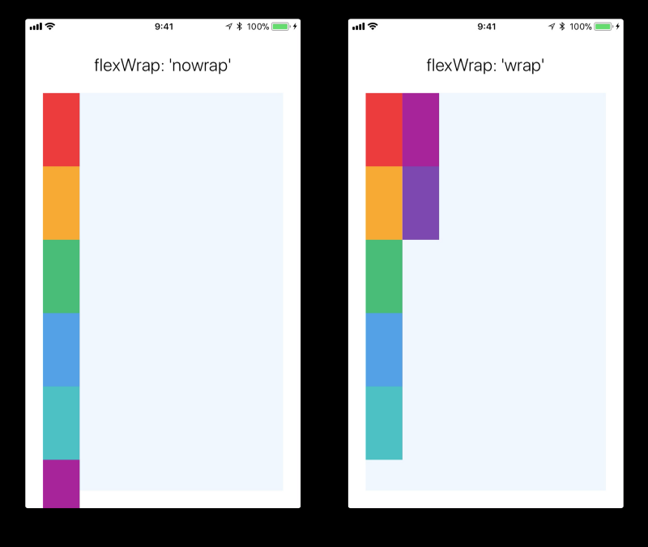

# Flexbox Layout
- 使用`flexDirection`、`alignItems`和 `justifyContent`三个样式属性就已经能满足大多数布局需求。
- React Native 中的 Flexbox 的工作原理和 web 上的 CSS 基本一致，当然也存在少许差异。首先是默认值不同：`flexDirection`的默认值是`column`而不是`row`，而flex也只能指定一个数字值。

## flexDirection
style中指定flexDirection默认的排列的方向的主轴。默认值是沿着竖直轴(column)方向排列。
- row 水平从左到右
- row-reverse 水平从右到左
- column 垂直从上到下
- column-reverse 垂直从下到上

```
<View style={{flex: 1, flexDirection: 'row'}}>
  <View style={{width: 50, height: 50, backgroundColor: 'powderblue'}} />
  <View style={{width: 50, height: 50, backgroundColor: 'skyblue'}} />
  <View style={{width: 50, height: 50, backgroundColor: 'steelblue'}} />
</View>
```

## justifyContent
在组件的 style 中指定justifyContent可以决定其子元素沿着主轴的排列方式。
- flex-start 靠近主轴的起始
- center 靠近主轴的中间
- flex-end 靠近主轴的末尾
- space-between 头尾顶着轴，中间平均分布
- space-around 头尾不顶着轴，所有的平均分布




## alignItems
在组件的 style 中指定alignItems可以决定其子元素沿着次轴（与主轴垂直的轴，比如若主轴方向为row，则次轴方向为column）的排列方式。
- flex-start 靠近次轴的起始
- center 靠近次轴的中间
- flex-end 靠近次轴的末尾
- stretch 默认值 把component拉伸到最高的高度。要使stretch选项生效的话，子元素在次轴方向上不能有固定的尺寸。

### Align Self
Align Self只影响一个component，可以覆盖parent的aligItems


## Align Content
针对item被flexWrap的情况
- flex-start (default value)
- flex-end 
- stretch 
- center 
- space-between 
- space-around 




## Flex Wrap
当children超出边界的时候，可以用Flex Wrap，可以让超出的自动切换到下一行或者下一列。




## Flex Basis, Grow, and Shrink


## Width and Height


## Absolute & Relative Layout
